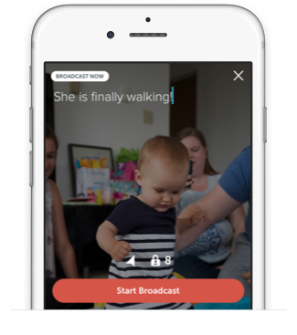

# Up Periscope

[Download the iOS App](https://itunes.apple.com/app/id972909677)

### Today, we’re excited to unveil Periscope, the best way to share and watch live video broadcasts from your mobile phone. You can download our [iOS app](https://itunes.apple.com/app/id972909677) today to start exploring.

Just over a year ago, we became fascinated by the idea of discovering the world through someone else’s eyes. What if you could see through the eyes of a protester in Ukraine? Or watch the sunrise from a hot air balloon in Cappadocia? It may sound crazy, but we wanted to build the closest thing to teleportation. While there are many ways to discover events and places, we realized there is no better way to experience a place ***right now*** than through live video. A picture may be worth a thousand words, but live video can take you someplace and show you around.

**For broadcasters**, Periscope lets you share an experience with others. Press a button, and instantly notify your followers that you’re live. Whether you’re witnessing your daughter’s first steps or a newsworthy event, Periscope offers an audience and the power of a shared experience. Most mobile broadcasting tools feel far from live. Broadcasters on Periscope are directly connected to their audience, able to feel their presence and interact. Going live on Periscope means more than a blinking red dot.

**For viewers**, Periscope gives you a new set of eyes and ears. Travel the world and step into someone else’s shoes. See what they see, hear what they hear, and hopefully feel what they feel. Watching a broadcast isn’t a passive experience like television. On Periscope, viewers influence the broadcaster by sending messages, and expressing their love by tapping the screen to send hearts.

What excites us most about Periscope is the power of seeing something for yourself. We watched someone rise above the Sonoma valley in a hot air balloon; we witnessed “Hands Up Don’t Shoot” directly from Ferguson, Missouri, a terrifying fire that erupted in San Francisco’s Mission district and a live performance from a pianist who played any song requested from the audience.

>> “a visual pulse of what’s happening **right now**”

We’ve always imagined Periscope as a visual pulse of what’s happening ***right now***. Our friends at Twitter felt the same way, and in January [we decided](https://twitter.com/periscopeco/status/576429747057504257) to work towards this vision together. We’ll continue building Periscope as a separate product, with a small team based in San Francisco. Twitter brings you closer to people, places, interests, and events in an experience that’s immediate, unfettered, and conversational. We think Periscope can help further that mission by giving people a way to share and experience the world around them, both near and far.

We are thrilled to share Periscope with you. And even more excited to see how you will use it.

[Download the iOS App](https://itunes.apple.com/app/id972909677)

