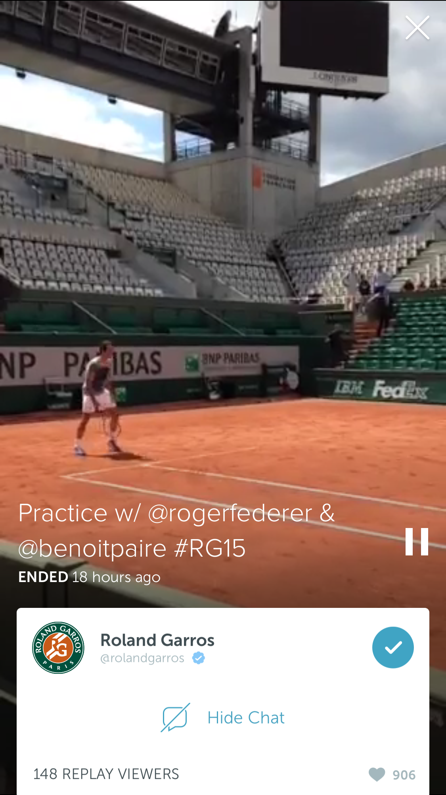

# Last Month in Periscope

The last month in Periscope has been incredible. We are continually amazed, and thankful to broadcasters around the world for bringing us to places we have never been before. The world of Periscope is exciting and often surprising. In the last month we celebrated with you, traveled across the globe, and sat patiently, watching newsworthy events unfold in front of our eyes. We wanted to share some of our favorite moments.

This week [Coleen Baik](https://twitter.com/colbay) with the [Women Cross DMZ](https://twitter.com/womencrossdmz) peace movement took us inside North Korea. From Coleen’s perspective, we were able to drive through the streets of North Korea, passing by landmarks and eventually joining Gloria Steinem’s peace delegations.

We sat with the rest of the world and watched the events in Baltimore unfold. Thank you to [Paul Lewis](https://twitter.com/paullewis) and [Jay Korff](https://twitter.com/abc7jay) for including us in conversations with local Baltimore residents.

> Absolutely brilliant jounalism from @PaulLewis in Baltimore overnight, real time interviews via @periscopeco a new age for journalism
> 
&#x200a;&mdash;&#x200a;<a href="https://twitter.com/drolo88/status/592929595910926337">@drolo88</a>

And as news of the earthquake spread, [Nick Garnett](https://twitter.com/nicholasgarnett) shared with us the devastation faced by the remote Nepalese villages of Sipaghat, Sindhupalchok, and others. [Mark Stone](https://twitter.com/Stone_SkyNews) took us to witness a hospital in Western Kathmandu, where some patients were too frightened to be treated inside the hospital for fear of another tremor.

> Powerful stuff by BBC 5 live&#39;s @nicholasgarnett on his experience reporting from Nepal; devastating Periscope #Mojo https://twitter.com/nicholasgarnett/status/596046756527341568 ...
> 
&#x200a;&mdash;&#x200a;<a href="https://twitter.com/DavidMcClelland/status/596065375114125312">@DavidMcClelland</a>

When [Christie’s](https://twitter.com/ChristiesInc) began broadcasting from their latest auction, we were delighted to see works from artists such as Mark Rothko, Jeff Koons, Alberto Giacometti, Francis Bacon, Lucian Freud, Cy Twombly, Jean-Michel Basiquiat, Andy Warhol, and Wassily Kandinsky. Over 200 people watched live as Christie’s set a record $179.3 million for any work at auction with Picasso’s *The Women of Algiers (Version ‘O’)*, 1955.

We attended the [Venice Biennale](https://twitter.com/la_biennale) with [Hans Ulrich Obrist](https://twitter.com/huobrist), who brought us in close contact with contemporary performers, installation artists, poets and sculptors.

We celebrated with [Rory McIlroy](https://twitter.com/mcilroyrory) after his 11th PGA Tour win, got an inside look from [Ian Poulter](https://twitter.com/ianjamespoulter) on how he prepares for each round and even watched [Roger Federer](https://twitter.com/rogerfederer) and [Benoît Paire](https://twitter.com/benoitpaire) practicing at [Roland Garros](https://twitter.com/rolandgarros).

As always, our broadcasters allowed us to travel around the globe with them. We sat on the edge of the Grand Canyon with [Nick Danger](https://twitter.com/nickdanger33), walked through the streets of NYC with [Jeremy Cowart](https://twitter.com/jeremycowart), and spent time in Rome getting to know the city from our spirited denizen, [Giulio Base](https://twitter.com/BaseGiulioBase).

We also went backstage with [The Rolling Stones](https://twitter.com/RollingStones), behind the scenes with [Oprah](https://twitter.com/Oprah), and caught [Hillary Clinton](https://twitter.com/HillaryClinton) answering her first press questions since announcing her Presidential candidacy with [Gabriel Debenedetti](https://twitter.com/gdebenedetti).

Thank you again to everyone who has allowed us to take a glimpse into their world. We know this is such a small sample of all the incredible moments being shared around the world, and we can’t wait to see where you will take us next…

Much Love,
Team Periscope

