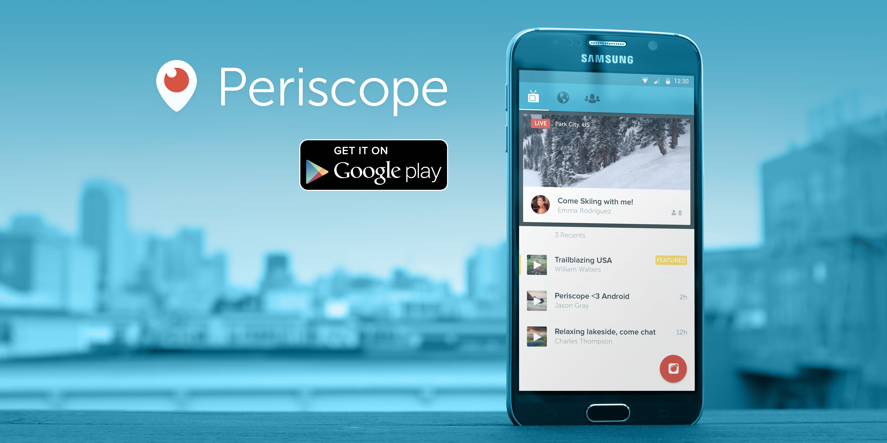
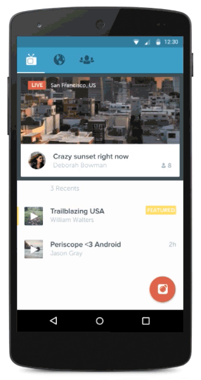
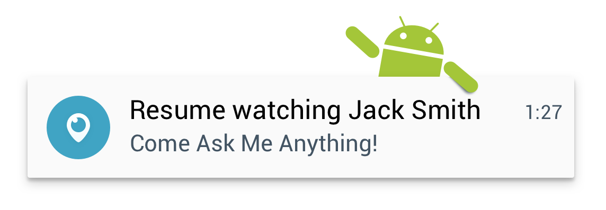

# Periscope on Android is LIVE

[Get Periscope on the Google Play Store](https://play.google.com/store/apps/details?id=tv.periscope.android)

When we started Periscope, we wanted to build the closest thing to [teleportation](https://medium.com/@periscope/up-periscope-f0b0a4d2e486) — by providing users with the best way to start or watch a live video broadcast. As a small startup, our initial launch was limited to just iOS, but we’ve been working really hard to craft an experience that feels special on Android, yet still unmistakably Periscope. Today, we’re excited to announce the launch of [Periscope on Android](https://play.google.com/store/apps/details?id=tv.periscope.android)!

Android owners using Version 4.4 (KitKat) and above can download Periscope from [Google Play](https://play.google.com/store/apps/details?id=tv.periscope.android). Periscope on Android has all the same core features that Periscope users have come to love: start a public or private broadcast, choose to allow comments from just those you follow, and interact with a broadcaster by chatting or sending hearts. There are a few things that are unique to Android:

* The application features a Material-inspired design that should feel familiar but modern to Android users

* Android users have granular control over additional Push Notification settings, such as “First Time Broadcast notifications” (when somebody you follow on Twitter broadcasts on Periscope for the first time) and “Share notifications” (when somebody you follow on Periscope shares somebody else’s broadcast).

* Periscope on Android offers you a “Resume notification” so you can keep watching where you left off in case your broadcast gets interrupted (by a phone call or message)

* Replays are saved without requiring the broadcaster to upload a file. This should save broadcasters lots of time and preserve precious mobile data allowance!

This is just the beginning for Periscope on Android. We have many exciting features and improvements in the works, so please follow us at [@periscopeco](https://twitter.com/periscopeco) to stay updated.

*Love,
[@pandemona](https://twitter.com/pandemona), [@lientm](https://twitter.com/lientm), [@jle](https://twitter.com/jle), and the rest of the [@periscopeco](https://twitter.com/periscopeco) team*

[Get Periscope on the Google Play Store](https://play.google.com/store/apps/details?id=tv.periscope.android)

