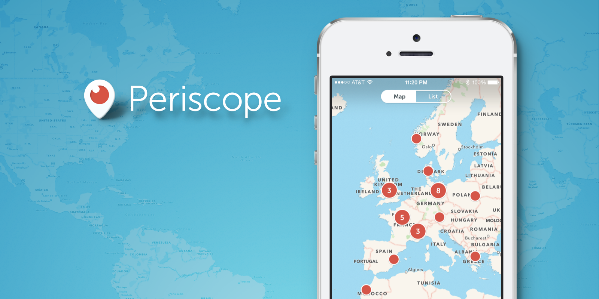

# Explore the World

### Periscope iOS 1.1 Update

When we started building [Periscope](https://periscope.tv), our first idea revolved around a map. We wanted to be able to see anywhere in the world, but questioned whether we would have enough broadcasts for a map to be compelling. *“What are the odds that anyone would even be live?”* we asked ourselves. So we shelved the map, and promised to revisit the idea when it made more sense.

We could never have predicted the volume of broadcasts happening across the world. We believe the incredible Periscope community has now made that original vision possible, which inspired us to release today’s [iOS update](https://itunes.apple.com/us/app/periscope/id972909677?mt=8):

__vimeo__:

Thank you to these Periscope users for allowing us to share their broadcasts: [@penguinsix](http://twitter.com/penguinsix), [@danandmoore](http://twitter.com/danandmoore), [@sky1ron](http://twitter.com/sky1ron), [@valaafshar](http://twitter.com/valaafshar), [@nicholasgarnett](http://twitter.com/nicholasgarnett), [@abhishekscariya](http://twitter.com/abhishekscariya), [@colbay](http://twitter.com/colbay), [@lidiaschillaci](http://twitter.com/lidiaschillaci), [@cailinoneil](http://twitter.com/cailinoneil), [@mweasner](http://twitter.com/mweasner), [@everydaydude](http://twitter.com/everydaydude), [@danandmoore](http://twitter.com/danandmoore), [@euromaestro](http://twitter.com/euromaestro), [@revbeej](http://twitter.com/revbeej), [@bohan](http://twitter.com/bohan), [@marloes](http://twitter.com/marloes), [@glacierNPS](http://twitter.com/glacierNPS), [@intothefuzz](http://twitter.com/intothefuzz)

### Map View

When you tap on the ‘Global’ section, you will be able to explore live broadcasts on an interactive map. You’ll see the most recent broadcasts (with location shared) all over the world, and have your choice of where to travel next.

In the spirit of this new update, we wanted to collect some of our favorite broadcasts from around the world and share them with you in the video on the left.

### **Periscope is now localized in 29 languages**

We want to continue to support our global community in any way we can. We hope providing more languages will broaden the Periscope community.

### **Replays are now instantly available**

No need to wait for a replay to upload after broadcasting. You can always choose to delete a replay later, directly from your feed.

### **Share on Twitter**

You can now share the link to a live broadcast or replay on Twitter. We want you to be able to share the amazing places, people and things you are seeing.

What excites us most about Periscope is the many worlds it makes visible — the past two months have continued to open our eyes. Thank you for continuing to allow us to travel the globe with you.

Much Love,
[Team Periscope](https://twitter.com/periscopeco)

