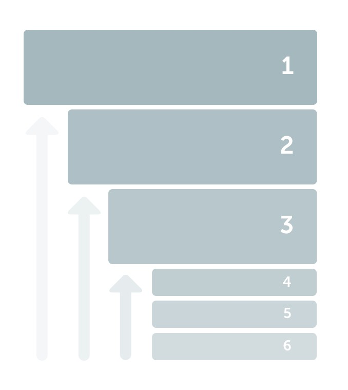
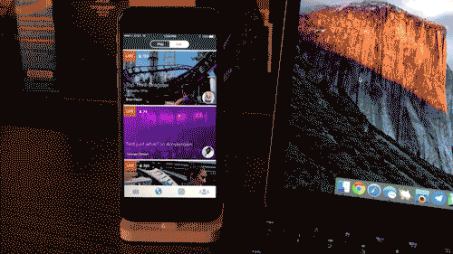

# Mute Notifications, a Better Global Feed, & more

It has been four months since we launched Periscope and we’ve been working hard to make it better each day. We’ve been blown away by what the Periscope community has created in such a short time. In the end of May, we announced that in aggregate users spend 10 years worth of time watching broadcasts live each day on Periscope. Today, we’re excited to share that this has increased to over 25 years of live watched time every day!

>> “…over 25 years of live watched time every day…”

A new [update is now available](https://itunes.apple.com/us/app/periscope/id972909677?mt=8) on iOS in the App Store with some great new goodies, so we wanted to share a bit more here on what we launched, and why:

### Notification Mute

There’s now a “Mute” option for every user you follow on Periscope. When you mute someone, their broadcasts still appear in your feed, but you won’t receive push notifications when they go live. Push notifications are a powerful communication channel, but they also have the potential of creating a frustrating degree of noise for users. We think it’s important to respect this power, and give users granular control over the notifications they receive while still providing the flexibility of seeing more content on Periscope. This is coming to Android imminently!

### A Better Global Feed

The global feed allows you to discover interesting content from people around the globe. We believe it is one of the best discovery tools viewers have on Periscope. We’ve refreshed this feed (on iOS and Android) to surface high quality broadcasts that you’re likely to enjoy. In your profile settings, you can now also indicate your language preferences. This impacts the broadcasts in your Global feed (by default, we will select your device’s preferred languages). We hope this update makes it easier to find the most interesting broadcasts on Periscope.

### **Your Broadcast Stats**

At the end of the broadcast, a panel pops up that tells you a few things about your broadcast (including **total time watched**). Previously, this information was only visible immediately after stopping your broadcast. Now, when viewing your past broadcasts, broadcast statistics will always be available.

### iOS 8 Handoff

You can start watching a broadcast on one device, and transition to watching it on another seamlessly. Simply ensure both are running iOS 8+ or OS X, have Bluetooth turned on, and are logged in to the same iCloud account. This is great for when you’re watching a broadcast on your Desktop, and want to quickly switch to watching on your iOS device (or vica versa).

Enjoy the new features, and thank you for continuing to make Periscope a wonderful platform for communication and expression. Please don’t hesitate to reach out to us [@periscopeco](https://twitter.com/periscopeco) for any thoughts/suggestions/questions.

Cheers

Team Periscope

