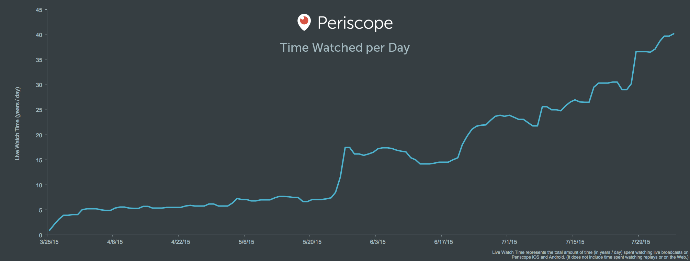
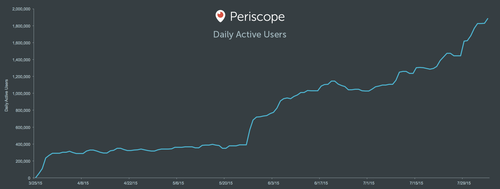

# Periscope, by the Numbers

Dear Periscope community and world,

We’d like to share an exciting update on Periscope’s growth, and provide some insight on how we measure our progress.

On August 2nd, we surpassed **10 million** [Periscope](https://periscope.tv) accounts. We launched Periscope just four months ago, on March 26, 2015. We would like to thank every single one of you for taking the time to use something that we’ve worked so hard to create. It means everything to us.

We’re even more stunned by the burgeoning usage of Periscope. Here’s the graph of our **Time Watched** since launching. We define Time Watched as the aggregate amount of time that people spend **watching live** **broadcasts** on iOS & Android. As of last week, we’re seeing over **40 years of video watched per day**.

Time Watched is the metric we care about most, and what we’ll keep you updated on periodically. Here’s why Time Watched matters to us:

* **It’s most reflective of the value we’re creating for people and the world**. Success for **broadcasters** means more time watched on their broadcasts. Success for the **audience** (viewers who are watching and participating in a Periscope) means more high quality broadcasts in their feeds that they want to watch and participate in. Success for broadcasters and their audience means success for Periscope.

* **Time Watched is also valuable because it can capture viewership of Periscope broadcasts outside of iOS/Android.** We have huge viewership on periscope.tv and this matters — especially to our broadcasters who get incredible reach and audience because of it. At the moment, we don’t include time watched from periscope.tv in our overall Time Watched metric — but we’re working on being able to track this precisely enough to share.

* **Time Watched **serves as a proxy for active user growth, without suffering some of the limitations of focusing exclusively on a metric like Daily Active Users (DAU) or Monthly Active Users (MAU). Although it’s useful for us to see that our DAU graph is trending upwards (see below), we don’t think it’s the most important metric for assessing our overall success.

Optimizing for DAU/MAU doesn’t properly motivate our team to create a product that people love. Here’s why: if we were motivated to grow DAU, we’d be incentivized to invest in a host of conventional growth hacks, viral mechanics, and marketing to drive up downloads. This direction doesn’t necessarily lead to a better product, or lead to success for Periscopers. We hold ourselves accountable to Time Watched as an organizational measure because it reflects the kernel of our product, and our core values.

We hope this was helpful information to share. Most importantly, we want Periscopers to know and feel that they’re contributing to a growing ecosystem. And we want people to know that the Periscope team is measuring itself in a way that aligns with the value that the community gets from Periscope. We will continue to be transparent about what we think and why, and you should hold us to that. If there are other areas of our product or focus that we should be more transparent about, please tell us!

Thank you

Kayvon, Joe, and the Periscope team

