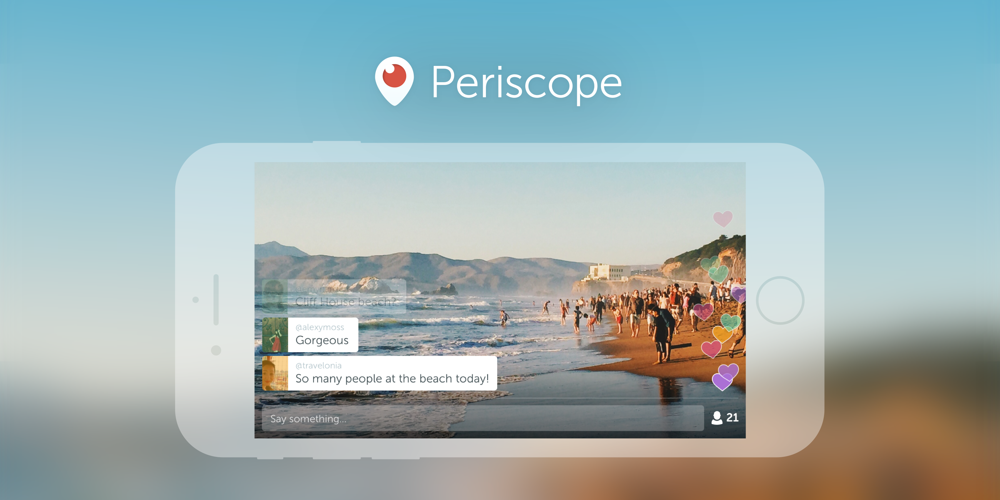
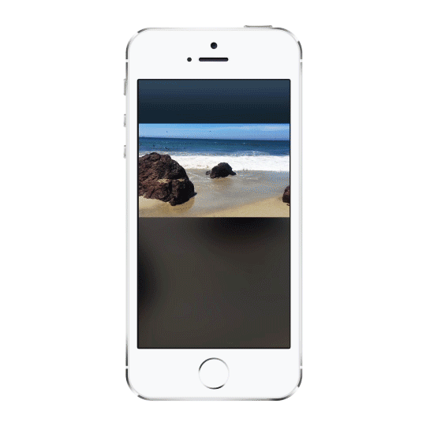
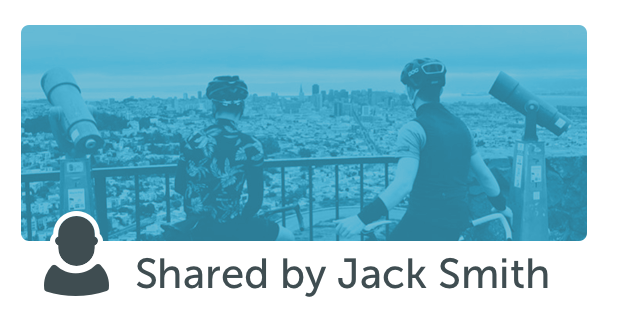
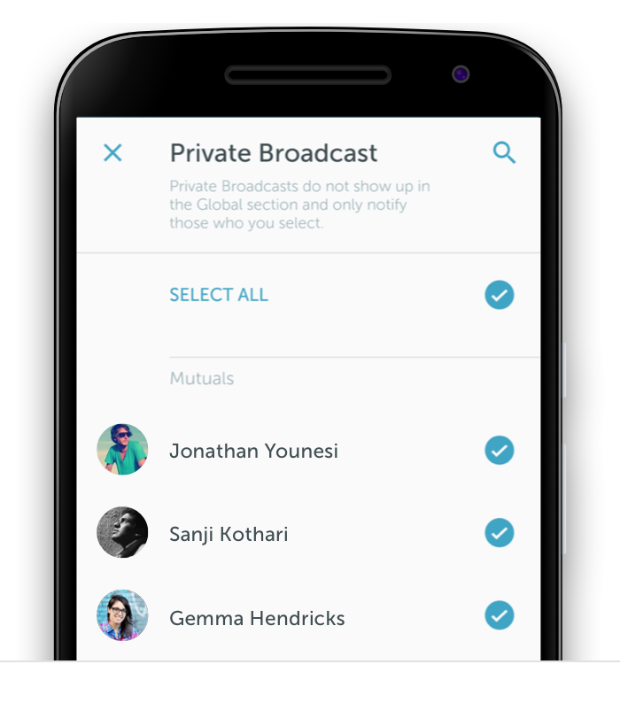

# Introducing Landscape

You asked, we delivered! In the latest version of iOS and Android, Periscopers can now hold their phones either in portrait or landscape. Here’s how it works: Viewers can continue holding their device in portrait, or match the broadcaster’s orientation to maintain full screen video. Either way, you’ll never need to tilt your head to watch sideways video.

When we first launched Periscope, we only supported portrait broadcasting. As much as we’re fans of portrait video, we know that there are times where the scene you’re trying to capture is best expressed in landscape. We know the community has been craving this feature — we wanted to be thoughtful about our approach to ensure a seamless experience across all of our platforms (iOS, Android and Web).

Here are some other new features we think you’ll love:

**Share Context: **When someone you follow shares a broadcast, it appears in your home feed. In this update, we’ve added an indicator beneath the broadcast title explaining who shared it with you. No more wondering why a broadcast showed up in your feed!

**Accessibility: **We’ve heard from a lot of people that Periscope needs to be more accessible for visually impaired Periscopers. In this version we’ve made large steps towards improving support for iOS accessibility features. We’ll continue to invest in this over time!

**Mutual Follow***: *This update makes private broadcasting much easier on Android. When you start a private broadcast, you can choose from a list of mutual followers (people you follow, who also follow you). We think this list is a more natural selection of people who you are likely to broadcast to. We’ve also added an option to quickly select *all *of your mutual follows. See something you want to share with your friends, but not the whole world? Check. This same behavior is coming soon to iOS, so hang tight!

We hope you enjoy the new features! Let us know what you think. And thank you to the entire Periscope community for bringing the world to all of us, every day.

Get the updates for [iOS](https://itunes.apple.com/us/app/periscope/id972909677?mt=8) and [Android](https://play.google.com/store/apps/details?id=tv.periscope.android).

