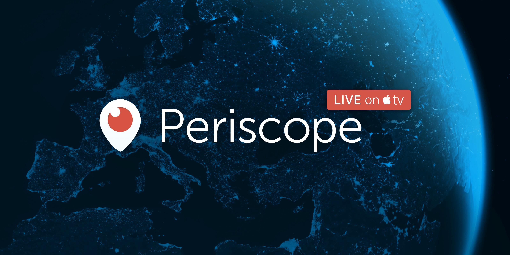

# Periscope — Now playing in a (Home) Theater Near You

Periscope lets you experience the world through someone else’s eyes. We use live video as a medium because when you watch events unfold live, it’s a more authentic experience. In our living rooms today, broadcast television is the closest thing we have to this. However, as live television becomes more and more produced, it can also become less genuine. This is what excites us about bringing Periscope to the Apple TV — the notion that you, your friends and family, can share what’s happening in the world *right now*, together.

Periscope on your TV lets you instantly experience live broadcasts. Open the app, and you’ll see a collection of live broadcasts from around the world (no account signup needed). You can send hearts to the broadcaster and read comments from other people watching with you. At any time, you can skip to the next broadcast, hide or show comments and hearts, and return to the main menu for an entirely fresh collection of places to go. If a broadcast ends, Periscope will automatically take you to the next destination.

So what’s next for this project? We see tons of possibilities and are really looking forward to hearing about how people use this first iteration. Giving everyone a way to access and share their personal feeds really excites us, as does the prospect of creating new ways to interact with the broadcaster. And of course, we’re always working to bring new types of content and new forms of discovery to the platform.

__vimeo__:

A perk of working at Periscope is that you see *a lot* of broadcasts. Each day is its own miniature exploration in human anthropology. What makes it great is that we experience it together; it spurs constant discussion, just as we hope it will for you. We’re so excited for you to try what we’ve built — we’ve only begun to scratch the surface. Enjoy, and happy scoping!

