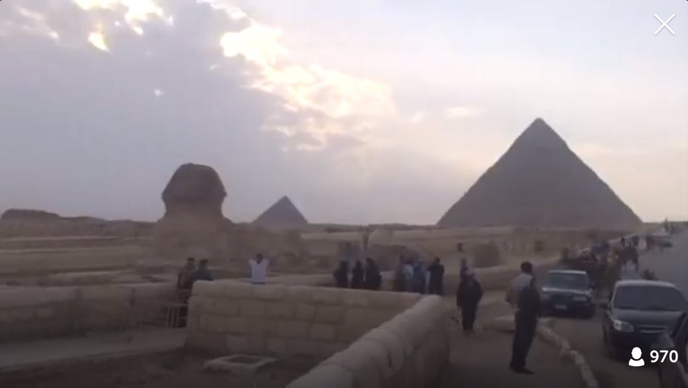
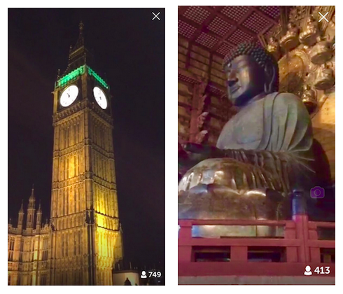
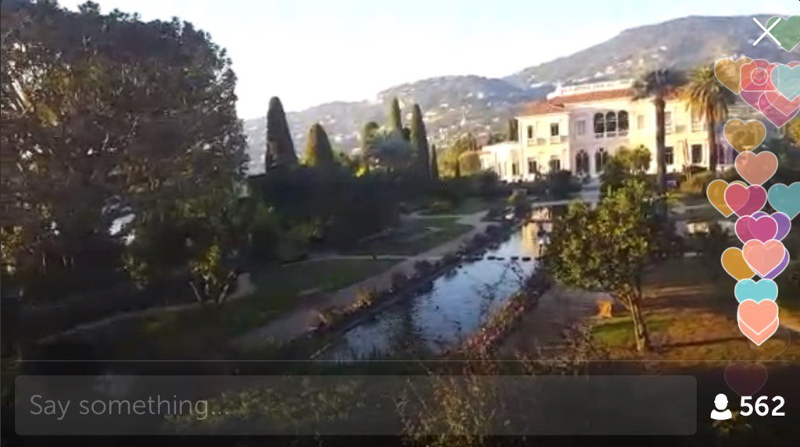
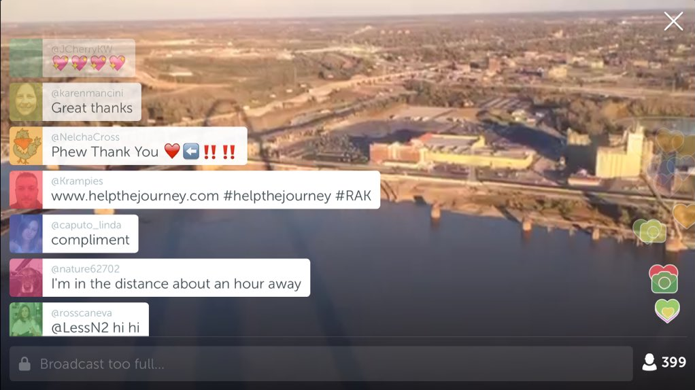
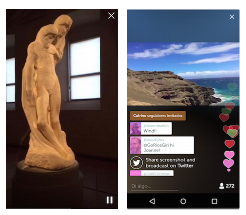
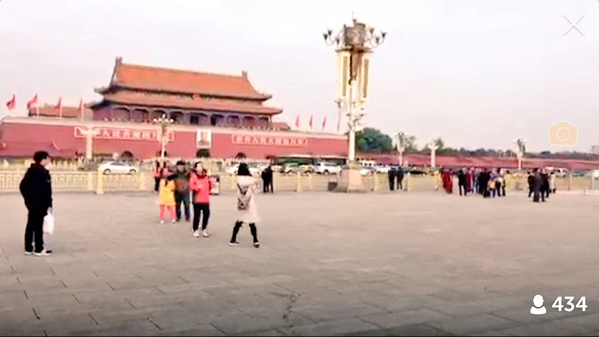
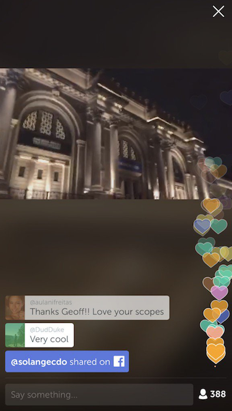

# Around the World in One Day

This weekend, more than 50 broadcasters organized a [Scope Day](https://twitter.com/search?q=%23ScopeDay&src=tyah) that took audiences around the globe. Over the course of 24 hours, they passed the cast,* taking us to some of the word’s most iconic destinations. Here are some of our favorites:

@[mh_hassib](https://www.periscope.tv/mh_hassib) started the day by giving us a chance to visit the pyramids in Cairo, Egypt (teaching us both the English and Arabic names of each pyramid).

[@BoopFashionista](https://www.periscope.tv/BoopFashionista) — one of our resident broadcasters in London — took us to Big Ben as the clock struck 11pm, and then to the London Eye to see it lit up at night.

@[WagamamaMama](https://www.periscope.tv/WagamamaMama) took us to Tōdai-ji in Nara, Japan, home of the largest bronze Buddha statue in the world.

@[efrenchcafe](https://www.periscope.tv/efrenchcafe) took us to the beautiful Villa Ephrussi de Rothschild in the French Riviera — showcasing both the stunning scene and the history of the villa.

@[Cheryl66stl](https://www.periscope.tv/Cheryl66stl), a true local, gave us a tour of St. Louis with a special visit to the top of St. Louis Arch.

@[Rosscaneva](https://www.periscope.tv/Rosscaneva) took us to Milan, Italy to see the museum of Sforza Castle. Rossella took us behind the scenes with the lead curator to see the last work of Michelangelo.

@[SandyChoiRadio](https://www.periscope.tv/SandyChoiRadio) — via @[ParachuteTV1](https://www.periscope.tv/ParachuteTV1/) — took us to the Green Sand Beach in Hawaii, one of four green sand beaches accessible in the world.

@[MTendsToTrave](https://www.periscope.tv/MTendsToTravel)l took us to Tiananmen Square, and together we explored 440 square meters of urban space in Beijing.

@[geoffgolberg](https://www.periscope.tv/geoffgolberg) closed out the night in NYC, bringing us to the Met. In true Geoff form, he showcased some amazing street talent in New York with a [special](https://twitter.com/Mr_E_Longfellow/status/663167658519465984) #ScopeDay performance.

The Periscope community transports us around the globe every day. Thank you for sharing your worlds.

Much love,

Team Periscope

> *Pass the cast: when a broadcaster tells the audience to join another broadcast, and then shares it with their followers — creating a waterfall effect.

