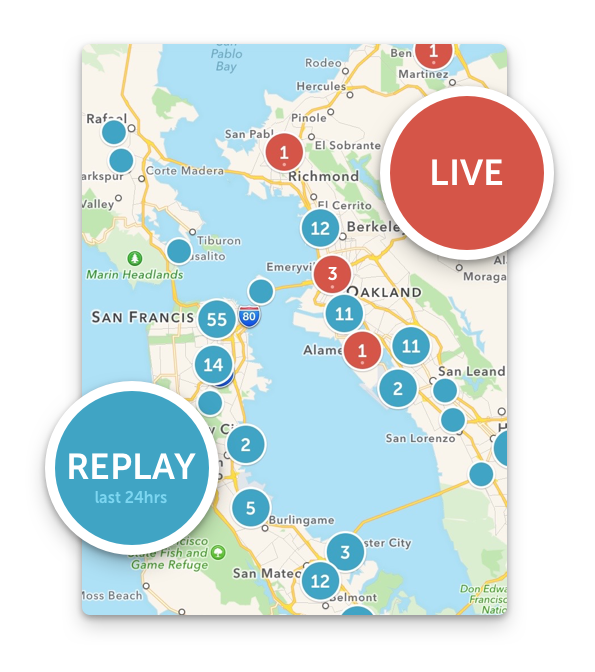

# Skip Around The World

We’re excited to announce two major updates to Periscope on iOS and Android: a revamped **Global Map**, and **Skip Ahead on replays**!

### Global Map

We’ve always thought that Periscope has the potential of showing you the world in real time. This vision inspired us to create the Global Map. Our first implementation, launched in June, had some limitations. The map only showed live broadcasts (no replays) and was limited to a total of 250 broadcasts. At any given point there are thousands of broadcasts live on Periscope and orders of magnitude more replays, so the Map was only showing the tip of the iceberg. The new map launching today has some major improvements.

Every time you zoom to a new place on the map, Periscope will reload broadcasts from this region, **including** replays from the last 24 hours. Red dots are live broadcasts, and blue dots are replays. You can look at the most remote area of the world and see both what’s happening now, and what’s happened recently.

When we’ve heard about breaking news events, as in the case of Hurricane Patricia, we’ve found ourselves checking Periscope first.

We think that the new Map functionality is much closer to fulfilling our original vision of seeing the world in real time. We hope you agree!

### **Skip Ahead in Replays**

We know you’re busy. When you’re watching a replay, you sometimes just want to fast forward a segment and get to the part you’re looking for. Or to the moment your friend told you about. Or you just want to seek through the whole thing quickly to get an idea of what happened. Now you can. Just press down while watching the replay, and drag left and right. You can even drag up and down to change the seek speed. And while you’re seeking, with your finger still pressed down, you’ll see a preview of that moment in the broadcast.

### **3D Touch Shortcuts**

For iPhone 6s and 6s+ owners, we’ve added a few handy shortcuts. If you press down on the Periscope app icon, you’ll have the following options:

* **Search People** — Pretty self explanatory!

* **Teleport** — Takes you someplace random in the world and shows you a live broadcast from there. We love this shortcut because we’ve always wanted Periscope to feel like teleportation.

* **Broadcast Mutuals **— Starts a private broadcast that only your mutual followers see (people you follow, who also follow you). This is a great way to quickly go live to your friends.

* **Broadcast — **Quickly start a public broadcast.

### **Zoom on Android**

We’ve also introduced the long-awaited pinch to zoom on Android, which lets you zoom in and out while broadcasting, just like your iOS friends can.

We’re really excited for you to try this new update. As always, let us know what you think by tweeting us [@periscopeco](http://twitter.com/periscopeco). Happy Periscoping!

Much love,
[Team Periscope](http://periscope.tv/about)

*p.s. - this post is dedicated to [Pablo](http://twitter.com/zbigy), for pressing the release button 2 days early…*

