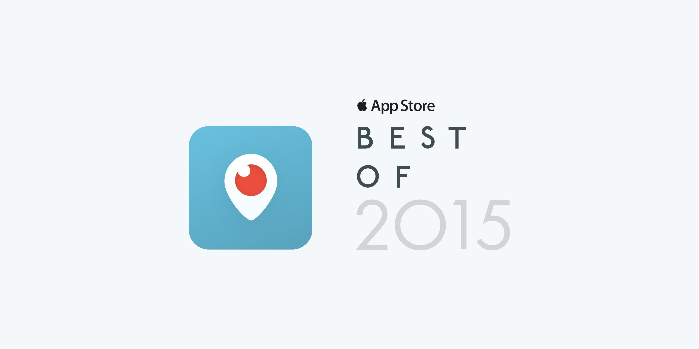

# Apple App Store’s 2015 App of the Year

This morning we woke up to a delightful surprise — [Periscope](http://itunes.apple.com/app/id972909677&mt=8) has been named [App Store Best of 2015](http://AppStore.com/Bestof2015) by Apple. When we launched Periscope this past March, we had no idea what to expect. We certainly hoped people would like what we had built, and would find value in using it. But we never expected our idea would be supported this much, or grow this fast. We certainly never expected to receive such high honors as this.

We’d like to thank everybody who has made Periscope possible: our friends and family who supported us as a fledgling startup, our investors who believed in the vision when it was just an idea, Twitter for doubling down on that vision and giving us the support and freedom to pursue it, our beta users for helping us pave the way, the incredible community of Periscopers who bring life to our creation every day, and Apple — not just for the recognition, but for building the devices and platform that make Periscope on iOS possible in the first place.

Much love,

Team Periscope

