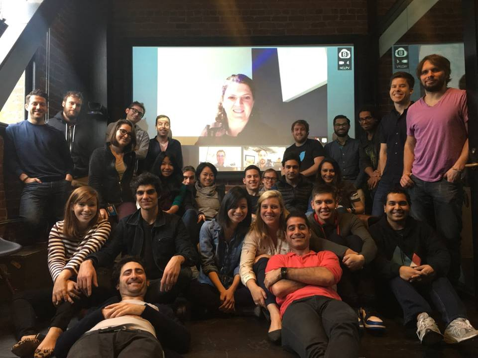
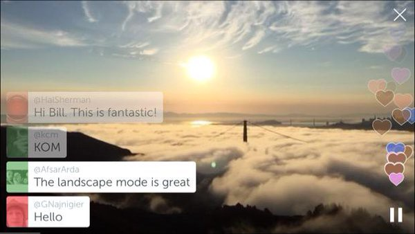
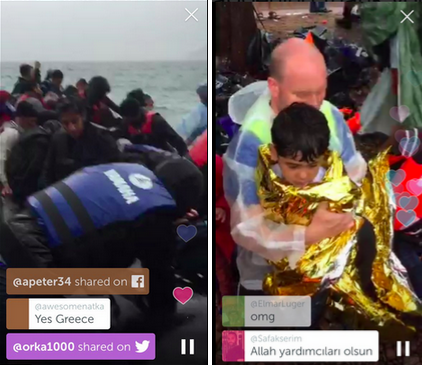
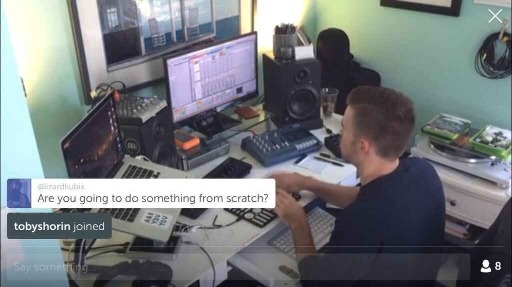
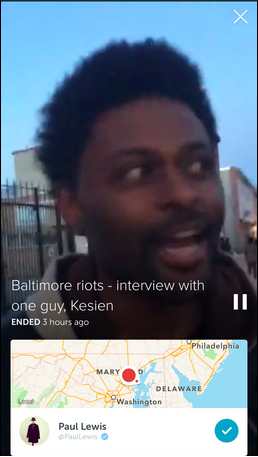
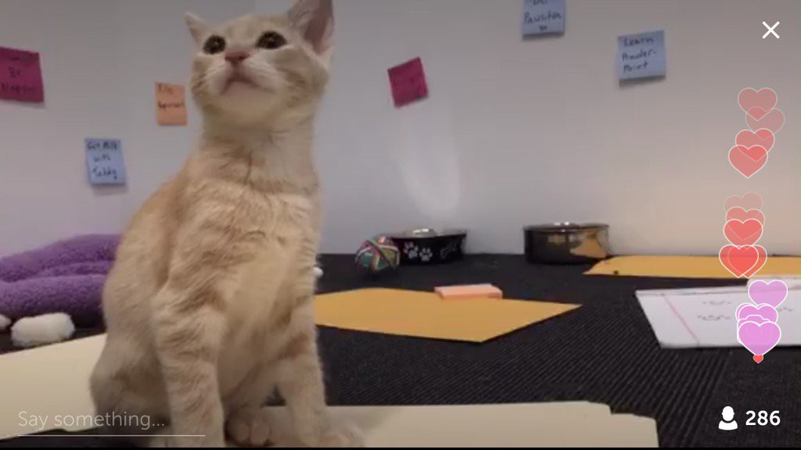
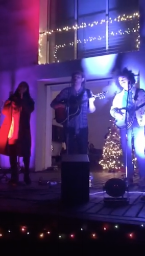
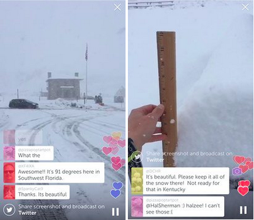
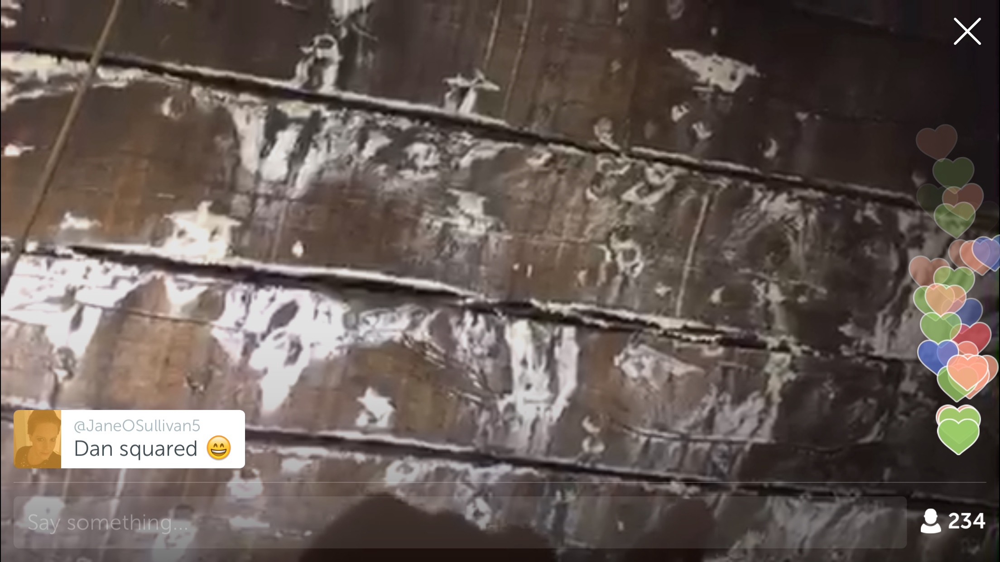
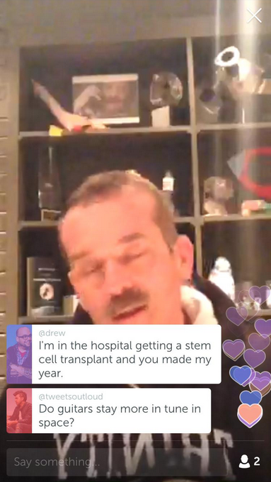

# An (Almost) Year in Review

To celebrate the first 279 days of Periscope, we asked everyone on the team to share their favorite broadcast from 2015. Our choices weren’t necessarily the most viewed or newsworthy broadcasts, but they were certainly the most memorable. We want to thank our incredible community for bringing us these moments, and many more.

Happy New Year and Much Love, 
Team Periscope

# **“**Atop Hawk Hill” by [Couch](https://www.periscope.tv/couch)

I’ve enjoyed many broadcasts from locations near and far in my time at Periscope — from the first cross-country broadcast I watched Kayvon make from the Minneapolis Sculpture Garden that convinced me of the concept, to [PenguinSix](https://www.periscope.tv/penguinsix)’s daily glimpses of his life in Hong Kong. Few broadcasts, however, have stuck with me as much as one made by our own Bill Couch. On the morning that we released Landscape to the general public, I awoke early and immediately opened Periscope hoping to find something to prove to myself that it was all working. By perfect coincidence I found a broadcast Bill had just published in my personal feed. I joined and was instantly greeted by a sublime sight: low-level fog stretching across the San Francisco Bay, with just the towers of the Golden Gate Bridge visible, seen from one of my favorite perspectives in the Marin Headlands. In that moment I knew we had finally made good on our shared dream of seeing the world through someone else’s eyes. No other broadcast quite reached the feeling of sharing another’s experience. I knew exactly where Bill stood, and experienced the world as he was experiencing it — all from the comfort of my bed.
** — [Nils**](https://www.periscope.tv/nils)

# “Heavy rain, new boats arriving” by [Paul Ronzheimer](https://www.periscope.tv/ronzheimer)

Watching the Syrian refugee coverage on Periscope has been really moving for me. I was only a year old when my parents took me and my older sister (then 3) and fled a war torn Vietnam. Until recently, everything I knew and understood about the refugee experience was based solely on my parents’ stories, and reading and watching documentaries about the Vietnamese boat people.

Seeing Syrian refugees share their story first hand, in real time, has been amazing and the periscopes that stand out the most to me are the ones where you see viewer perspectives changing to one of understanding and compassion.
** — [Lien**](https://www.periscope.tv/lientm)

# “Birocratic — Live Beatmaking #BiroMakesABeat” by[ Birocratic](https://www.periscope.tv/birocratic)

Birocratic is a musician that I’ve discovered years ago. I love his music, and often have his Soundcloud channel on repeat while designing Periscope ;D. One day I was getting ready for work and got a push notification about his very first broadcast. I kind of lost it and squeeled through the toothpaste in my mouth (was brushing my teeth at the time). It was fascinating to see the creative process of an artist I admire, completely raw, and happening right at that moment before my eyes. All the struggles, repetitions, false starts, iterations, as well as the sheer joy and energy with which he brought the music I love into being made me not only appreciate his work that much more, but also connected me with him as a human being.
** — [Veronika**](https://www.periscope.tv/verohecko)

__vine__:

# **“Happy #Halloween from Sock Cop! I’m a Vampirate!” by [Sock Cop**](https://www.periscope.tv/jasonburglar)

A long long time ago in a galaxy far away I stumbled upon a talking sock… who apparently was a cop. Just like everyone else I thought “WTF?”. Quickly I was reassured by the talking sock that everything would be ok, that i should “ease into it like a hot bath”. And I did just that. Months later, dozens of late night broadcasts later, I tuned in for a #halloween extravaganza. The Sock decided to be a vampire and a pirate for halloween… if that wasn’t enough for you, he had a black light.
** — [Tyler**](https://www.periscope.tv/tyhan1)

# “Baltimore residents now — very moving” by[ Paul Lewis](https://www.periscope.tv/paullewis)

The Baltimore riots broke less than one month after our launch in March. Coverage of the unrest was limited and we couldn’t get a real sense for what it was like to be in Baltimore. We fell into one of Paul’s broadcasts as he crossed the city, spoke with residents and gave context as events unfolded. This narrative opened his immediate reality to a dynamic, responsive audience. And he empowered this audience to witness and react to urgent and organic stories. It was powerful; these worlds were radically open and unfiltered.
** —[ Alex**](https://www.periscope.tv/alexk)

# “On a ferry. There’s a really bad storm. I’m scared” by Unknown

I’ll never forget this broadcast. I was flying from San Francisco to London and was wondering whether the WiFi was fast enough to make Periscope work. The lighting was dim on the plane since most passengers were sleeping. I was browsing the Map and found a broadcast that caught my eye for two reasons: 1) the title was dramatic and 2) the broadcaster was in the middle of the river (not often you see the red dot in the middle of a body of water. I joined along with 7 other people, watching this woman visibly and audibly terrified. Through her camera you could see the shadow of a ferry captain piloting the boat. You could hear terrential down pour and you could feel the boat rocking left to right through the violent storm. The broadcaster was breathing deeply. I found myself, along with everybody else in the broadcast, sending her comments saying “It’s going to be OK. We’re here with you. You’ll get to the other side soon”. I thought this broadcast was really powerful because it brought all of us together. As viewers, we wanted to help comfort this stranger. As a broadcast, she just wanted to share a scary experience with people because she had nobody to talk to.
** — [Kayvon**](https://www.periscope.tv/kayvon)

# “Watch me kill 🔪👣🎃#Halloween” by Blu[mhouse

This live horror production was such a unique application of Periscope, and I was really impressed by their production value. I really felt like the producers had reimagined their genre, and the incorporation of the audience only enhanced how scary the story was.
** — [Aaron**](https://www.periscope.tv/aw)

# **“Bed Time Stories” by [Adam Yaffe**](https://www.periscope.tv/@adamyaffe)

I fell in love with Adam’s family. They are quirky, cheeky, laugh out loud funny, kind and entertaining simultaneously. My favorite broadcast was when Adam did his #Bedtime show with his wife. They talk about “dating” and their two young sons run into the room and Adam shouts cheek at them because both him and his wife are nakey under the bed. I was in a fit of giggles. The sons were both laughing, and mortified. I am always thoroughly entertained and delighted by what happens next with adam’s family! Adam also coined the term the #PeriFamily thanks to his loyal followers. I ‘ve tried to make this happen in my office, but like ‘fetch’ it’s just not happening!
** — [Abigail**](https://www.periscope.tv/abigail_purcell)

# “Sunset faroe islands” by [tsjohansen](https://www.periscope.tv/tsjohansen)

We had just added the ability to see replays on the Map view, and I was searching around to find broadcasts in areas I wasn’t familiar with. I saw a blue dot between Iceland and Norway in the middle of the ocean and was intrigued. Broadcasts located in the middle of the ocean tend to yield surprises.

While it was a short broadcast from a photographer (and his only one ever) showcasing the sunset he was seeing, I had never heard of these islands before, and when I saw their topography as he panned around, and the light from the sunset, I was immediately struck. “I must visit this place,” I told myself. Since then, I’ve been doing homework on the islands, and talked to friends who have visited them. One of Periscope’s great powers for me is the ability to discover places and cultures and customs I’m not familiar with, and can find new places I want to experience in person.
** — [Bill**](https://www.periscope.tv/couch)

# “Secret Cove outside san francisco — come join our treasure hunt!🙏🙀👹” by Jenn[ifer Paden

These were broadcasted from my girlfriend’s account, while 4 of us were headed to Kirby Cove to camp for a night. It’s probably the most fun I ever had broadcasting, so it’s my favorite.
** — [Thiago**](https://www.periscope.tv/thiagorobert15)

# “We are watching a Penguin Parade!” by [Monterey Bay Aquarium](https://www.periscope.tv/MontereyAq)

This was just a scope of penguins walking around the aquarium — and it’s my favorite! As we watched the group waddle down the carpeted aquarium hallways, our penguin patron/guide to the Monterey Bay Aquarium, Patrick, explained that the walk is an enrichment offered to the birds. The broadcast was as informative as it was adorable and if I could, I’d watch one a day.
** —[ Kim**](https://www.periscope.tv/kats)

# “Leopard in a tree. #migration2015” by[ Garry Van Der Walt](https://www.periscope.tv/@gerryvanderwalt)

It was amazing to be able to watch a live broadcast of a leopard relaxing on a tree branch in its natural habitat in Kenya. The broadcaster added a whole new layer of coolness and creativity to the broadcast by using binoculars to zoom in on the leopard and its meal.
** — [Nader**](https://www.periscope.tv/naderz)

# “Can’t-miss #UberKITTENS Cam” by [Uber](https://www.periscope.tv/uber)

What’s not to love about a super cute kitten cam :) Uber occasionally runs a promotion where local animal shelters go around the city and let you hang out with kittens and puppies — and you can call them right from the app. Unfortunately there’s always such high demand that I’ve never been able to see the kittens myself, but Uber did the next best thing: they Periscoped it! They set up an area in their office at their headquarters where the kittens roamed around, and they Periscoped it all day. It was an adorable break to be able to check in the kittens throughout the day, and it brought a smile to my face.
** — [Sara**](https://www.periscope.tv/pandemona)

# “Goldbirdman” by [Adam Goldberg](https://www.periscope.tv/theadamgoldberg)

This broadcast really demonstrated how Periscope can create entirely new forms of performance entertainment for a live audience. In the broadcast, Adam Goldberg performs an improvised sketch in the style of the movie Birdman while walking around the streets of New York. He takes on the role of Birdman, while the person holding the phone (camera) acts as the sinister voice in the background that represent his darker thoughts. The audience is then able to watch as Adam walks around the city looking frazzled, confused, and speaking to himself, while the deep voice behind the camera yells at him at him in anger and brings him down. Also, while this is all happening, the people in the street around get more and more confused at the scene they are witnessing. It was a really amazing piece of art, and knowing that it was all happening live, with people around the world watching and commenting on the performance felt incredibly special, and really stuck with me as one of the best uses of Periscope.
** — [Pablo**](https://www.periscope.tv/pablo)

# “Old 97 little rock last night of tour” by [Ken Bethea](https://www.periscope.tv/tornillo)

I was surfing in Couch Mode on web (my favorite way to find interesting broadcasts) and suddenly saw the leader singer of the Old 97’s, one of my favorite bands. I immediately grabbed my phone, searched for the broadcast and starting commenting like a true fangirl.

Rhett Miller hasn’t broadcasted before, so I wasn’t expecting to see his face right there staring at me. When I entered the broadcast there were around 20 people, all huge fans of the Old 97’s. Ken Bethea (harpsichordist for the Old 97’s) gave us a tour of their bus, walked around and then took us to sound check. During sound check he asked the audience on Periscope what they should practice. I requested “Book of Poems” and seconds later, they were playing it. Sitting at my desk in San Francisco, I was able to attend a sound check for one of my favorite bands in Little Rock, Arkansas, request a song and be transported somewhere I would otherwise never have access to. Even after watching hundreds of broadcasts everyday, my mind was blown.
** — [Lili**](https://www.periscope.tv/lilisalzberg)

# “Paris Live Place De La République #parisattacks #jesuisparis” by[ Die Welt](https://www.periscope.tv/welt)

This broadcast captured the mood in Paris, the day after the attacks, with respect and empathy for the victims, mourners and city. The broadcast focused on those laying tributes at Place De La Republique. Speaking very few words, the broadcaster captured the somber tone, broadcasting for over an hour and 25 mins. It was both moving and extraordinary to be transported to that scene, live, and to be given an opportunity to grieve with Paris from across the Atlantic.
** — [Nick**](https://www.periscope.tv/nicksallon)

# “It’s Strange — K.Flay” by [Justin Starry](https://www.periscope.tv/starry)

I recently moved across the country and before I left Boston my friend and I tried getting tickets to a show featuring an artist we had just discovered named K.Flay. Unfortunately the show had sold out and we missed the opportunity to see her. Fast forward a few months and I got tickets to see K.Flay and while at the show I Periscoped my favorite song. To my surprise, my friend in Boston tuned in almost immediately and we were able to share that moment that was otherwise impossible due to the sold out tickets a few months ago.
** — [Justin**](https://www.periscope.tv/starry)

# **“**The Wilder Society Xmas Backyard Sessions” by [The Wilder Society](https://www.periscope.tv/wilder_society)

It was a backyard christmas party in Santa Monica. There was a no-name band on the deck in front of a glowing christmas tree visible through the open sliding glass door. There was a guitar, banjo, and backing singer doing a loose arrangement of the First Noel. They all had good voices. They seemed to be the first in a long line-up that would follow. I liked the music but it was also just personal resonance and nostalgia. It reminded me of LA where I used to visit my wife before we got married. It reminded me of earlier times when I knew more musicians. They seemed like people I might like to know.

But really, I don't have one favorite broadcast. I've found that when I watch broadcasts indiscriminately during daylight hours, I come away having seen some cool stuff in aggregate. Once I saw a chubby 10-year-old in sweats asking for hearts to motivate him through his ridiculous martial arts exercise routine. Sweetest kid ever.
** — [Mark**](https://www.periscope.tv/marmars)

# Unknown by [David Blaine](https://www.periscope.tv/davidblaine)

In the early days, David did a couple of magic tricks and showed one of his friends that does live art. Both of these broadcasts were so rad to see because they were happening live. For the magic tricks, it was just like being right there with the other viewers. The things he does blows your mind and to see it live was even better.
** — [Judette**](https://www.periscope.tv/jtplatz)

# Everything by [Yellowstone National Park](https://www.periscope.tv/yellowstonenps)

I like yellowstone. I cannot go there myself so watching it is cool.
** — [Jonathan**](https://www.periscope.tv/jle)

# “I’m a brain scientist, ask me anything” by [Ian McLaughlin](https://www.periscope.tv/@_Anthropoid)

I love Ian’s broadcasts because it gives viewers the opportunity to ask questions and interact with a neuroscience PhD candidate, someone whom I likely wouldn’t have met in real life and do it in a way which is much less tedious and more fun than having a text-only back and forth. There’s huge potential for subject matter experts from many fields to connect with viewers from around the world and learn something new from an experts in those fields. I especially like that Ian considers his regular Periscope sessions a way to improve his skills in communicating to a layperson about his passions as well as a way to stumble upon and think through subjects he may not have thought of himself.
** — [Suyash**](https://www.periscope.tv/suyash)

# “Up close to Henry VIII’s flagship: Mary Rose. Recovered after 400 years on the seabed.” by [Dan Snow](https://www.periscope.tv/thehistoryguy)

One of my favourite broadcasters is the historian Dan Snow. His depth of knowledge, great camera work and interaction with his audience has turned his tours of museums, castles and even the site of ancient Troy into fantastic experiences. One of the best was his tour of Henry VIII’s flagship the Mary Rose, buried in the Solent for over 400 years. He took advantage of special access to the ship, using a crane and a colleague broadcasting a second viewpoint to answer our questions and give us real insight into this famous ship and its history.
** — [Geraint**](https://www.periscope.tv/geraint)

# “Grand Army Plaza in Brooklyn” by [NYC Parks](https://www.periscope.tv/nycparks)

I came across NYC parks on the featured users list. Although, I’ve never been to New York, I’ve always wanted to visit and finally have a trip planned for February. Of course, the internet is a great resource and I could easily research things to do. But it’s hard to find things that are really unique, historical and exclusive. That’s one of the reasons I followed NYC Parks. In this particular broadcast, a team of experts guides us (the viewers) through the arch at the park. The arch is closed to the public so it was really cool seeing something that I would be able to see, even when I visit New York. The views from the top of the arch were spectacular! There was the Manhattan skyline on one side and on the other side you could see the famous Brooklyn Library.
** — Jag**

# “Playing Guitar” by [Chris Hadfield](https://www.periscope.tv/Cmdr_Hadfield)

I had just gotten the Periscope beta and it was the first broadcast I ever joined, so I wasn’t really sure what to expect. I was walking off a ferry that had just docked in San Francisco, watching Commander Hadfield sitting in his home office, playing guitar and simply talking to the handful of us who were watching. I had planned on calling an Uber, but I became so caught up in this broadcast that, 20 minutes later, I realized I’d walked the whole way home while watching it. Someone asked him what his greatest fear while in space was. Another asked if he’d play us Space Oddity. He did, and it was fantastic. 
** — [Jonah**](https://www.periscope.tv/jonah)

# We can’t wait to see what 2016 brings!

