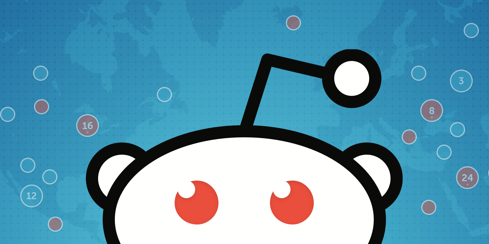

# **/r/periscopes**

Periscope’s success is built upon our dedicated community of broadcasters, audience members, and more inconspicuously, yet no less notably, curators — individuals who often find and highlight the most interesting moments on Periscope. As we navigate the limitless world of broadcasts, we are constantly in search of interesting and thought-provoking broadcasts to share with all of you. Today, these community curators bring some of the most compelling and diverse broadcasts to our attention. To give these curators a more pronounced voice, we are launching our subreddit [/r/periscopes](https://www.reddit.com/r/periscopes/) (with an “s”).

>> We hope that our subreddit will provide another avenue for us to connect with the broader Periscope community and facilitate a dialogue around the most exciting and compelling broadcasts.

Reddit is a creative and collaborative community, and with your help, we hope to discover more broadcasts to highlight on a regular basis. Together, we will also find new broadcasters — people who are using the platform in innovative ways and pushing the boundaries of Periscope.

We are often asked what we consider worthwhile enough to surface to our global community. Here are a few factors we believe make for compelling broadcasts:

* **Creativity:** Broadcasts should feel original, expressive and inspire others to experiment.

* **Interactivity: **The most interesting broadcasters interact directly with their audience.

* **Relevance:** Periscope broadcasts often address timely subject matter, such as breaking news, specific themes or remarkable events.

* **Unique Perspective: **The broadcast should ideally provide a unique view on the world.

* **Interesting Content: **We love broadcasts that make you want to see more or show you something new.

With these attributes in mind, we encourage you to share any interesting broadcasts you come across with the community on /r/periscopes with a brief explanation as to why you were intrigued by it. To foster effective, dynamic discussion on this forum, we would also love to hear your perspective on what other people post through comments and votes. Please review our subreddit rules below, and we can’t wait to discover amazing broadcasts together!

### **Do**

1. Every submission must be a direct link to a Periscope broadcast that you think is either **feature-worthy** (in app, on Twitter, or in blog posts) or **interesting (**but maybe not perfect).

1. With your submission, write why you love it or what makes it special.

1. Upvote broadcasts when someone has submitted something you love.

1. Keep comments on topic.

1. Have fun and respect every individual’s unique taste (every voice is important!)

### Don’t

1. Submit your own broadcasts.

1. Submit a broadcast someone else has already submitted.

Much Love,
Team Periscope

