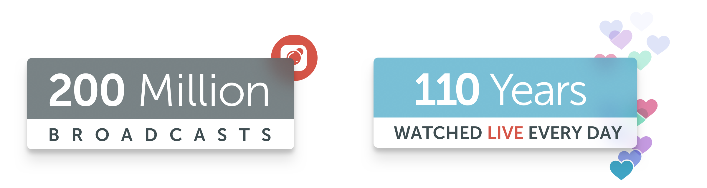
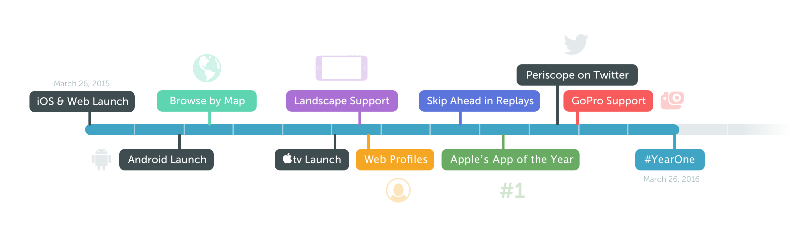

# Year One

Dear Periscope Community,

Saturday marked one year since we released Periscope to the world. We’ve come a long way since then and we have you, our community, to thank.

We’re proud of what we’ve built together and we’re excited to share just how far we’ve come. As of today, over **200 million broadcasts** have been created on Periscope and over **110 years of live video are watched every day **on iOS and Android ([*read more here](https://medium.com/@periscope/periscope-by-the-numbers-6b23dc6a1704#.hs3fv4h4a) about why we value “Time Watched” as a metric*). For everyone who joined us along the way, we hope this reaffirms that you are a part of something bigger. Thank you for making Periscope a vibrant global community– it means everything to us.

Cheers to a great first year!

Much love,
Team Periscope

