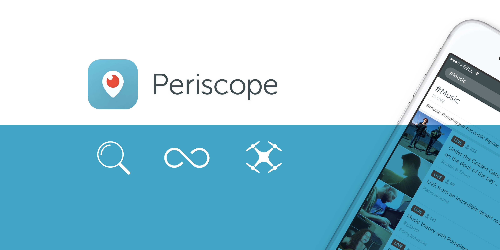
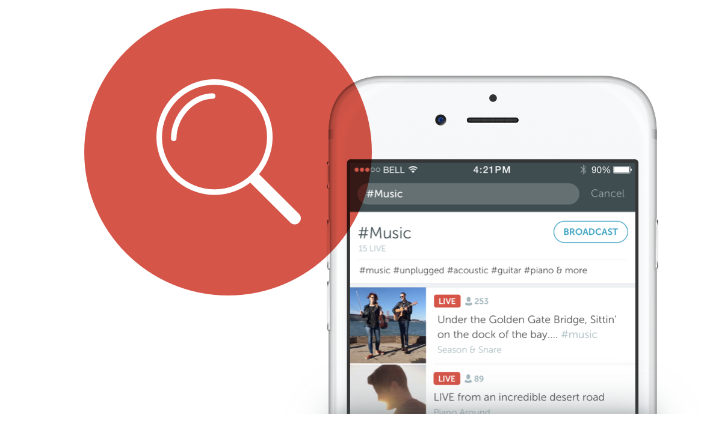
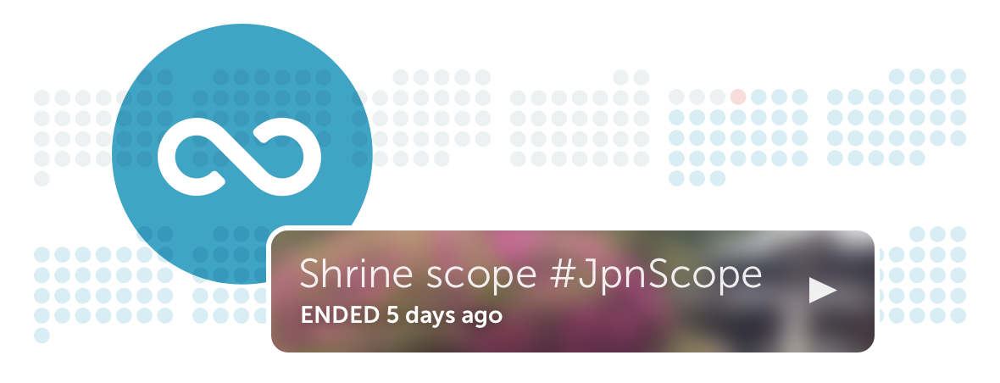

# Coming Soon: Broadcast Search, Drones and Save Beyond 24 Hours

Dear Periscope Community,
 
Everyday, our community creates amazing broadcasts — whether visiting a new place, performing a song, or sparking a passionate discussion. In the coming weeks, we’re launching broadcast search and drone support to help people form communities around the topics they care about and broadcast from new perspectives. We also want to share a preview of our full beyond 24 hours approach that will be available in the coming weeks.

# **Search for Broadcasts You’re Interested In**

In the coming weeks, you’ll be able to search for broadcasts by title or topic. When you tap on the search button in the Global List, you’ll see a list of suggested topics to search for, including #Travel, #Music, #Food and more. To broadcast about a topic, simply tap the Broadcast button in the topic’s search results to add the relevant hashtag, or add the hashtag to your title directly.
 
We’re also testing two special topics that you can search for. In “First Scope,” you can welcome new broadcasters to our community. In “GoPros and Drones,” you can find broadcasts from GoPros and, for the first time, drones!

# A New Perspective with Drones

To broadcast from a supported DJI drone, just connect your iPhone to your drone’s remote. We’ll automatically pull in your drone’s video feed and let you switch between it, your iPhone cameras and even your GoPro. During your broadcast, you can narrate from a bird’s eye view using your phone or even [Sketch](https://twitter.com/periscopeco/status/725452090244521984) on the broadcast to highlight different sights:

> Broadcast from a bird&#39;s eye view with drones! Available on iOS soon.https://amp.twimg.com/v/bd34a01f-bda2-4b5c-8975-0db0f6c75db2 ...
> 
&#x200a;&mdash;&#x200a;<a href="https://twitter.com/periscopeco/status/729703816472338432">@periscopeco</a>

[**Watch**](https://www.periscope.tv/Zagat/1nAKEwYndllJL) Zagat’s drone broadcast from a New York farm.

Anyone with an iPhone and a [supported DJI drone](https://help.periscope.tv/customer/portal/articles/2421540) will be able to start broadcasting in the coming weeks.

# Save Your Broadcasts Beyond 24 Hours

Last week, we [introduced](https://twitter.com/periscopetv/status/728031744847433729) a public beta for you to add #save to your broadcasts to keep them beyond 24 hours. Today, we want to give you a preview of the full solution that we’re launching in the next few weeks.

Our goal is to give you full control of your broadcasts. Soon, your broadcasts will be automatically saved on Periscope and Twitter with comments and hearts. Should you change your mind, you can still delete your broadcasts at any time in the post-broadcast screen or in your profile. And, for those of you who still want your broadcasts to be removed after 24 hours, you can easily configure that in your account settings.
 
We hope these updates will make it easier for you to find broadcasts and communities that you care about. To learn more, visit our Help Center for [search](https://help.periscope.tv/customer/portal/articles/2421534) and [drone broadcasts](https://help.periscope.tv/customer/portal/articles/2421540).

Much love,
Team Periscope

**Downloads
**[Screenshots](https://www.dropbox.com/sh/i3i5x2suij8p3zo/AAAuoack62jAiHyoXKz5CAkaa/Images?dl=0)

