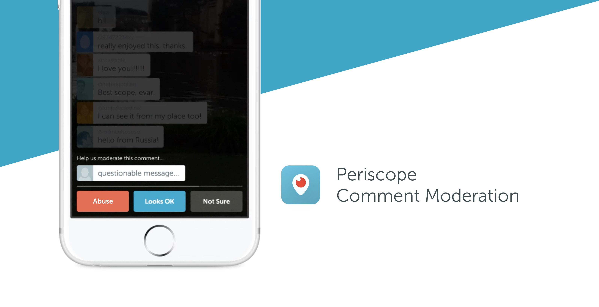

# Introducing Comment Moderation

Dear Periscope Community,

We’ve seen incredible communities and real-life friendships form on Periscope because it’s live, unfiltered and open. We’ve also seen broadcasters get discovered and quickly grow a large, public following. But with this openness comes an increased risk for spam and abuse, and this is something that we take seriously.

Above all, we want our community to be safe on Periscope. Comments are a vital part of the experience and we’ve been working hard on a system that still feels true to the live and unfiltered nature of our platform. Specifically, we want to develop a system that is:

* **Transparent**:** **People should clearly understand how comments are being moderated.

* **Community-led**: People in a broadcast are best suited to determine what’s okay and what’s not. Context matters — for example, a comment that might be okay in a comedy broadcast might not be okay somewhere else.

* **Live**: Because Periscope is real-time, people should be able to report and moderate comments as they appear on the screen.

Today, we’re rolling out a comment moderation system that empowers our community to report and vote on comments that they consider to be spam or abuse.

__gfycat__:

Here’s how it works:

1. During a broadcast, viewers can **report comments as spam or abuse**. The viewer that reports the comment will no longer see messages from that commenter for the remainder of the broadcast. The system may also identify commonly reported phrases.

1. When a comment is reported, **a few viewers are randomly selected** to vote on whether they think the comment is spam, abuse, or looks okay.

1. The result of the vote is shown to voters. If the majority votes that the comment is spam or abuse, the commenter will be notified that their ability to chat in the broadcast has been temporarily disabled. Repeat offenses will result in chat being disabled for that commenter for the remainder of the broadcast.

We’ve designed this system to be very lightweight — the entire process above should last just a matter of seconds. That said, if people don’t want to participate, broadcasters can elect to not have their broadcasts moderated, and viewers can opt out of voting from their Settings.

This system works in tandem with other tools that we have in place for our community. You can still [report ongoing harassment or abuse](https://help.periscope.tv/customer/portal/articles/2313190), [block and remove people from your broadcasts](https://help.periscope.tv/customer/portal/articles/2016653), and [restrict comments to people you know](https://help.periscope.tv/customer/portal/articles/2051924).

There are no silver bullets, but we’re committed to developing tools to keep Periscope a safe and open place for people to connect in real-time. We look forward to working closely with you and everyone else in the community to improve comment moderation.

To learn more, visit our [Help Center](https://help.periscope.tv/customer/portal/articles/2442663).

Much Love,
Team Periscope

**Downloads
**[Press Assets](https://www.dropbox.com/sh/mt86qvfyz8vb930/AAALSkbfwO1N50thksVH4xbba?dl=0)

