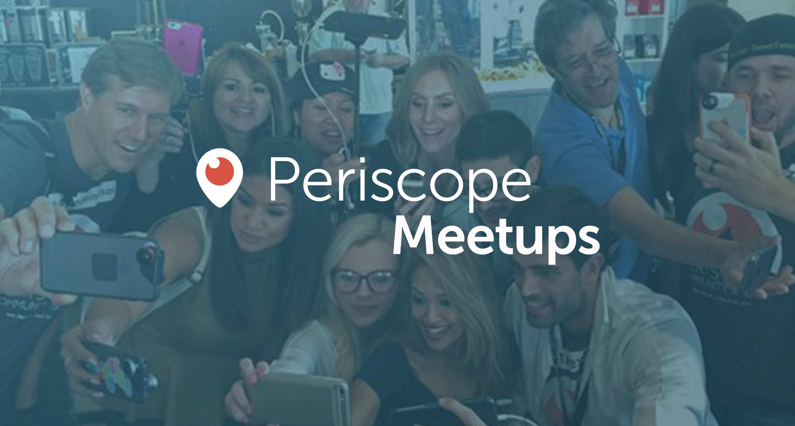
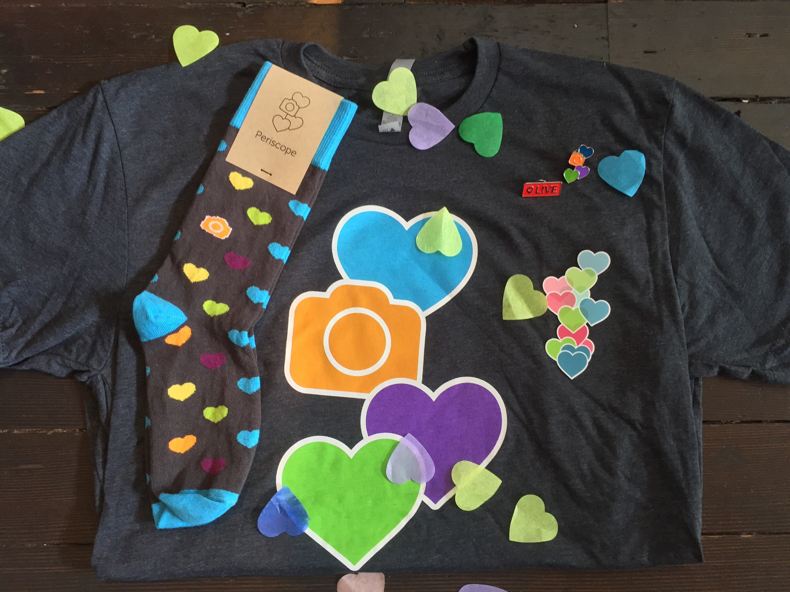

# Let’s All Hangout IRL!

Some of our favorite moments since launching Periscope have been meeting our community in person. From our surprise happy hour at our San Francisco office to meeting up with broadcasters in Atlanta, to mingling in a Parisian studio, each gathering has been inspiring and rewarding. We know many of you have been planning your own meetups (or want to!), and we would love to help support them. Whether you are interested in planning an event or simply attending one, we want to help make these experiences more fun and accessible for everyone in the community. We are excited to start supporting these in a meaningful way, and hope the following tips, tricks and FAQs will inspire you
 
 If you are planning a meetup:

* Keep meetups simple, and make sure they are as open as possible. One of the best things about the Periscope community is that anyone can be a part of it. Meetups should be the same.

* Pick a unique hashtag for the event — it will help you promote and connect with others, make your broadcasts more discoverable and encourage people from all over the world to join via Periscope.

* Plan meetups around a topic or location. Want to get all the #PottersofPeriscope together? Or just want to meet everyone else in Paris that loves Periscope? Picking something to center your meetup around will attract more people!

Ready to start planning your own meetup? Amazing! We are so excited to hear about it. Please fill out [**this form**](https://docs.google.com/forms/u/0/d/1wRaCnGSn1H9UdJtQKCpj4Cy0fvXbT3pAYaUaJr_AuFk/edit) to keep us in the loop. Here are a few things we can do to help support your meetup:

* Promote it! We will be updating [**our events page](https://periscopemeetups.splashthat.com) **with all meetup dates and locations so others can find your event. We will also tweet out events to keep more people up-to-date.

* Periscope Party Packs! An essential part of any good party is some sweet swag. We will send a Periscope Party Pack to the host of the event to help get the party started.

Have you already planned a meetup and want to tell us about it after the fact? Send us pictures from the meetup, the list of attendees, and your favorite broadcast of the event to meetups@periscope.tv!
 
If you are not a planner, but would still love to attend a meetup, make sure to check [**our events page](https://periscopemeetups.splashthat.com).** We will be updating it with dates, locations and event details to keep you all in the loop!
 
To kick-off these amazing IRL events, we will be hosting two meetups of our own in Los Angeles, CA and London, UK! If you live nearby,** [please RSVP for one of our two upcoming events! **](https://periscopemeetups.splashthat.com/)
 
Much Love, 
Team Periscope

### FAQ

**How do I decide where to host my event? **
Pick somewhere central that is easily accessible by all. Local parks, landmarks and restaurants are all great places to meet up with your favorite scopers. 
 
**How do I promote my event? **
Broadcast about it on Periscope! Tweet about it! Share on other social networks. Most importantly, make sure to [share](https://docs.google.com/forms/u/0/d/1wRaCnGSn1H9UdJtQKCpj4Cy0fvXbT3pAYaUaJr_AuFk/edit) with us so we can help you promote it! 
 
**I want to plan a meetup, but I don’t have any ideas…help!**
Meetups don’t have to be complicated! A few fun ideas for a meetup are:

* Picnic in a local park

* A walking tour of your favorite neighborhood

* Attending a local trivia night together

**What items are in a Periscope Party Pack? **
Each Party Pack will contain the following:

* Name Tags

* Periscope Balloons

* Stickers

* One surprise item for everyone who attends the meetup

Note that we are only able to send party packs if we have 3 weeks’ notice! Please make sure to give us enough of a heads-up in order to get the items shipped to you in time.

**What if I want special Periscope items for my meetup? **
If you want something special, please make the request ASAP, and we will do our best to accommodate. We can’t make any promises with special requests, but we do promise what comes in the party pack is pretty fun!
 
**What if I want to cancel my event?**
If you need to cancel your event, let us know ASAP so we can remove it from [the site](https://periscopemeetups.splashthat.com/?preview). Remember to notify anyone that has RSVPed to you as well. If we have already sent you a Party Pack, we ask that you hold on to it and use it at your next event!

