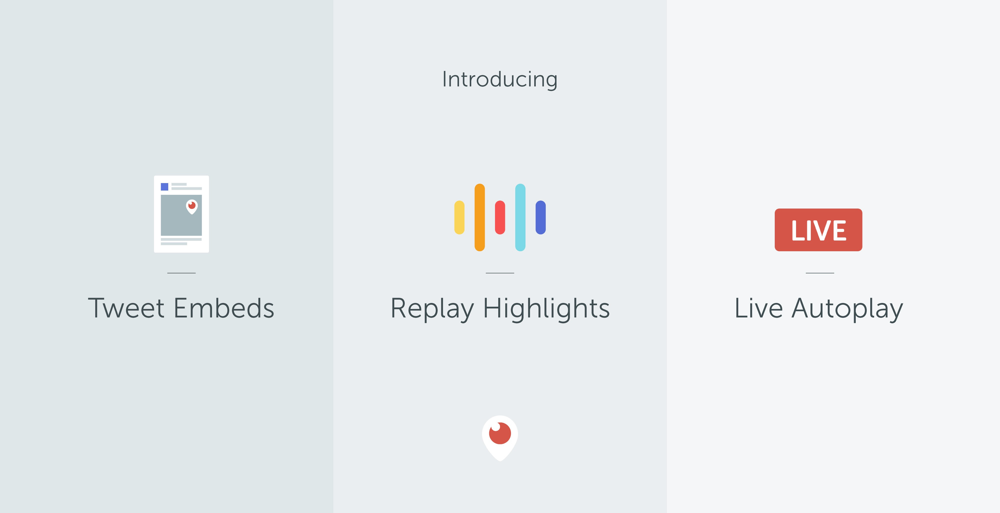

# **Introducing Replay Highlights, Periscope Tweet Embeds and Live Autoplay**

Dear Periscope Community,
 
There are hundreds of millions of live and replay broadcasts on Periscope, and more get added everyday. We’re introducing three new features today to make it easier for you to discover and watch the broadcasts that you’re interested in.

### Watch Replay Highlights

With so much to watch, we want to make it easier for you to find the best moments on Periscope. We’re introducing a new feature called Highlights, which automatically generates a short trailer for every Periscope broadcast. You can watch highlights of your home feed to catch up on broadcasts you missed from the last day, highlights of somebody’s profile to get a flavor for their previous broadcasts, or highlights of any search result (like #NoBillNoBreak or “pottery”) to get a convenient overview of any topic.

We look at a variety of signals to determine what parts of a replay should be included in a highlight and will continue to improve these signals over time. We hope that highlights make watching multiple replays an easy, engaging and seamless experience.

### **Play Periscope Broadcasts in Embedded Tweets**

Exciting moments unfold live on Periscope and Twitter — from breaking news like [#NoBillNoBreak](https://twitter.com/ScottPetersSD/status/745693620892766208?ref_src=twsrc%5Etfw) and [recent protests](https://www.rt.com/news/352494-gay-pride-rally-jerusalem/) to sports events like [Wimbledon](https://twitter.com/Wimbledon/status/752460713348694016) and the [MLB All-star Game](https://twitter.com/MLB/status/752977528931823616). Starting today, you’ll be able to embed these Periscopes anywhere on the web by simply embedding the Tweet. Media outlets such as [El Pais](http://elpais.com/elpais/2016/07/21/actualidad/1469098810_215849.html), [Le Parisien](http://www.leparisien.fr/culture-loisirs/tv/accuse-d-avoir-incite-des-comediens-a-se-denuder-morandini-va-s-exprimer-19-07-2016-5979283.php), [Mashable](http://mashable.com/2016/07/20/twitter-periscope-tweet-embeds), [Mic](https://mic.com/articles/147242/house-democrats-hit-with-ethics-complaint-after-gun-control-sit-in#.O7NxlM1An), [RT](https://www.rt.com/news/352494-gay-pride-rally-jerusalem/), [Veja São Paulo](http://vejasp.abril.com.br/blogs/miguel-barbieri/2016/07/20/cinema-periscope/) and [Washington Post](https://www.washingtonpost.com/news/the-fix/wp/2016/06/22/the-real-reason-c-span-cameras-arent-showing-democrats-gun-control-sit-in/) are already bringing their stories to life using this feature.

> LIVE on #Periscope: On the range with Jason Dayhttps://www.periscope.tv/w/al9XzDI2NjYwM3wxWXFLRGJhZ2tCd0pWcO_NFFEC7oRDha8vzihMO5yjhns9rmKEuEFJvR25nUU= ...
> 
&#x200a;&mdash;&#x200a;<a href="https://twitter.com/pgatour/status/756088383483613184">@pgatour</a>

> LIVE on #Periscope: Clashes in #Gazi #Istanbul #Turkeyhttps://www.periscope.tv/w/alpFUjFZTEVKellSV2dFTm58MU95S0FiYXFuTk9HYupxYC3Zqx8tTg2Er9CO5jPuAkl06bms9Ymh27CWDHiD ...
> 
&#x200a;&mdash;&#x200a;<a href="https://twitter.com/rt_com/status/754694153473261574">@rt_com</a>

To find Periscope broadcasts to embed, you can search for “#Periscope” with other keywords on [Twitter](https://twitter.com/search?q=%23periscope&src=typd).

### **Autoplay Live Broadcasts on Android**

On Android, live broadcasts will autoplay in the Watch Tab and Global Feed without sound, so you can see what’s happening around the world immediately when you open Periscope. If you find a broadcast interesting, you can simply tap to get the full live experience. 
 
Replay highlights will be be available on iOS and Android in the next few days, while autoplay will be available on Android first with iOS coming soon. Learn more about [embedded Periscope tweets](https://dev.twitter.com/web/periscope), [replay highlights](https://help.periscope.tv/customer/portal/articles/2016183), and [live autoplay](https://help.periscope.tv/customer/portal/articles/2016183). We can’t wait for you to try these new ways to discover and watch broadcasts on Periscope.

Much love,
Team Periscope

P.S. For more, check out our broadcast on these new features:

> LIVE on #Periscope: New Periscope Features - Highlights, Web Embeds, Autoplay!https://www.periscope.tv/w/al-qdTl8MW1uR2VrZURXcUx4WC9F7h_En0cHLb0yXb0WhNClFcwyvZQA4ByPzhEfndeZ ...
> 
&#x200a;&mdash;&#x200a;<a href="https://twitter.com/periscopeco/status/756177140710637569">@periscopeco</a>

