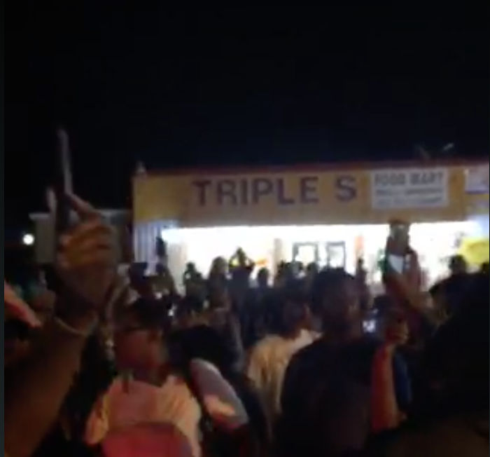

# Officer-Involved Shootings

### What’s next after Alton Sterling and Philando Castile protests?

It’s been two weeks since police shot and killed Alton Sterling and Philando Castile — deaths caught on video in separate incidents less than a day apart, igniting a wave of protests calling once again for reforms to end racial inequities in the criminal justice system.

Some marchers used Periscope to provide interactive live streams, capturing emotional, raw footage, including the on-camera arrest of prominent Black Lives Matter leader DeRay McKesson. We’ve collected some of the more notable clips below, from the night Sterling was killed through a live stream of his funeral last Friday.

Visceral images are powerful; data and research appear to be lagging behind. Records of officer-involved shootings are collected haphazardly, with much of it provided voluntarily by local police departments, many of which do not participate. Even so, disturbing patterns are visible. One of the most prominent studies to date, an analysis by [**ProPublica](http://www.propublica.org/article/deadly-force-in-black-and-white) **of admittedly incomplete FBI records from 1980-2012, concluded black teens were 21 times as likely as white teens to be shot and killed by police between 2010–2012.

Such disparities may not be new, but they are newly visible due to cell phone cameras and social media. Will these prove powerful enough to provoke real inquiry, and change?

> Protesters outside Triple S Food Mart in Baton Rouge, after alleged police shooting caught on video. @kelsthegreat_https://www.periscope.tv/kelsthegreat_/1YpKkpNQqOjGj ...
> 
&#x200a;&mdash;&#x200a;<a href="https://twitter.com/periscopetv/status/750720436372119553">@periscopetv</a>

> LIVE on #Periscope: Press conference: Mayor Holden &amp; BRPD Chief Dabadie give statement on officer involved shootinghttps://www.periscope.tv/w/akvTcTFKUkttWlpZb3B2alB8MXlvSk1MQWdEcFJHUeHoIrt_3yn-yL6tBVxIGVed1H-mvSiqaJIFJWDcpZA2 ...
> 
&#x200a;&mdash;&#x200a;<a href="https://twitter.com/brpd/status/750723589788225536">@brpd</a>

> LIVE on #Periscope: New York protests over last nights shootings in the US #BlackLivesMatter #PhilandoCastile #Alto...https://www.periscope.tv/w/ak16cTFXZ0VnYWJXQVlBS3Z8MVBsSlFqYVFlUWR4RTKURbMqIR30nolX6iKE2ofTQgllpoitLmLpFy_jw30O ...
> 
&#x200a;&mdash;&#x200a;<a href="https://twitter.com/radiokermath/status/751177793694683138">@radiokermath</a>

> LIVE on #Periscope: #blacklivesmatter protest Londonhttps://www.periscope.tv/w/ak6iTTFyYVFaRERkcm5Yanp8MURYR3ladm9udnlKTQdCT_DXJ_zIK4uLtPl9V5PgUxf1sGFbwQzNpxofGiSk ...
> 
&#x200a;&mdash;&#x200a;<a href="https://twitter.com/osx_ail/status/751495460712550401">@osx_ail</a>

> @deray is arrested at 4:45 for walking on the highway during a #BlackLivesMatter protest in Baton Rouge, LAhttps://www.periscope.tv/w/alBq0Dg2Mjg0MDV8MURYeHlaanZyV1ZLTfx3RD7nWL_3TQzX2qKrNjWkHAs03oQOWSpo4x-YI1Zk ...
> 
&#x200a;&mdash;&#x200a;<a href="https://twitter.com/periscopetv/status/751986572891828224">@periscopetv</a>

> LIVE on #Periscope: Saint Paul highway protesthttps://www.periscope.tv/w/alB0nzEyOTQ0NzgwfDFqTUpnbm1CZ1htR0wpnsmfrUIlPetoUP692ktbLPredFTYrXOAdl85D6Sldw== ...
> 
&#x200a;&mdash;&#x200a;<a href="https://twitter.com/little_goon/status/751996163033853952">@little_goon</a>

> LIVE on #Periscope: Alton Sterling Funeralhttps://www.periscope.tv/w/alemZDExMzkzfDFncXh2QmVXRXpreEK9Wm7Y2qmAroXln8BSVu_z-XGBfmAiBk4H6ywZ3EEIlg== ...
> 
&#x200a;&mdash;&#x200a;<a href="https://twitter.com/fusion/status/753973749217505281">@fusion</a>

