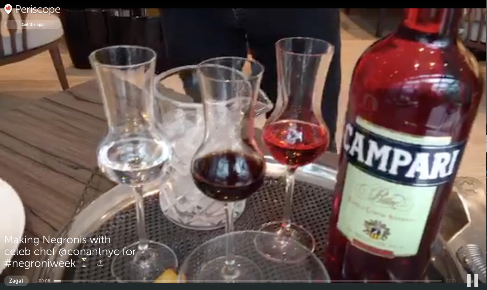

# You Are Getting Very Thirsty…

In 1947, the Negroni was still relatively unknown in the United States. Orson Welles tried the apéritif in Rome while filming *Black Magic,* a now-obscure picture adapted from an Alexandre Dumas novel about a hypnotist who chooses the dark side. “The bitters are excellent for your liver, the gin is bad for you,” he wrote in a letter to a newspaper back home. “They balance each other.”

The Negroni is now recognized as a cocktail classic, and fans will find an excellent how-to below from celeb chef Scott Conant. Following up is a full-course meal of some of our favorite foodie Periscopes: More drinks, extremely healthy food, extremely unhealthy food, dessert and a bonus from food bible Zagat for chocolate lovers.

### Cocktail hour

> @Zagat on #Periscope: Making Negronis with celeb chef @conantnyc for #negroniweek http://periscope.tv/w/aiXjjDg2Mjg0MDV8MXZBeFJSQW1Scnp4bFy-kOtO0w9cAttcSCoX0HSeSGNSLBgYNGQR0Gkztapq ...
> 
&#x200a;&mdash;&#x200a;<a href="https://twitter.com/periscopetv/status/740295578425298944">@periscopetv</a>

> LIVE on #Periscope: Making my Pepperdime cocktail at my new restaurant @georgie_bh at Montage Beverly Hills #Cockta...https://www.periscope.tv/w/al1IwTFNV0V3ZEx6bUp4UWJ8MWRqR1hYekFyTUVHWmH7UH_SBVlP1jv-dVuyTI7zqdWR3vytEdRl-_ILpUmG ...
> 
&#x200a;&mdash;&#x200a;<a href="https://twitter.com/gzchef/status/755522474930937856">@gzchef</a>

> LIVE on #Periscope: Ask a bartender! Mixing cocktails at Brooklyn&#39;s @MaisonPremiere with @mokeshow https://www.periscope.tv/w/akQZ4DEwNTg4NDExfDFybXhQcE5wTW9YeE7PnaxaA4Dw9gqyrhMEXQXpen2RP8NUGv79Wu34WT7itg== ...
> 
&#x200a;&mdash;&#x200a;<a href="https://twitter.com/zagat/status/748600192006524928">@zagat</a>

### Make something healthy…

> Add this colorful side veggie dish to your next dinner table! @churchill_danhttps://www.periscope.tv/w/akQNyTg2Mjg0MDV8MVJER2x3V3BqRE1LTL9avOalqzhIouUHg1ggiDaw7ghsIVx3CqP7RFIvWH3z ...
> 
&#x200a;&mdash;&#x200a;<a href="https://twitter.com/periscopetv/status/748588392162553856">@periscopetv</a>

> LIVE on #Periscope: Kale chips. I make them. We discuss.https://www.periscope.tv/w/ak7e5zE2NjQ1Nzh8MXlOeGFSTnZERWdLamO55vPFzLxyMc1DgufY6DTgH4DqmChFNAUFrHbyg1Wr ...
> 
&#x200a;&mdash;&#x200a;<a href="https://twitter.com/annavocino/status/751560526602203136">@annavocino</a>

> LIVE on #Periscope: #Vegan 4th of July Dessert #cookalong with @twitterfoodhttps://www.periscope.tv/w/ajrYBTI0MzQxN3wxT2RKcndZT1pQcHhYx4aT4qm_ukLPzxZJ7HgQ-FhI0dggSI5cNeATpFhTcTs= ...
> 
&#x200a;&mdash;&#x200a;<a href="https://twitter.com/jerryjamesstone/status/746055579206979584">@jerryjamesstone</a>

### … or not.

> LIVE on #Periscope: Making a monster burger in a secret test kitchen https://www.periscope.tv/w/akLtWTM2NXwxbkFLRXFSVk1lbEtMXnMrCajBHxT1e5Tw9KU74ACJENzmeMplojcESlcD4GQ= ...
> 
&#x200a;&mdash;&#x200a;<a href="https://twitter.com/robbyjayala/status/748277506743078912">@robbyjayala</a>

### Either way, make sure you keep room for dessert.

> LIVE on #Periscope: Healthy Soft Serve #Cookalong with @churchill_dan @twitterfood &amp; @periscopetvhttps://www.periscope.tv/w/ak1M4zg5OTg3ODh8MVlxS0RWcWJvWGFKVqHq0p9nSoINEenJi331CLUY_xXsPUFtAdLkbd_LQjTq ...
> 
&#x200a;&mdash;&#x200a;<a href="https://twitter.com/churchill_dan/status/751128884230426624">@churchill_dan</a>

> LIVE on #Periscope: It&#39;s James&#39; Birthday So We&#39;re Making Him A Cake (In A Mug)https://www.periscope.tv/w/akUkiTEzOTk5OTd8MXJteFBwUVdXb0x4TqRjOupH3eSq6tGOhcQCI8Judi26uAmyAzq3gWMAgpMa ...
> 
&#x200a;&mdash;&#x200a;<a href="https://twitter.com/sortedfood/status/748886515955146752">@sortedfood</a>

> @JanisBakes on #Periscope: Finishing up Pokemon cookies. And emojis. And bachelorette. On a perfect pool day. http://periscope.tv/w/al15ajg2Mjg0MDV8MXpxS1Z6Z25tcm1LQsc8RcJZnfqS9A0uO8KrWHciqCmdQzEX0kaNoavf4i9F ...
> 
&#x200a;&mdash;&#x200a;<a href="https://twitter.com/periscopetv/status/755574889419898880">@periscopetv</a>

### Still hungry? Join Zagat for a decadent dive into chocolate.

> @Zagat on #Periscope: Inside @jacquestorres 40,000 sq ft chocolate factory with the man himself. All of the !http://periscope.tv/w/ah3DwDg2Mjg0MDV8MU93R1diT01WWVpLURCwWoLAkaLnGf23PRayHP26klN4sBrh0kdx4HDB_6m_ ...
> 
&#x200a;&mdash;&#x200a;<a href="https://twitter.com/periscopetv/status/738062569441656833">@periscopetv</a>

