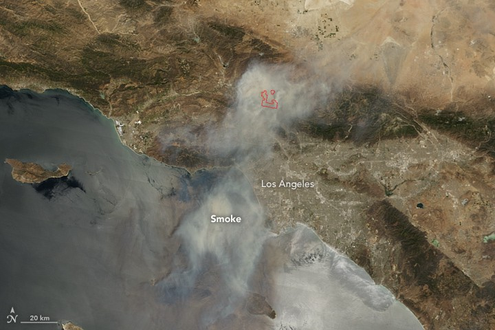

# Scenes from the Sand Fire

>> *The effects of global warming on temperature, precipitation levels, and soil moisture are turning many of our forests into kindling during wildfire season.*— [Union of Concerned Scientists](http://www.ucsusa.org/global_warming/science_and_impacts/impacts/global-warming-and-wildfire.html#.V5pAQJMrLUI)

Sand Canyon is a chapparal and brush covered stretch of the San Gabriel Mountains on the northwestern edge of Angeles National Forest near Los Angeles. On July 22, a fast-moving blaze exploded out of its steep gullies and nearby Placerita Canyon, threatening thousands of homes in the city of Santa Clarita to the west. Dryness, high winds and proximity to densely populated cities quickly made the Sand Fire one the most dangerous wild fires in California this year.

Firefighters continued to make progress against the fire Thursday, with [InciWeb](http://inciweb.nwcg.gov/incident/4878/) reporting it about 65 percent contained. So far, it has consumed more than 38,000 acres, or about 60 square miles. At least one death has been reported, and 18 structures and buildings have been destroyed. The cause is not yet known.

Periscopers @MarkHawk, @ReeseLives, @knxedmertz and @western_oracle captured these indelible images of the Sand Fire as it progressed over the past week.

> LIVE on #Periscope: Canyon Country #SandFire After Evachttps://www.periscope.tv/w/amgXdzMzMDIxNjh8MVlxeG93VlhNT0V4dhOWOPhFvLJML8Rjsguvj835I44R0_4RGq8GRNMjBCyY ...
> 
&#x200a;&mdash;&#x200a;<a href="https://twitter.com/markhawk/status/758493209790001152">@markhawk</a>

> LIVE on #Periscope: 7/26 #SandFire update. Afternoon winds are back. Thanks again to all fighting this firehttps://www.periscope.tv/w/amZrEjExMTY5NTF8MVlwS2tvZWJZVmRLasM9bTiwmmY2MaUjMmyL67clTdhGQn-NFrDda-ToNtg1 ...
> 
&#x200a;&mdash;&#x200a;<a href="https://twitter.com/reeselives/status/758033224752771074">@reeselives</a>

> @knxedmertz on #Periscope: View Placerita Canyon &amp; Running Horse Road SandFire @knx1070 https://www.periscope.tv/w/amUKoTE5OTA3N3wxQmRHWVZWenpaeUpYPx_oI0iL7O3M11vqc6SCtGLTVl3oLxaJ9ZAMCrI2k34= ... #SandFire
> 
&#x200a;&mdash;&#x200a;<a href="https://twitter.com/knx1070/status/757654909814583296">@knx1070</a>

> @periscopeco just shared our broadcast of yesterdays #SandFire stream in #SantaClarita. We&#39;re top result in the apphttps://www.periscope.tv/w/amTVtzF4ZUtXd1pHYlBLUHd8MURYeHlsWlhBQVlKTfK7c5O7u9W7KATri-DAGkludadnWlC8ZMY11T4UnlKq ...
> 
&#x200a;&mdash;&#x200a;<a href="https://twitter.com/markhawk/status/757599858186256384">@markhawk</a>

> LIVE on #Periscope: #SandFire Evac Canyon Country On GoPro Hero4 Black #MarkHawkCamhttps://www.periscope.tv/w/amQapjMzMDIxNjh8MUJkeFlWWE13bXpLWAf7DDHSrdtK_xriIRW5MJoq4u4G4PP5lLirawih5uum ...
> 
&#x200a;&mdash;&#x200a;<a href="https://twitter.com/markhawk/status/757397117434408961">@markhawk</a>

> LIVE on #Periscope: Update 4:30 #SandFire winds are still an issue. Safety first and respond to evacuations. https://www.periscope.tv/w/amP3VTExMTY5NTF8MWVhS2JMZVByWnFKWNTy6wl3d7oa7zcv4GdOJ8kIrcpD0ALVXkdmmreGbbae ...
> 
&#x200a;&mdash;&#x200a;<a href="https://twitter.com/reeselives/status/757359196161454080">@reeselives</a>

> LIVE on #Periscope: The #SandFire as seen from Golden Valley Road. Flames cresting hills north of #PlaceritaCanyon....https://www.periscope.tv/w/amP0HzF6WUtiR25iTHJhamV8MU1ZR056QkxqcXpHd7RmnsiIVP-8eJ0mr-xIAAyKDNMRoiq26TCbc-C0ibbK ...
> 
&#x200a;&mdash;&#x200a;<a href="https://twitter.com/western_oracle/status/757355747567034368">@western_oracle</a>

> LIVE on #Periscope: #SandFire, hills off of Sand Roadhttps://www.periscope.tv/w/amPlhzMzMDIxNjh8MW1yeG1iekF3QVFLeXRNxPmSKYdn-gRAsHyeIY9GZ9z6tG-0lRGg4YM1cI_l ...
> 
&#x200a;&mdash;&#x200a;<a href="https://twitter.com/markhawk/status/757340075453579264">@markhawk</a>

> LIVE on #Periscope: Forest Fire Santa Clarita #SandFire #GoProHero4Blackhttps://www.periscope.tv/w/amLRDTMzMDIxNjh8MWdxeHZCQW56a2d4QkyXtbx3qFscXBlTElJYwMnYKZKTGQBbw1e1Cx69tfSJ ...
> 
&#x200a;&mdash;&#x200a;<a href="https://twitter.com/markhawk/status/757043211458064384">@markhawk</a>

> @knxedmertz on #Periscope: Looking from along Warm Springs off Sand Canyon #SandFire @knx1070 https://www.periscope.tv/w/amKemjU3NDMzMDB8MVlxR293T2txWmFHdsLMskHjX80ak59VhqqTiUJNoV-pVgTMjGqlLPA36SOg ... #fire #breaking
> 
&#x200a;&mdash;&#x200a;<a href="https://twitter.com/flippineugene/status/756989215691247616">@flippineugene</a>

> LIVE on #Periscope: #SandFire winds are up and firefighters have their hands full . Sorry for the sound in adva...https://www.periscope.tv/w/amKcYTExMTY5NTF8MWRSSlpxa1BkZWJHQsTaR8Ooap3-60OsB9F95AHrUIDeagRk7e4EHNRwNAXp ...
> 
&#x200a;&mdash;&#x200a;<a href="https://twitter.com/reeselives/status/756986654854828032">@reeselives</a>

> LIVE on #Periscope: Forest Fire in Santa Claritahttps://www.periscope.tv/w/amGOcDMzMDIxNjh8MW5BS0Vid3lha2VHTFnegh18UI2DRMkgkZ2OznRO49T3WzNVpWkv34fi5d3k ...
> 
&#x200a;&mdash;&#x200a;<a href="https://twitter.com/markhawk/status/756696815387291648">@markhawk</a>

> @knxedmertz on #Periscope: View from Mandalay Rd off Sand Canyon #SandFire @knx1070 https://www.periscope.tv/w/amKWcjE5OTA3N3wxTHlHQmJrd3dNekdOnK22Wrw2Qv3IkdxFnsL0RqLgNU176DqU_f6b95EHg_g= ... #SantaClarita
> 
&#x200a;&mdash;&#x200a;<a href="https://twitter.com/knx1070/status/756980382738751488">@knx1070</a>

> @knxedmertz Watch on #Periscope View #SandFire @knx1070https://www.periscope.tv/knxedmertz/1yNGaewAqPdGj ...
> 
&#x200a;&mdash;&#x200a;<a href="https://twitter.com/rfdadams/status/756970923920457732">@rfdadams</a>

