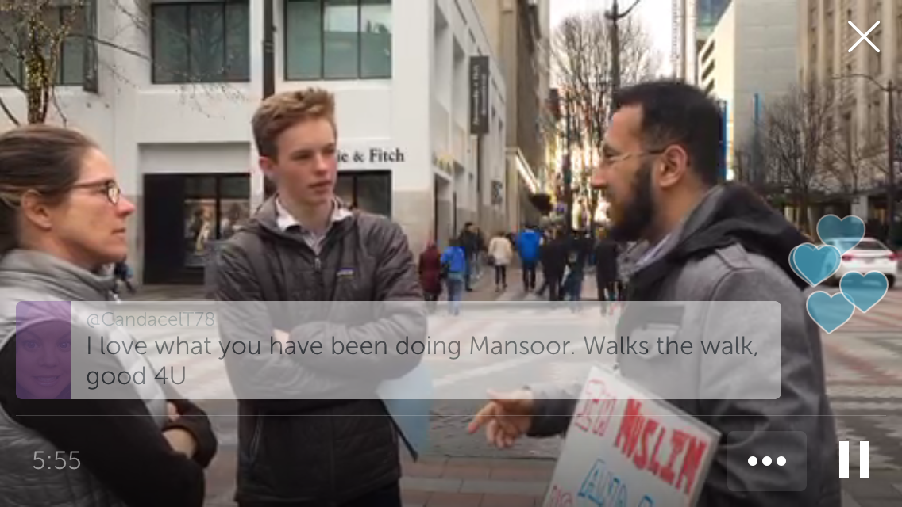
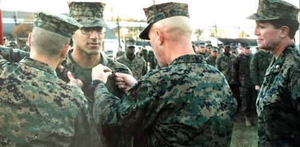
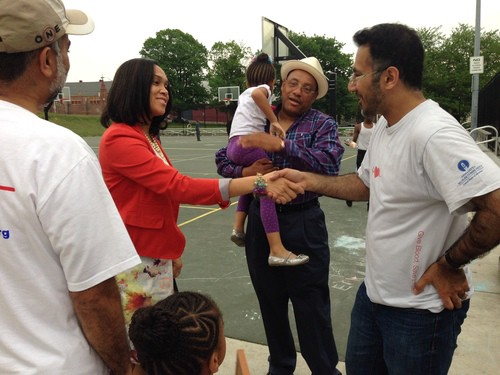

# **Broadcaster Spotlight: @mansoortshams**

We’re excited to kick off a new series of broadcaster Q&As with Mansoor Shams, founder of [MuslimMarine.org](http://muslimmarine.org/). Get to know Mansoor below, and find him on Periscope [here](https://www.periscope.tv/mansoortshams/).

**What inspired you to start broadcasting?**

I’ve always had a passion to spread positivity. In what seemed to be a divided world, particularly here in America, Periscope gave me an additional platform to speak to fellow Americans, as well as people across the world, to educate and break some of the myths creating division among different groups. I felt that as a proud Muslim American U.S. Marine I was in a unique position to help.

**What’s been your most interesting experience that you’ve shared on Periscope?**

I’d say the coolest thing has been the ability to connect with people from all walks of life. Some of these people I’ve had the opportunity to actually meet in person or talk with on the phone. I’m sure some of these people will be friends for life.

**What’s on your bucket list of things to broadcast?**

I’m brainstorming a potential nationwide tour of as many states as possible with my sign, “I’m a Muslim AND a U.S. Marine, ask me anything.” Of course I’d like to bring my Periscope audience along as part of the ride. In addition, I’m involved with other speaking engagements which I would also like to share with the Periscope family.

**Who are three of your favorite broadcasters we should follow today?**

Three of my favorite broadcasters are as follows: Muslim Imam [@Rizwan1770](https://www.periscope.tv/Rizwan1770), America’s Muslim [@Harris_Zafar,](https://www.periscope.tv/Harris_Zafar) and Muslim Bodybuilder [@TariqHMalik](https://www.periscope.tv/TariqHMalik1).

