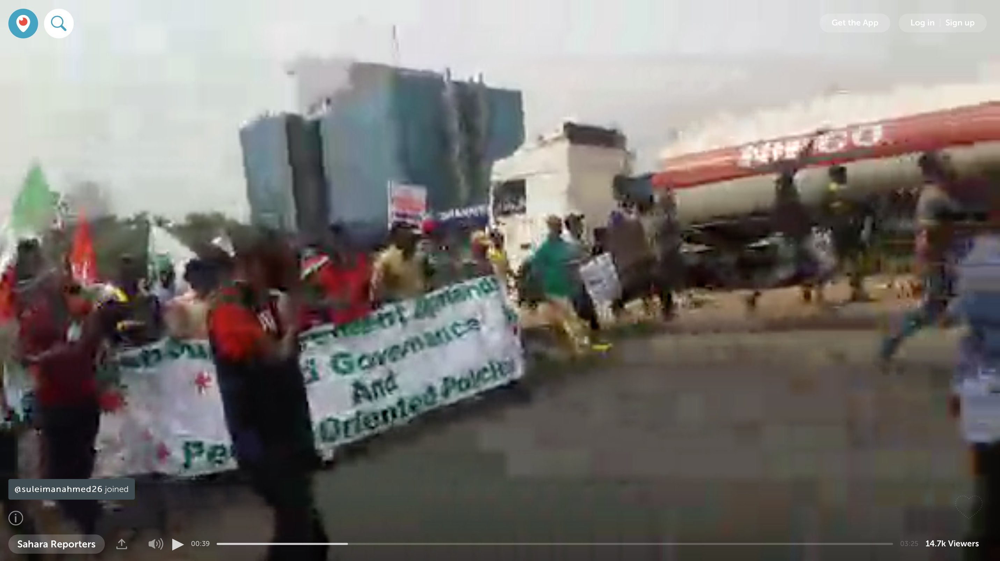

# Rewind: February 2017

### The past is never dead. It isn’t even past.
 — William Faulkner, Requiem for a Nun (1951)

Periscope FOMO. Maybe you didn’t know you had it, now you do. Sorry. Starting today we’ll be recapping a few live streams that caught our attention in recent weeks. Maybe you didn’t see them. Maybe you’d like to catch up. *Good luck!* Periscopers broadcast in the millions, around the world, 24 hours a day, seven days a week. There is no catching up. Just FOMO.

And MO. Plenty of MO.

Here’s what you could have been watching last month.

> Live now in 360! https://t.co/DaPlQQgosm
> 
&#x200a;&mdash;&#x200a;<a href="https://twitter.com/ladygaga/status/827271030313922561">@ladygaga</a>

Lady Gaga opens up with fans in Live 360 before her Super Bowl LI performance.

> ICYMI: Check out the @foofighters live on @periscopetv 🤘🎸🎟 #glastonbury https://t.co/LPAEhEuxE4
> 
&#x200a;&mdash;&#x200a;<a href="https://twitter.com/TwitterMusic/status/835356719681134598">@TwitterMusic</a>

The Foo Fighters play a surprise, intimate concert for about two and half hours at 650 seat venue Cheese and Grain in Frome, UK.

> We&#39;re LIVE at #MusicBeyondBorders, a celebration of immigration and what it has meant for our country! https://t.co/xgTwfBzGMu
> 
&#x200a;&mdash;&#x200a;<a href="https://twitter.com/seattlesymphony/status/829534901363838976">@seattlesymphony</a>

Music of immigrants from the seven countries under President Trump’s suspended travel ban, as performed by the Seattle Symphony.

> It only comes once a year. Walk the #NASCAR Cup garage at @DISupdates. Happy #DaytonaDay! https://t.co/YHJOmEzkB1
> 
&#x200a;&mdash;&#x200a;<a href="https://twitter.com/NASCARONFOX/status/835857484870987776">@NASCARONFOX</a>

Behind the scenes at the Daytona 500.

> LIVE on #Periscope with @AlabedBana - Send us your questions #TheNewsmakers https://t.co/IVJ2r1UMhX
> 
&#x200a;&mdash;&#x200a;<a href="https://twitter.com/trtworld/status/827494809543794689">@trtworld</a>

Bana Alabed, a Syrian girl from Aleppo known for her tweets, answers questions live.

# In the news…

[Trump addresses joint session of Congress](https://www.periscope.tv/w/1MYxNLBlzWXGw) 
[Turkey President Recep Tayyip Erdoğan](https://www.periscope.tv/w/1jMKgYWzjoXJL)
[Mount Etna erupts](https://www.periscope.tv/w/1DXxyrZRrYRKM)
[South Africa deploys troops at State of the Nation](https://www.periscope.tv/w/1OyKAowqWjDJb) 
[Crowds in Mogadishu hail newly-elected Pres. Farmajo](https://www.periscope.tv/w/1ypJdXDVoyyJW) 
[Protesters in Lagos, Nigeria](https://www.periscope.tv/w/1LyxBjPPpErxN)
[NODAPL protesters forced off Oceti Sakowin camp](https://www.periscope.tv/w/1gqxvqWNOmnJB)
[Iraqi forces push to recapture Mosul from ISIS](https://www.periscope.tv/w/1mnGeVPBLwvJX)
[Protests against alleged election fraud in Ecuador](https://www.periscope.tv/w/1ZkJzEQqXXWGv)
[Protests in Romania over government corruption](https://www.periscope.tv/w/1PlKQZRdqZkGE)
[Refugees in Indonesia protest UN resettlement process](https://www.periscope.tv/w/1YqKDXzzyMvKV)

# Cool!

