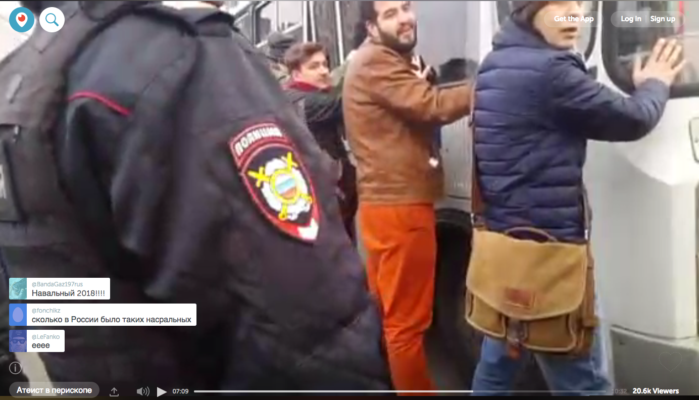

# Rewind: March 2017

Прошлое — это маяк, а не порт. | The past is a lighthouse, not a port.
 — *Old proverb*

### A spotlight on Russia

Speaking out in Russia against the government can land you in prison. Yet, last month, thousands of Russians risked arrest to have their voices heard.

On March 26, citizens across the country marched to protest alleged corruption in the government in an astonishing challenge to the leadership of Pres. Vladimir Putin.

This was the day that marked [the largest rallies in five years with a record number](http://www.rosbalt.ru/like/2017/03/27/1602341.html) of detainees.

This was the day [tens of thousands marched and 1000+ were detained](https://meduza.io/feature/2017/03/27/skolko-lyudey-vyshli-na-ulitsy-26-marta-i-skolko-zaderzhali-karta-protesta) in [82 cities](https://www.thetimes.co.uk/edition/news/mass-arrests-as-anti-putin-protests-sweep-across-russia-j38sxj58j) across the Russian Federation.

The country’s main opposition leader, Alexey Navalny, organized the day-long event with his [Anti-Corruption Foundation](https://fbk.info/english/about/) (FBK) weeks prior. So yes, it was planned.

Amid the political waves, Periscopes popped up in true submarine fashion all over.

The FBK chose specifically to use Periscopes in [their 10-hour coverage](https://www.youtube.com/watch?v=I2FhmpoHMiQ) of the day. So did [VICE News Tonight](http://www.hbo.com/vice/about/article/about-vice-news-tonight.html) in English, if you prefer. Then there were the spontaneous Periscopes from ordinary people broadcasting live from the streets.

Below we have gathered a few that stood out:

[We watched as Russia’s Far East city began the protests in Vladivostok](https://www.pscp.tv/ArseniyVladcity/1mrGmevlDZkGy?t=4m15s). 
 
[We stood amidst the crowd as roughly 1000 gathered in the Siberian city of Tomsk. ](https://www.pscp.tv/w/1jMJgYvneqlKL?t=6m20s)
 
[We were there as nearly 1500 gathered in Ufa.](https://www.pscp.tv/stalin_live/1nAKEVzbkMRGL?t=37m11s)
 
[We were transported to the middle of a chanting crowd of thousands in Saint Petersburg.](https://www.pscp.tv/w/1lDxLRrVyDQGmt=1m5s)
 
[We witnessed citizens by the handful being detained in Moscow.](https://www.pscp.tv/w/1MnGnLvaWbExO?t=7m10s)

### Other top picks for March

Russia, as large as it is, doesn’t encompass even half of Periscope. Watch some of our recent favorite broadcasts below.

> Let&#39;s bring the 🌎 world in one stream to celebrate #YearTwo of @periscopetv. Pick a color for your country. https://t.co/FoMiBUMIyH
> 
&#x200a;&mdash;&#x200a;<a href="https://twitter.com/nahsehen/status/846105793334145024">@nahsehen</a>

@nahsehen coloured in a world map based on viewers for our 2nd Birthday.

> ✉️ Letters to strangers for #NationalKindnessDay ❤ #inspire @periscopetv #golive https://t.co/XQwF3IrFcI
> 
&#x200a;&mdash;&#x200a;<a href="https://twitter.com/Sonam_108/status/847843734393729024">@Sonam_108</a>

@Sonam108 let us watch as she handed strangers letters of kindness on the streets of London.

> 🇳🇱🚲 Bike to a voting booth in the #Netherlands and cast your ballot. 🗳️ // @kasparkoch #DutchElection https://t.co/jhcaBYee7D
> 
&#x200a;&mdash;&#x200a;<a href="https://twitter.com/periscopetv/status/842076069570134016">@periscopetv</a>

@KasparKoch took us on a bike ride to go vote in the Netherlands.

> 🌊Clean and pristine waves - let&#39;s play! 🤙🏼 #hawaii #northshore #beach #travel #saltycures https://t.co/DKH2LMNSBX
> 
&#x200a;&mdash;&#x200a;<a href="https://twitter.com/saltycures/status/842438309976526848">@saltycures</a>

@SaltyCures helped us catch some sun and waves in Hawai’i.

> Breaking - Protesters set fire to #Paraguay Congress after secret vote. // @oslovera https://t.co/ykD8RbuyOO
> 
&#x200a;&mdash;&#x200a;<a href="https://twitter.com/periscopetv/status/847970754037559296">@periscopetv</a>

@OsLovera scoped as protesters set fire to Paraguay’s Congress after a secret vote.

