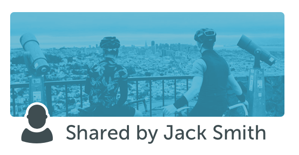

# Periscope Blog Combined

- [Periscope Blog Archive Combined](https://periscope.neocities.org/blog/combined)
- [WTF](https://davidblue.wtf/drafts/B4C123ED-558F-4D24-8B51-25D938EAD528.html)

---

- - - -
url: https://medium.com/periscope/up-periscope-f0b0a4d2e486
title: Up Periscope
subtitle: Today we’re excited to unveil Periscope, the best way to share and watch live video broadcasts from your mobile phone.
slug: up-periscope
description: 
tags: periscope,twitter,social-media
author: Periscope
username: periscope
- - - -

# Up Periscope

[Download the iOS App](https://itunes.apple.com/app/id972909677)

### Today, we’re excited to unveil Periscope, the best way to share and watch live video broadcasts from your mobile phone. You can download our [iOS app](https://itunes.apple.com/app/id972909677) today to start exploring.

Just over a year ago, we became fascinated by the idea of discovering the world through someone else’s eyes. What if you could see through the eyes of a protester in Ukraine? Or watch the sunrise from a hot air balloon in Cappadocia? It may sound crazy, but we wanted to build the closest thing to teleportation. While there are many ways to discover events and places, we realized there is no better way to experience a place ***right now*** than through live video. A picture may be worth a thousand words, but live video can take you someplace and show you around.

**For broadcasters**, Periscope lets you share an experience with others. Press a button, and instantly notify your followers that you’re live. Whether you’re witnessing your daughter’s first steps or a newsworthy event, Periscope offers an audience and the power of a shared experience. Most mobile broadcasting tools feel far from live. Broadcasters on Periscope are directly connected to their audience, able to feel their presence and interact. Going live on Periscope means more than a blinking red dot.

**For viewers**, Periscope gives you a new set of eyes and ears. Travel the world and step into someone else’s shoes. See what they see, hear what they hear, and hopefully feel what they feel. Watching a broadcast isn’t a passive experience like television. On Periscope, viewers influence the broadcaster by sending messages, and expressing their love by tapping the screen to send hearts.

What excites us most about Periscope is the power of seeing something for yourself. We watched someone rise above the Sonoma valley in a hot air balloon; we witnessed “Hands Up Don’t Shoot” directly from Ferguson, Missouri, a terrifying fire that erupted in San Francisco’s Mission district and a live performance from a pianist who played any song requested from the audience.

>> “a visual pulse of what’s happening **right now**”

We’ve always imagined Periscope as a visual pulse of what’s happening ***right now***. Our friends at Twitter felt the same way, and in January [we decided](https://twitter.com/periscopeco/status/576429747057504257) to work towards this vision together. We’ll continue building Periscope as a separate product, with a small team based in San Francisco. Twitter brings you closer to people, places, interests, and events in an experience that’s immediate, unfettered, and conversational. We think Periscope can help further that mission by giving people a way to share and experience the world around them, both near and far.

We are thrilled to share Periscope with you. And even more excited to see how you will use it.

[Download the iOS App](https://itunes.apple.com/app/id972909677)

- - - -
url: https://medium.com/periscope/last-month-in-periscope-9e6115eb2dfa
title: Last Month in Periscope
subtitle: The last month in Periscope has been incredible. We are continually amazed, and thankful to broadcasters around the world for bringing us…
slug: last-month-in-periscope
description: 
tags: social-media,travel,tech
author: Periscope
username: periscope
- - - -

# Last Month in Periscope

The last month in Periscope has been incredible. We are continually amazed, and thankful to broadcasters around the world for bringing us to places we have never been before. The world of Periscope is exciting and often surprising. In the last month we celebrated with you, traveled across the globe, and sat patiently, watching newsworthy events unfold in front of our eyes. We wanted to share some of our favorite moments.

This week [Coleen Baik](https://twitter.com/colbay) with the [Women Cross DMZ](https://twitter.com/womencrossdmz) peace movement took us inside North Korea. From Coleen’s perspective, we were able to drive through the streets of North Korea, passing by landmarks and eventually joining Gloria Steinem’s peace delegations.

We sat with the rest of the world and watched the events in Baltimore unfold. Thank you to [Paul Lewis](https://twitter.com/paullewis) and [Jay Korff](https://twitter.com/abc7jay) for including us in conversations with local Baltimore residents.

> Absolutely brilliant jounalism from @PaulLewis in Baltimore overnight, real time interviews via @periscopeco a new age for journalism  
> 
&＃x200a;&mdash;&＃x200a;<a href="https://twitter.com/drolo88/status/592929595910926337">@drolo88</a>
  

And as news of the earthquake spread, [Nick Garnett](https://twitter.com/nicholasgarnett) shared with us the devastation faced by the remote Nepalese villages of Sipaghat, Sindhupalchok, and others. [Mark Stone](https://twitter.com/Stone_SkyNews) took us to witness a hospital in Western Kathmandu, where some patients were too frightened to be treated inside the hospital for fear of another tremor.

> Powerful stuff by BBC 5 live&#39;s @nicholasgarnett on his experience reporting from Nepal; devastating Periscope ＃Mojo https://twitter.com/nicholasgarnett/status/596046756527341568 ...  
> 
&＃x200a;&mdash;&＃x200a;<a href="https://twitter.com/DavidMcClelland/status/596065375114125312">@DavidMcClelland</a>
  

When [Christie’s](https://twitter.com/ChristiesInc) began broadcasting from their latest auction, we were delighted to see works from artists such as Mark Rothko, Jeff Koons, Alberto Giacometti, Francis Bacon, Lucian Freud, Cy Twombly, Jean-Michel Basiquiat, Andy Warhol, and Wassily Kandinsky. Over 200 people watched live as Christie’s set a record $179.3 million for any work at auction with Picasso’s *The Women of Algiers (Version ‘O’)*, 1955.

https://periscope.neocities.org/blog
We attended the [Venice Biennale](https://twitter.com/la_biennale) with [Hans Ulrich Obrist](https://twitter.com/huobrist), who brought us in close contact with contemporary performers, installation artists, poets and sculptors.

We celebrated with [Rory McIlroy](https://twitter.com/mcilroyrory) after his 11th PGA Tour win, got an inside look from [Ian Poulter](https://twitter.com/ianjamespoulter) on how he prepares for each round and even watched [Roger Federer](https://twitter.com/rogerfederer) and [Benoît Paire](https://twitter.com/benoitpaire) practicing at [Roland Garros](https://twitter.com/rolandgarros).

As always, our broadcasters allowed us to travel around the globe with them. We sat on the edge of the Grand Canyon with [Nick Danger](https://twitter.com/nickdanger33), walked through the streets of NYC with [Jeremy Cowart](https://twitter.com/jeremycowart), and spent time in Rome getting to know the city from our spirited denizen, [Giulio Base](https://twitter.com/BaseGiulioBase).

We also went backstage with [The Rolling Stones](https://twitter.com/RollingStones), behind the scenes with [Oprah](https://twitter.com/Oprah), and caught [Hillary Clinton](https://twitter.com/HillaryClinton) answering her first press questions since announcing her Presidential candidacy with [Gabriel Debenedetti](https://twitter.com/gdebenedetti).

Thank you again to everyone who has allowed us to take a glimpse into their world. We know this is such a small sample of all the incredible moments being shared around the world, and we can’t wait to see where you will take us next…

Much Love,
Team Periscope

- - - -
url: https://medium.com/periscope/introducing-comment-moderation-df09439de956
title: Introducing Comment Moderation
subtitle: Dear Periscope Community,
slug: introducing-comment-moderation
description: 
tags: social-media,periscope
author: Periscope
username: periscope
- - - -

# Introducing Comment Moderation

Dear Periscope Community,

We’ve seen incredible communities and real-life friendships form on Periscope because it’s live, unfiltered and open. We’ve also seen broadcasters get discovered and quickly grow a large, public following. But with this openness comes an increased risk for spam and abuse, and this is something that we take seriously.

Above all, we want our community to be safe on Periscope. Comments are a vital part of the experience and we’ve been working hard on a system that still feels true to the live and unfiltered nature of our platform. Specifically, we want to develop a system that is:

* **Transparent**:** **People should clearly understand how comments are being moderated.

* **Community-led**: People in a broadcast are best suited to determine what’s okay and what’s not. Context matters — for example, a comment that might be okay in a comedy broadcast might not be okay somewhere else.

* **Live**: Because Periscope is real-time, people should be able to report and moderate comments as they appear on the screen.

Today, we’re rolling out a comment moderation system that empowers our community to report and vote on comments that they consider to be spam or abuse.

__gfycat__:

Here’s how it works:

1. During a broadcast, viewers can **report comments as spam or abuse**. The viewer that reports the comment will no longer see messages from that commenter for the remainder of the broadcast. The system may also identify commonly reported phrases.

1. When a comment is reported, **a few viewers are randomly selected** to vote on whether they think the comment is spam, abuse, or looks okay.

1. The result of the vote is shown to voters. If the majority votes that the comment is spam or abuse, the commenter will be notified that their ability to chat in the broadcast has been temporarily disabled. Repeat offenses will result in chat being disabled for that commenter for the remainder of the broadcast.

We’ve designed this system to be very lightweight — the entire process above should last just a matter of seconds. That said, if people don’t want to participate, broadcasters can elect to not have their broadcasts moderated, and viewers can opt out of voting from their Settings.

This system works in tandem with other tools that we have in place for our community. You can still [report ongoing harassment or abuse](https://help.periscope.tv/customer/portal/articles/2313190), [block and remove people from your broadcasts](https://help.periscope.tv/customer/portal/articles/2016653), and [restrict comments to people you know](https://help.periscope.tv/customer/portal/articles/2051924).

There are no silver bullets, but we’re committed to developing tools to keep Periscope a safe and open place for people to connect in real-time. We look forward to working closely with you and everyone else in the community to improve comment moderation.

To learn more, visit our [Help Center](https://help.periscope.tv/customer/portal/articles/2442663).

Much Love,
Team Periscope

**Downloads
**[Press Assets](https://www.dropbox.com/sh/mt86qvfyz8vb930/AAALSkbfwO1N50thksVH4xbba?dl=0)

- - - -
url: https://medium.com/@Mancerrss/hey-cool-but-i-wanna-ask-are-you-guys-gonna-start-supporting-3rd-party-handheld-360-cameras-like-b507e5cfbd47
title: Hey cool. But I wanna ask are you guys gonna start supporting 3rd party handheld 360 cameras like…
subtitle: thank you and keep innovating
slug: hey-cool-but-i-wanna-ask-are-you-guys-gonna-start-supporting-3rd-party-handheld-360-cameras-like
description: 
tags: 
author: Steven Mancera
username: Mancerrss
- - - -

Hey cool. But I wanna ask are you guys gonna start supporting 3rd party handheld 360 cameras like Samsung Gear 360?

***thank you and keep innovating***

- - - -
url: https://medium.com/periscope/periscope-by-the-numbers-6b23dc6a1704
title: Periscope, by the Numbers
subtitle: Dear Periscope community and world,
slug: periscope-by-the-numbers
description: 
tags: periscope,social-media,tech
author: Periscope
username: periscope
- - - -

# Periscope, by the Numbers

Dear Periscope community and world,

We’d like to share an exciting update on Periscope’s growth, and provide some insight on how we measure our progress.

On August 2nd, we surpassed **10 million** [Periscope](https://periscope.tv) accounts. We launched Periscope just four months ago, on March 26, 2015. We would like to thank every single one of you for taking the time to use something that we’ve worked so hard to create. It means everything to us.

We’re even more stunned by the burgeoning usage of Periscope. Here’s the graph of our **Time Watched** since launching. We define Time Watched as the aggregate amount of time that people spend **watching live** **broadcasts** on iOS & Android. As of last week, we’re seeing over **40 years of video watched per day**.

Time Watched is the metric we care about most, and what we’ll keep you updated on periodically. Here’s why Time Watched matters to us:

* **It’s most reflective of the value we’re creating for people and the world**. Success for **broadcasters** means more time watched on their broadcasts. Success for the **audience** (viewers who are watching and participating in a Periscope) means more high quality broadcasts in their feeds that they want to watch and participate in. Success for broadcasters and their audience means success for Periscope.

* **Time Watched is also valuable because it can capture viewership of Periscope broadcasts outside of iOS/Android.** We have huge viewership on periscope.tv and this matters — especially to our broadcasters who get incredible reach and audience because of it. At the moment, we don’t include time watched from periscope.tv in our overall Time Watched metric — but we’re working on being able to track this precisely enough to share.

* **Time Watched **serves as a proxy for active user growth, without suffering some of the limitations of focusing exclusively on a metric like Daily Active Users (DAU) or Monthly Active Users (MAU). Although it’s useful for us to see that our DAU graph is trending upwards (see below), we don’t think it’s the most important metric for assessing our overall success.

Optimizing for DAU/MAU doesn’t properly motivate our team to create a product that people love. Here’s why: if we were motivated to grow DAU, we’d be incentivized to invest in a host of conventional growth hacks, viral mechanics, and marketing to drive up downloads. This direction doesn’t necessarily lead to a better product, or lead to success for Periscopers. We hold ourselves accountable to Time Watched as an organizational measure because it reflects the kernel of our product, and our core values.

We hope this was helpful information to share. Most importantly, we want Periscopers to know and feel that they’re contributing to a growing ecosystem. And we want people to know that the Periscope team is measuring itself in a way that aligns with the value that the community gets from Periscope. We will continue to be transparent about what we think and why, and you should hold us to that. If there are other areas of our product or focus that we should be more transparent about, please tell us!

Thank you

Kayvon, Joe, and the Periscope team

- - - -
url: https://medium.com/periscope/rewind-february-2017-999bb9bb49c4
title: Rewind: February 2017
subtitle: The past is never dead. It isn’t even past.
 — William Faulkner, Requiem for a Nun (1951)
slug: rewind-february-2017
description: 
tags: periscope,live-streaming,news,lady-gaga,foo-fighters
author: Periscope
username: periscope
- - - -

# Rewind: February 2017

### The past is never dead. It isn’t even past.
 — William Faulkner, Requiem for a Nun (1951)

Periscope FOMO. Maybe you didn’t know you had it, now you do. Sorry. Starting today we’ll be recapping a few live streams that caught our attention in recent weeks. Maybe you didn’t see them. Maybe you’d like to catch up. *Good luck!* Periscopers broadcast in the millions, around the world, 24 hours a day, seven days a week. There is no catching up. Just FOMO.

And MO. Plenty of MO.

Here’s what you could have been watching last month.

> Live now in 360! https://t.co/DaPlQQgosm  
> 
&＃x200a;&mdash;&＃x200a;<a href="https://twitter.com/ladygaga/status/827271030313922561">@ladygaga</a>
  
Lady Gaga opens up with fans in Live 360 before her Super Bowl LI performance.

> ICYMI: Check out the @foofighters live on @periscopetv 🤘🎸🎟 ＃glastonbury https://t.co/LPAEhEuxE4  
> 
&＃x200a;&mdash;&＃x200a;<a href="https://twitter.com/TwitterMusic/status/835356719681134598">@TwitterMusic</a>
  
The Foo Fighters play a surprise, intimate concert for about two and half hours at 650 seat venue Cheese and Grain in Frome, UK.

> We&#39;re LIVE at ＃MusicBeyondBorders, a celebration of immigration and what it has meant for our country! https://t.co/xgTwfBzGMu  
> 
&＃x200a;&mdash;&＃x200a;<a href="https://twitter.com/seattlesymphony/status/829534901363838976">@seattlesymphony</a>
  
Music of immigrants from the seven countries under President Trump’s suspended travel ban, as performed by the Seattle Symphony.

> It only comes once a year. Walk the ＃NASCAR Cup garage at @DISupdates. Happy ＃DaytonaDay! https://t.co/YHJOmEzkB1  
> 
&＃x200a;&mdash;&＃x200a;<a href="https://twitter.com/NASCARONFOX/status/835857484870987776">@NASCARONFOX</a>
  
Behind the scenes at the Daytona 500.

> LIVE on ＃Periscope with @AlabedBana - Send us your questions ＃TheNewsmakers https://t.co/IVJ2r1UMhX  
> 
&＃x200a;&mdash;&＃x200a;<a href="https://twitter.com/trtworld/status/827494809543794689">@trtworld</a>
  
Bana Alabed, a Syrian girl from Aleppo known for her tweets, answers questions live.

# In the news…

[Trump addresses joint session of Congress](https://www.periscope.tv/w/1MYxNLBlzWXGw) 
[Turkey President Recep Tayyip Erdoğan](https://www.periscope.tv/w/1jMKgYWzjoXJL)
[Mount Etna erupts](https://www.periscope.tv/w/1DXxyrZRrYRKM)
[South Africa deploys troops at State of the Nation](https://www.periscope.tv/w/1OyKAowqWjDJb) 
[Crowds in Mogadishu hail newly-elected Pres. Farmajo](https://www.periscope.tv/w/1ypJdXDVoyyJW) 
[Protesters in Lagos, Nigeria](https://www.periscope.tv/w/1LyxBjPPpErxN)
[NODAPL protesters forced off Oceti Sakowin camp](https://www.periscope.tv/w/1gqxvqWNOmnJB)
[Iraqi forces push to recapture Mosul from ISIS](https://www.periscope.tv/w/1mnGeVPBLwvJX)
[Protests against alleged election fraud in Ecuador](https://www.periscope.tv/w/1ZkJzEQqXXWGv)
[Protests in Romania over government corruption](https://www.periscope.tv/w/1PlKQZRdqZkGE)
[Refugees in Indonesia protest UN resettlement process](https://www.periscope.tv/w/1YqKDXzzyMvKV)

# Cool!

- - - -
url: https://medium.com/periscope/oh-the-places-you-ll-go-14ae1c224c52
title: Oh the places you’ll go
subtitle: A peek into Periscope so far.
slug: oh-the-places-you-ll-go
description: 
tags: 
author: Periscope
username: periscope
- - - -

# Oh the places you’ll go

We launched [Periscope](https://periscope.tv) a week ago and have been overwhelmed (in the best possible way) by the outpouring of excitement for the product. We built Periscope to let people discover the world through someone else’s eyes and in just a matter of days have taken us all around the globe — to nearly every country in the world.

The [US Dept of Interior](https://twitter.com/Interior) took us on a tour of the National Mall and a [Glacier National Park](https://twitter.com/GlacierNPS) ranger showed us the stunning wilderness and answered questions.

> @Interior @GlacierNPS on @periscopeco ＃livestream. It was short, sweet, informative &amp; moderated 20-59 guests. pic.twitter.com/3AMW1GKkj3  
> 
&＃x200a;&mdash;&＃x200a;<a href="https://twitter.com/jjoycemanalo/status/582628445848494080">@jjoycemanalo</a>
  

[Christopher Miller](https://twitter.com/ChristopherJM) gave us a glimpse into Ukraine.

> LIVE on ＃Periscope: The Ukrainian landscape as seen from the westbound ＃Dnipropetrovsk-＃Kiev train this morning. https://www.periscope.tv/w/VvouojU1MnwxMDk2MzkzZf1Zx1wLdwPjL_4LVYgsj55asHD7oNYVDcfMVVEa_a8= ...  
> 
&＃x200a;&mdash;&＃x200a;<a href="https://twitter.com/christopherjm/status/582444412258672640">@christopherjm</a>
  

[Aaron Paul](https://twitter.com/aaronpaul_8) took us to his living room to listen to an acoustic performance by Jack Garratt.

> LIVE on ＃Periscope: Jack Garratt everybody https://www.periscope.tv/w/VvX_2TU0N3wxNjQ2OTaDiWPZdktsXBZdq9tqHAnFllZ1XyRbgljAuoEPRK_b5Q== ...  
> 
&＃x200a;&mdash;&＃x200a;<a href="https://twitter.com/aaronpaul_8/status/581295396774801408">@aaronpaul_8</a>
  

> @aaronpaul_8 just broadcasted the most amazing ＃periscope from his home: a performance from Jack Garrett. pic.twitter.com/KrRvvVG4Re  
> 
&＃x200a;&mdash;&＃x200a;<a href="https://twitter.com/Melissa_Inc/status/582426599846473728">@Melissa_Inc</a>
  

[Jimmy Fallon](https://twitter.com/jimmyfallon) brought us to the set of The Tonight Show to watch his monologue rehearsal.

> LIVE on ＃Periscope: Monoscope -- monologue rehearsal https://www.periscope.tv/w/VvWSDTM0NjkxfDc3ODA1heNyZ5qa6yqGywX_W4k1ku5VpUrzrWQsLVP7BNzzK-4= ...  
> 
&＃x200a;&mdash;&＃x200a;<a href="https://twitter.com/jimmyfallon/status/581176855228772352">@jimmyfallon</a>
  

[Benjamin Millepied](https://twitter.com/B_Millepied) took us backstage at the Paris Ballet to watch Swan Lake and inside ballet class at the Paris Opera.

> immensely enjoying @B_Millepied&#39;s periscopes of ＃SwanLake from off stage @BalletOParis! So close you can hear the ballet shoes! @periscopeco  
> 
&＃x200a;&mdash;&＃x200a;<a href="https://twitter.com/ellenannedavies/status/580788442289868800">@ellenannedavies</a>
  

> ce midi, @B_Millepied propose de suivre sa &quot;Ballet Class&quot; en live de l&#39;@operadeparis, via @periscopeco pic.twitter.com/VzRAzYmhNr  
> 
&＃x200a;&mdash;&＃x200a;<a href="https://twitter.com/loic_g/status/582498605413564416">@loic_g</a>
  

Italian Opera legend [Massimo Giordano](https://twitter.com/TheItalianTenor) sang to us and [Wendy Macnaughton](https://twitter.com/wendymac) showed us how to paint a flower.

> Experienced @wendymac&#39;s badassness drawing a pretty flower today. (Cc: @periscopeco) pic.twitter.com/zK1V2Q8fDc  
> 
&＃x200a;&mdash;&＃x200a;<a href="https://twitter.com/itsafterfive/status/582637435638525952">@itsafterfive</a>
  

And many, many more of you have given us a fascinating glimpse into all sorts of experiences and events, from a car chase in Los Angeles to a church service in Tennesse to a conversation about Bitcoin.

> basically, I love Periscope http://www.dailydot.com/lol/why-is-periscope-obsessed-with-fridges/ ... pic.twitter.com/dsieXF9lLR  
> 
&＃x200a;&mdash;&＃x200a;<a href="https://twitter.com/lindseyweber/status/582293110568402944">@lindseyweber</a>
  

And, of course, many of you have [shown us your fridge](https://twitter.com/search?q=fridge%20periscope&src=typd). What?!

You have also sent us a ton of feedback and we’re listening! We just shipped an update to the app ([download here](https://itunes.apple.com/app/id972909677)) with a handful of changes and more to come:

* ***“Woah with the notifications!” ***We hear you, it can get noisy. We switched the default setting off for follower notifications and know we need to make the overall controls here more granular. We’re on it.

* ***“It’s hard to sift through the live feeds.”*** Totally, we agree. As of our latest iOS 1.0.1 update, live broadcasts from people you follow will always be at the top. We’re also introducing a ‘Featured’ section to highlight unique content.

* ***“The location sharing is too revealing.” ***You don’t have to share your location publicly and can turn this feature off anytime before broadcasting. But, when you do choose to show your location, we’ve changed the map display so it’s further zoomed out and less precise (in the latest 1.0.1 version).

* ***“My broadcasts aren’t being tweeted”*** [Try this](https://help.periscope.tv/customer/portal/articles/2017798).

* ***“When is Android coming?”*** Soon! We’re working on it.

Suffice to say, you’ve kept us up all night with your creativity. And, kept us up all night trying to keep our servers running! Thank you all for bringing [Periscope](https://periscope.tv) to life.

- - - -
url: https://medium.com/periscope/hi-ashley-e75183a45c18
title: Hi Ashley!
subtitle: 
slug: hi-ashley
description: 
tags: 
author: Periscope
username: periscope
- - - -

Hi Ashley! Have you signed up for the waitlist? That’s the fastest way to get access. If you have any additional questions, please reach out to [twitter.com/PeriscopeHelp.](https://twitter.com/periscopehelp)

- - - -
url: https://medium.com/periscope/you-are-getting-very-thirsty-73eb06752018
title: You Are Getting Very Thirsty…
subtitle: In 1947, the Negroni was still relatively unknown in the United States. Orson Welles tried the apéritif in Rome while filming Black Magic…
slug: you-are-getting-very-thirsty
description: 
tags: food,cooking,cocktails,periscope,rewind
author: Evan Hansen
username: e
- - - -

# You Are Getting Very Thirsty…

In 1947, the Negroni was still relatively unknown in the United States. Orson Welles tried the apéritif in Rome while filming *Black Magic,* a now-obscure picture adapted from an Alexandre Dumas novel about a hypnotist who chooses the dark side. “The bitters are excellent for your liver, the gin is bad for you,” he wrote in a letter to a newspaper back home. “They balance each other.”

The Negroni is now recognized as a cocktail classic, and fans will find an excellent how-to below from celeb chef Scott Conant. Following up is a full-course meal of some of our favorite foodie Periscopes: More drinks, extremely healthy food, extremely unhealthy food, dessert and a bonus from food bible Zagat for chocolate lovers.

### Cocktail hour

> @Zagat on ＃Periscope: Making Negronis with celeb chef @conantnyc for ＃negroniweek http://periscope.tv/w/aiXjjDg2Mjg0MDV8MXZBeFJSQW1Scnp4bFy-kOtO0w9cAttcSCoX0HSeSGNSLBgYNGQR0Gkztapq ...  
> 
&＃x200a;&mdash;&＃x200a;<a href="https://twitter.com/periscopetv/status/740295578425298944">@periscopetv</a>
  

> LIVE on ＃Periscope: Making my Pepperdime cocktail at my new restaurant @georgie_bh at Montage Beverly Hills ＃Cockta...https://www.periscope.tv/w/al1IwTFNV0V3ZEx6bUp4UWJ8MWRqR1hYekFyTUVHWmH7UH_SBVlP1jv-dVuyTI7zqdWR3vytEdRl-_ILpUmG ...  
> 
&＃x200a;&mdash;&＃x200a;<a href="https://twitter.com/gzchef/status/755522474930937856">@gzchef</a>
  

> LIVE on ＃Periscope: Ask a bartender! Mixing cocktails at Brooklyn&＃39;s @MaisonPremiere with @mokeshow https://www.periscope.tv/w/akQZ4DEwNTg4NDExfDFybXhQcE5wTW9YeE7PnaxaA4Dw9gqyrhMEXQXpen2RP8NUGv79Wu34WT7itg== ...  
> 
&＃x200a;&mdash;&＃x200a;<a href="https://twitter.com/zagat/status/748600192006524928">@zagat</a>
  

### Make something healthy…

> Add this colorful side veggie dish to your next dinner table! @churchill_danhttps://www.periscope.tv/w/akQNyTg2Mjg0MDV8MVJER2x3V3BqRE1LTL9avOalqzhIouUHg1ggiDaw7ghsIVx3CqP7RFIvWH3z ...  
> 
&＃x200a;&mdash;&＃x200a;<a href="https://twitter.com/periscopetv/status/748588392162553856">@periscopetv</a>
  

> LIVE on ＃Periscope: Kale chips. I make them. We discuss.https://www.periscope.tv/w/ak7e5zE2NjQ1Nzh8MXlOeGFSTnZERWdLamO55vPFzLxyMc1DgufY6DTgH4DqmChFNAUFrHbyg1Wr ...  
> 
&＃x200a;&mdash;&＃x200a;<a href="https://twitter.com/annavocino/status/751560526602203136">@annavocino</a>
  

> LIVE on ＃Periscope: ＃Vegan 4th of July Dessert ＃cookalong with @twitterfoodhttps://www.periscope.tv/w/ajrYBTI0MzQxN3wxT2RKcndZT1pQcHhYx4aT4qm_ukLPzxZJ7HgQ-FhI0dggSI5cNeATpFhTcTs= ...  
> 
&＃x200a;&mdash;&＃x200a;<a href="https://twitter.com/jerryjamesstone/status/746055579206979584">@jerryjamesstone</a>
  

### … or not.

> LIVE on ＃Periscope: Making a monster burger in a secret test kitchen https://www.periscope.tv/w/akLtWTM2NXwxbkFLRXFSVk1lbEtMXnMrCajBHxT1e5Tw9KU74ACJENzmeMplojcESlcD4GQ= ...  
> 
&＃x200a;&mdash;&＃x200a;<a href="https://twitter.com/robbyjayala/status/748277506743078912">@robbyjayala</a>
  

### Either way, make sure you keep room for dessert.

> LIVE on ＃Periscope: Healthy Soft Serve ＃Cookalong with @churchill_dan @twitterfood &amp; @periscopetvhttps://www.periscope.tv/w/ak1M4zg5OTg3ODh8MVlxS0RWcWJvWGFKVqHq0p9nSoINEenJi331CLUY_xXsPUFtAdLkbd_LQjTq ...  
> 
&＃x200a;&mdash;&＃x200a;<a href="https://twitter.com/churchill_dan/status/751128884230426624">@churchill_dan</a>
  

> LIVE on ＃Periscope: It&＃39;s James&＃39; Birthday So We&＃39;re Making Him A Cake (In A Mug)https://www.periscope.tv/w/akUkiTEzOTk5OTd8MXJteFBwUVdXb0x4TqRjOupH3eSq6tGOhcQCI8Judi26uAmyAzq3gWMAgpMa ...  
> 
&＃x200a;&mdash;&＃x200a;<a href="https://twitter.com/sortedfood/status/748886515955146752">@sortedfood</a>
  

> @JanisBakes on ＃Periscope: Finishing up Pokemon cookies. And emojis. And bachelorette. On a perfect pool day. http://periscope.tv/w/al15ajg2Mjg0MDV8MXpxS1Z6Z25tcm1LQsc8RcJZnfqS9A0uO8KrWHciqCmdQzEX0kaNoavf4i9F ...  
> 
&＃x200a;&mdash;&＃x200a;<a href="https://twitter.com/periscopetv/status/755574889419898880">@periscopetv</a>
  

### Still hungry? Join Zagat for a decadent dive into chocolate.

> @Zagat on ＃Periscope: Inside @jacquestorres 40,000 sq ft chocolate factory with the man himself. All of the !http://periscope.tv/w/ah3DwDg2Mjg0MDV8MU93R1diT01WWVpLURCwWoLAkaLnGf23PRayHP26klN4sBrh0kdx4HDB_6m_ ...  
> 
&＃x200a;&mdash;&＃x200a;<a href="https://twitter.com/periscopetv/status/738062569441656833">@periscopetv</a>
  

- - - -
url: https://medium.com/periscope/mute-notifications-a-better-global-feed-more-c3288566a756
title: Mute Notifications, a Better Global Feed, & more
subtitle: It has been four months since we launched Periscope and we’ve been working hard to make it better each day. We’ve been blown away by what…
slug: mute-notifications-a-better-global-feed-more
description: 
tags: social-media,tech,periscope
author: Periscope
username: periscope
- - - -

# Mute Notifications, a Better Global Feed, & more

It has been four months since we launched Periscope and we’ve been working hard to make it better each day. We’ve been blown away by what the Periscope community has created in such a short time. In the end of May, we announced that in aggregate users spend 10 years worth of time watching broadcasts live each day on Periscope. Today, we’re excited to share that this has increased to over 25 years of live watched time every day!

>> “…over 25 years of live watched time every day…”

A new [update is now available](https://itunes.apple.com/us/app/periscope/id972909677?mt=8) on iOS in the App Store with some great new goodies, so we wanted to share a bit more here on what we launched, and why:

### Notification Mute

There’s now a “Mute” option for every user you follow on Periscope. When you mute someone, their broadcasts still appear in your feed, but you won’t receive push notifications when they go live. Push notifications are a powerful communication channel, but they also have the potential of creating a frustrating degree of noise for users. We think it’s important to respect this power, and give users granular control over the notifications they receive while still providing the flexibility of seeing more content on Periscope. This is coming to Android imminently!

### A Better Global Feed

The global feed allows you to discover interesting content from people around the globe. We believe it is one of the best discovery tools viewers have on Periscope. We’ve refreshed this feed (on iOS and Android) to surface high quality broadcasts that you’re likely to enjoy. In your profile settings, you can now also indicate your language preferences. This impacts the broadcasts in your Global feed (by default, we will select your device’s preferred languages). We hope this update makes it easier to find the most interesting broadcasts on Periscope.

### **Your Broadcast Stats**

At the end of the broadcast, a panel pops up that tells you a few things about your broadcast (including **total time watched**). Previously, this information was only visible immediately after stopping your broadcast. Now, when viewing your past broadcasts, broadcast statistics will always be available.

### iOS 8 Handoff

You can start watching a broadcast on one device, and transition to watching it on another seamlessly. Simply ensure both are running iOS 8+ or OS X, have Bluetooth turned on, and are logged in to the same iCloud account. This is great for when you’re watching a broadcast on your Desktop, and want to quickly switch to watching on your iOS device (or vica versa).

Enjoy the new features, and thank you for continuing to make Periscope a wonderful platform for communication and expression. Please don’t hesitate to reach out to us [@periscopeco](https://twitter.com/periscopeco) for any thoughts/suggestions/questions.

Cheers

Team Periscope

- - - -
url: https://medium.com/periscope/around-the-world-in-one-day-1ffe3dda1226
title: Around the World in One Day
subtitle: This weekend, more than 50 broadcasters organized a Scope Day that took audiences around the globe. Over the course of 24 hours, they…
slug: around-the-world-in-one-day
description: 
tags: periscope,travel,community
author: Periscope
username: periscope
- - - -

# Around the World in One Day

This weekend, more than 50 broadcasters organized a [Scope Day](https://twitter.com/search?q=%23ScopeDay&src=tyah) that took audiences around the globe. Over the course of 24 hours, they passed the cast,* taking us to some of the word’s most iconic destinations. Here are some of our favorites:

@[mh_hassib](https://www.periscope.tv/mh_hassib) started the day by giving us a chance to visit the pyramids in Cairo, Egypt (teaching us both the English and Arabic names of each pyramid).

[@BoopFashionista](https://www.periscope.tv/BoopFashionista) — one of our resident broadcasters in London — took us to Big Ben as the clock struck 11pm, and then to the London Eye to see it lit up at night.

@[WagamamaMama](https://www.periscope.tv/WagamamaMama) took us to Tōdai-ji in Nara, Japan, home of the largest bronze Buddha statue in the world.

@[efrenchcafe](https://www.periscope.tv/efrenchcafe) took us to the beautiful Villa Ephrussi de Rothschild in the French Riviera — showcasing both the stunning scene and the history of the villa.

@[Cheryl66stl](https://www.periscope.tv/Cheryl66stl), a true local, gave us a tour of St. Louis with a special visit to the top of St. Louis Arch.

@[Rosscaneva](https://www.periscope.tv/Rosscaneva) took us to Milan, Italy to see the museum of Sforza Castle. Rossella took us behind the scenes with the lead curator to see the last work of Michelangelo.

@[SandyChoiRadio](https://www.periscope.tv/SandyChoiRadio) — via @[ParachuteTV1](https://www.periscope.tv/ParachuteTV1/) — took us to the Green Sand Beach in Hawaii, one of four green sand beaches accessible in the world.

@[MTendsToTrave](https://www.periscope.tv/MTendsToTravel)l took us to Tiananmen Square, and together we explored 440 square meters of urban space in Beijing.

@[geoffgolberg](https://www.periscope.tv/geoffgolberg) closed out the night in NYC, bringing us to the Met. In true Geoff form, he showcased some amazing street talent in New York with a [special](https://twitter.com/Mr_E_Longfellow/status/663167658519465984) ＃ScopeDay performance.

The Periscope community transports us around the globe every day. Thank you for sharing your worlds.

Much love,

Team Periscope

> *Pass the cast: when a broadcaster tells the audience to join another broadcast, and then shares it with their followers — creating a waterfall effect.  

- - - -
url: https://medium.com/periscope/broadcaster-spotlight-mansoortshams-aeb166263222
title: Broadcaster Spotlight: @mansoortshams
subtitle: We’re excited to kick off a new series of broadcaster Q&As with Mansoor Shams, founder of MuslimMarine.org. Get to know Mansoor below, and…
slug: broadcaster-spotlight-mansoortshams
description: 
tags: periscope,social-media
author: Periscope
username: periscope
- - - -

# **Broadcaster Spotlight: @mansoortshams**

We’re excited to kick off a new series of broadcaster Q&As with Mansoor Shams, founder of [MuslimMarine.org](http://muslimmarine.org/). Get to know Mansoor below, and find him on Periscope [here](https://www.periscope.tv/mansoortshams/).

**What inspired you to start broadcasting?**

I’ve always had a passion to spread positivity. In what seemed to be a divided world, particularly here in America, Periscope gave me an additional platform to speak to fellow Americans, as well as people across the world, to educate and break some of the myths creating division among different groups. I felt that as a proud Muslim American U.S. Marine I was in a unique position to help.

**What’s been your most interesting experience that you’ve shared on Periscope?**

I’d say the coolest thing has been the ability to connect with people from all walks of life. Some of these people I’ve had the opportunity to actually meet in person or talk with on the phone. I’m sure some of these people will be friends for life.

**What’s on your bucket list of things to broadcast?**

I’m brainstorming a potential nationwide tour of as many states as possible with my sign, “I’m a Muslim AND a U.S. Marine, ask me anything.” Of course I’d like to bring my Periscope audience along as part of the ride. In addition, I’m involved with other speaking engagements which I would also like to share with the Periscope family.

**Who are three of your favorite broadcasters we should follow today?**

Three of my favorite broadcasters are as follows: Muslim Imam [@Rizwan1770](https://www.periscope.tv/Rizwan1770), America’s Muslim [@Harris_Zafar,](https://www.periscope.tv/Harris_Zafar) and Muslim Bodybuilder [@TariqHMalik](https://www.periscope.tv/TariqHMalik1).

- - - -
url: https://medium.com/periscope/skip-around-the-world-bd419f1ade3b
title: Skip Around The World
subtitle: We’re excited to announce two major updates to Periscope on iOS and Android: a revamped Global Map, and Skip Ahead on replays!
slug: skip-around-the-world
description: 
tags: periscope,social-media,tech
author: Periscope
username: periscope
- - - -

# Skip Around The World

We’re excited to announce two major updates to Periscope on iOS and Android: a revamped **Global Map**, and **Skip Ahead on replays**!

### Global Map

We’ve always thought that Periscope has the potential of showing you the world in real time. This vision inspired us to create the Global Map. Our first implementation, launched in June, had some limitations. The map only showed live broadcasts (no replays) and was limited to a total of 250 broadcasts. At any given point there are thousands of broadcasts live on Periscope and orders of magnitude more replays, so the Map was only showing the tip of the iceberg. The new map launching today has some major improvements.

Every time you zoom to a new place on the map, Periscope will reload broadcasts from this region, **including** replays from the last 24 hours. Red dots are live broadcasts, and blue dots are replays. You can look at the most remote area of the world and see both what’s happening now, and what’s happened recently.

When we’ve heard about breaking news events, as in the case of Hurricane Patricia, we’ve found ourselves checking Periscope first.

We think that the new Map functionality is much closer to fulfilling our original vision of seeing the world in real time. We hope you agree!

### **Skip Ahead in Replays**

We know you’re busy. When you’re watching a replay, you sometimes just want to fast forward a segment and get to the part you’re looking for. Or to the moment your friend told you about. Or you just want to seek through the whole thing quickly to get an idea of what happened. Now you can. Just press down while watching the replay, and drag left and right. You can even drag up and down to change the seek speed. And while you’re seeking, with your finger still pressed down, you’ll see a preview of that moment in the broadcast.

### **3D Touch Shortcuts**

For iPhone 6s and 6s+ owners, we’ve added a few handy shortcuts. If you press down on the Periscope app icon, you’ll have the following options:

* **Search People** — Pretty self explanatory!

* **Teleport** — Takes you someplace random in the world and shows you a live broadcast from there. We love this shortcut because we’ve always wanted Periscope to feel like teleportation.

* **Broadcast Mutuals **— Starts a private broadcast that only your mutual followers see (people you follow, who also follow you). This is a great way to quickly go live to your friends.

* **Broadcast — **Quickly start a public broadcast.

### **Zoom on Android**

We’ve also introduced the long-awaited pinch to zoom on Android, which lets you zoom in and out while broadcasting, just like your iOS friends can.

We’re really excited for you to try this new update. As always, let us know what you think by tweeting us [@periscopeco](http://twitter.com/periscopeco). Happy Periscoping!

Much love,
[Team Periscope](http://periscope.tv/about)

*p.s. - this post is dedicated to [Pablo](http://twitter.com/zbigy), for pressing the release button 2 days early…*

- - - -
url: https://medium.com/periscope/explore-the-world-fc3874a35bbe
title: Explore the World
subtitle: Periscope iOS 1.1 Update
slug: explore-the-world
description: 
tags: tech,periscope,social-media
author: Periscope
username: periscope
- - - -

# Explore the World

### Periscope iOS 1.1 Update

When we started building [Periscope](https://periscope.tv), our first idea revolved around a map. We wanted to be able to see anywhere in the world, but questioned whether we would have enough broadcasts for a map to be compelling. *“What are the odds that anyone would even be live?”* we asked ourselves. So we shelved the map, and promised to revisit the idea when it made more sense.

We could never have predicted the volume of broadcasts happening across the world. We believe the incredible Periscope community has now made that original vision possible, which inspired us to release today’s [iOS update](https://itunes.apple.com/us/app/periscope/id972909677?mt=8):

__vimeo__:

Thank you to these Periscope users for allowing us to share their broadcasts: [@penguinsix](http://twitter.com/penguinsix), [@danandmoore](http://twitter.com/danandmoore), [@sky1ron](http://twitter.com/sky1ron), [@valaafshar](http://twitter.com/valaafshar), [@nicholasgarnett](http://twitter.com/nicholasgarnett), [@abhishekscariya](http://twitter.com/abhishekscariya), [@colbay](http://twitter.com/colbay), [@lidiaschillaci](http://twitter.com/lidiaschillaci), [@cailinoneil](http://twitter.com/cailinoneil), [@mweasner](http://twitter.com/mweasner), [@everydaydude](http://twitter.com/everydaydude), [@danandmoore](http://twitter.com/danandmoore), [@euromaestro](http://twitter.com/euromaestro), [@revbeej](http://twitter.com/revbeej), [@bohan](http://twitter.com/bohan), [@marloes](http://twitter.com/marloes), [@glacierNPS](http://twitter.com/glacierNPS), [@intothefuzz](http://twitter.com/intothefuzz)

### Map View

When you tap on the ‘Global’ section, you will be able to explore live broadcasts on an interactive map. You’ll see the most recent broadcasts (with location shared) all over the world, and have your choice of where to travel next.

In the spirit of this new update, we wanted to collect some of our favorite broadcasts from around the world and share them with you in the video on the left.

### **Periscope is now localized in 29 languages**

We want to continue to support our global community in any way we can. We hope providing more languages will broaden the Periscope community.

### **Replays are now instantly available**

No need to wait for a replay to upload after broadcasting. You can always choose to delete a replay later, directly from your feed.

### **Share on Twitter**

You can now share the link to a live broadcast or replay on Twitter. We want you to be able to share the amazing places, people and things you are seeing.

What excites us most about Periscope is the many worlds it makes visible — the past two months have continued to open our eyes. Thank you for continuing to allow us to travel the globe with you.

Much Love,
[Team Periscope](https://twitter.com/periscopeco)

- - - -
url: https://medium.com/periscope/rewind-march-2017-2fd5b85951f7
title: Rewind: March 2017
subtitle: Прошлое — это маяк, а не порт. | The past is a lighthouse, not a port.
 — Old proverb
slug: rewind-march-2017
description: 
tags: russia,putin,live-streaming,periscope,news
author: Periscope
username: periscope
- - - -

# Rewind: March 2017

Прошлое — это маяк, а не порт. | The past is a lighthouse, not a port.
 — *Old proverb*

### A spotlight on Russia

Speaking out in Russia against the government can land you in prison. Yet, last month, thousands of Russians risked arrest to have their voices heard.

On March 26, citizens across the country marched to protest alleged corruption in the government in an astonishing challenge to the leadership of Pres. Vladimir Putin.

This was the day that marked [the largest rallies in five years with a record number](http://www.rosbalt.ru/like/2017/03/27/1602341.html) of detainees.

This was the day [tens of thousands marched and 1000+ were detained](https://meduza.io/feature/2017/03/27/skolko-lyudey-vyshli-na-ulitsy-26-marta-i-skolko-zaderzhali-karta-protesta) in [82 cities](https://www.thetimes.co.uk/edition/news/mass-arrests-as-anti-putin-protests-sweep-across-russia-j38sxj58j) across the Russian Federation.

The country’s main opposition leader, Alexey Navalny, organized the day-long event with his [Anti-Corruption Foundation](https://fbk.info/english/about/) (FBK) weeks prior. So yes, it was planned.

Amid the political waves, Periscopes popped up in true submarine fashion all over.

The FBK chose specifically to use Periscopes in [their 10-hour coverage](https://www.youtube.com/watch?v=I2FhmpoHMiQ) of the day. So did [VICE News Tonight](http://www.hbo.com/vice/about/article/about-vice-news-tonight.html) in English, if you prefer. Then there were the spontaneous Periscopes from ordinary people broadcasting live from the streets.

Below we have gathered a few that stood out:

[We watched as Russia’s Far East city began the protests in Vladivostok](https://www.pscp.tv/ArseniyVladcity/1mrGmevlDZkGy?t=4m15s). 
 
[We stood amidst the crowd as roughly 1000 gathered in the Siberian city of Tomsk. ](https://www.pscp.tv/w/1jMJgYvneqlKL?t=6m20s)
 
[We were there as nearly 1500 gathered in Ufa.](https://www.pscp.tv/stalin_live/1nAKEVzbkMRGL?t=37m11s)
 
[We were transported to the middle of a chanting crowd of thousands in Saint Petersburg.](https://www.pscp.tv/w/1lDxLRrVyDQGmt=1m5s)
 
[We witnessed citizens by the handful being detained in Moscow.](https://www.pscp.tv/w/1MnGnLvaWbExO?t=7m10s)

### Other top picks for March

Russia, as large as it is, doesn’t encompass even half of Periscope. Watch some of our recent favorite broadcasts below.

> Let&#39;s bring the 🌎 world in one stream to celebrate ＃YearTwo of @periscopetv. Pick a color for your country. https://t.co/FoMiBUMIyH  
> 
&＃x200a;&mdash;&＃x200a;<a href="https://twitter.com/nahsehen/status/846105793334145024">@nahsehen</a>
  
@nahsehen coloured in a world map based on viewers for our 2nd Birthday.

> ✉️ Letters to strangers for ＃NationalKindnessDay ❤ ＃inspire @periscopetv ＃golive https://t.co/XQwF3IrFcI  
> 
&＃x200a;&mdash;&＃x200a;<a href="https://twitter.com/Sonam_108/status/847843734393729024">@Sonam_108</a>
  
@Sonam108 let us watch as she handed strangers letters of kindness on the streets of London.

> 🇳🇱🚲 Bike to a voting booth in the ＃Netherlands and cast your ballot. 🗳️ // @kasparkoch ＃DutchElection https://t.co/jhcaBYee7D  
> 
&＃x200a;&mdash;&＃x200a;<a href="https://twitter.com/periscopetv/status/842076069570134016">@periscopetv</a>
  
@KasparKoch took us on a bike ride to go vote in the Netherlands.

> 🌊Clean and pristine waves - let&#39;s play! 🤙🏼 ＃hawaii ＃northshore ＃beach ＃travel ＃saltycures https://t.co/DKH2LMNSBX  
> 
&＃x200a;&mdash;&＃x200a;<a href="https://twitter.com/saltycures/status/842438309976526848">@saltycures</a>
  
@SaltyCures helped us catch some sun and waves in Hawai’i.

> Breaking - Protesters set fire to ＃Paraguay Congress after secret vote. // @oslovera https://t.co/ykD8RbuyOO  
> 
&＃x200a;&mdash;&＃x200a;<a href="https://twitter.com/periscopetv/status/847970754037559296">@periscopetv</a>
  
@OsLovera scoped as protesters set fire to Paraguay’s Congress after a secret vote.

- - - -
url: https://medium.com/periscope/an-almost-year-in-review-8865bc24436e
title: An (Almost) Year in Review
subtitle: To celebrate the first 279 days of Periscope, we asked everyone on the team to share their favorite broadcast from 2015. Our choices…
slug: an-almost-year-in-review
description: 
tags: periscope,social-media,new-year
author: Periscope
username: periscope
- - - -

# An (Almost) Year in Review

To celebrate the first 279 days of Periscope, we asked everyone on the team to share their favorite broadcast from 2015. Our choices weren’t necessarily the most viewed or newsworthy broadcasts, but they were certainly the most memorable. We want to thank our incredible community for bringing us these moments, and many more.

Happy New Year and Much Love, 
Team Periscope

# **“**Atop Hawk Hill” by [Couch](https://www.periscope.tv/couch)

I’ve enjoyed many broadcasts from locations near and far in my time at Periscope — from the first cross-country broadcast I watched Kayvon make from the Minneapolis Sculpture Garden that convinced me of the concept, to [PenguinSix](https://www.periscope.tv/penguinsix)’s daily glimpses of his life in Hong Kong. Few broadcasts, however, have stuck with me as much as one made by our own Bill Couch. On the morning that we released Landscape to the general public, I awoke early and immediately opened Periscope hoping to find something to prove to myself that it was all working. By perfect coincidence I found a broadcast Bill had just published in my personal feed. I joined and was instantly greeted by a sublime sight: low-level fog stretching across the San Francisco Bay, with just the towers of the Golden Gate Bridge visible, seen from one of my favorite perspectives in the Marin Headlands. In that moment I knew we had finally made good on our shared dream of seeing the world through someone else’s eyes. No other broadcast quite reached the feeling of sharing another’s experience. I knew exactly where Bill stood, and experienced the world as he was experiencing it — all from the comfort of my bed.
** — [Nils**](https://www.periscope.tv/nils)

# “Heavy rain, new boats arriving” by [Paul Ronzheimer](https://www.periscope.tv/ronzheimer)

Watching the Syrian refugee coverage on Periscope has been really moving for me. I was only a year old when my parents took me and my older sister (then 3) and fled a war torn Vietnam. Until recently, everything I knew and understood about the refugee experience was based solely on my parents’ stories, and reading and watching documentaries about the Vietnamese boat people.

Seeing Syrian refugees share their story first hand, in real time, has been amazing and the periscopes that stand out the most to me are the ones where you see viewer perspectives changing to one of understanding and compassion.
** — [Lien**](https://www.periscope.tv/lientm)

# “Birocratic — Live Beatmaking ＃BiroMakesABeat” by[ Birocratic](https://www.periscope.tv/birocratic)

Birocratic is a musician that I’ve discovered years ago. I love his music, and often have his Soundcloud channel on repeat while designing Periscope ;D. One day I was getting ready for work and got a push notification about his very first broadcast. I kind of lost it and squeeled through the toothpaste in my mouth (was brushing my teeth at the time). It was fascinating to see the creative process of an artist I admire, completely raw, and happening right at that moment before my eyes. All the struggles, repetitions, false starts, iterations, as well as the sheer joy and energy with which he brought the music I love into being made me not only appreciate his work that much more, but also connected me with him as a human being.
** — [Veronika**](https://www.periscope.tv/verohecko)

__vine__:

# **“Happy ＃Halloween from Sock Cop! I’m a Vampirate!” by [Sock Cop**](https://www.periscope.tv/jasonburglar)

A long long time ago in a galaxy far away I stumbled upon a talking sock… who apparently was a cop. Just like everyone else I thought “WTF?”. Quickly I was reassured by the talking sock that everything would be ok, that i should “ease into it like a hot bath”. And I did just that. Months later, dozens of late night broadcasts later, I tuned in for a ＃halloween extravaganza. The Sock decided to be a vampire and a pirate for halloween… if that wasn’t enough for you, he had a black light.
** — [Tyler**](https://www.periscope.tv/tyhan1)

# “Baltimore residents now — very moving” by[ Paul Lewis](https://www.periscope.tv/paullewis)

The Baltimore riots broke less than one month after our launch in March. Coverage of the unrest was limited and we couldn’t get a real sense for what it was like to be in Baltimore. We fell into one of Paul’s broadcasts as he crossed the city, spoke with residents and gave context as events unfolded. This narrative opened his immediate reality to a dynamic, responsive audience. And he empowered this audience to witness and react to urgent and organic stories. It was powerful; these worlds were radically open and unfiltered.
** —[ Alex**](https://www.periscope.tv/alexk)

# “On a ferry. There’s a really bad storm. I’m scared” by Unknown

I’ll never forget this broadcast. I was flying from San Francisco to London and was wondering whether the WiFi was fast enough to make Periscope work. The lighting was dim on the plane since most passengers were sleeping. I was browsing the Map and found a broadcast that caught my eye for two reasons: 1) the title was dramatic and 2) the broadcaster was in the middle of the river (not often you see the red dot in the middle of a body of water. I joined along with 7 other people, watching this woman visibly and audibly terrified. Through her camera you could see the shadow of a ferry captain piloting the boat. You could hear terrential down pour and you could feel the boat rocking left to right through the violent storm. The broadcaster was breathing deeply. I found myself, along with everybody else in the broadcast, sending her comments saying “It’s going to be OK. We’re here with you. You’ll get to the other side soon”. I thought this broadcast was really powerful because it brought all of us together. As viewers, we wanted to help comfort this stranger. As a broadcast, she just wanted to share a scary experience with people because she had nobody to talk to.
** — [Kayvon**](https://www.periscope.tv/kayvon)

# “Watch me kill 🔪👣🎃#Halloween” by Blu[mhouse

This live horror production was such a unique application of Periscope, and I was really impressed by their production value. I really felt like the producers had reimagined their genre, and the incorporation of the audience only enhanced how scary the story was.
** — [Aaron**](https://www.periscope.tv/aw)

# **“Bed Time Stories” by [Adam Yaffe**](https://www.periscope.tv/@adamyaffe)

I fell in love with Adam’s family. They are quirky, cheeky, laugh out loud funny, kind and entertaining simultaneously. My favorite broadcast was when Adam did his ＃Bedtime show with his wife. They talk about “dating” and their two young sons run into the room and Adam shouts cheek at them because both him and his wife are nakey under the bed. I was in a fit of giggles. The sons were both laughing, and mortified. I am always thoroughly entertained and delighted by what happens next with adam’s family! Adam also coined the term the ＃PeriFamily thanks to his loyal followers. I ‘ve tried to make this happen in my office, but like ‘fetch’ it’s just not happening!
** — [Abigail**](https://www.periscope.tv/abigail_purcell)

# “Sunset faroe islands” by [tsjohansen](https://www.periscope.tv/tsjohansen)

We had just added the ability to see replays on the Map view, and I was searching around to find broadcasts in areas I wasn’t familiar with. I saw a blue dot between Iceland and Norway in the middle of the ocean and was intrigued. Broadcasts located in the middle of the ocean tend to yield surprises.

While it was a short broadcast from a photographer (and his only one ever) showcasing the sunset he was seeing, I had never heard of these islands before, and when I saw their topography as he panned around, and the light from the sunset, I was immediately struck. “I must visit this place,” I told myself. Since then, I’ve been doing homework on the islands, and talked to friends who have visited them. One of Periscope’s great powers for me is the ability to discover places and cultures and customs I’m not familiar with, and can find new places I want to experience in person.
** — [Bill**](https://www.periscope.tv/couch)

# “Secret Cove outside san francisco — come join our treasure hunt!🙏🙀👹” by Jenn[ifer Paden

These were broadcasted from my girlfriend’s account, while 4 of us were headed to Kirby Cove to camp for a night. It’s probably the most fun I ever had broadcasting, so it’s my favorite.
** — [Thiago**](https://www.periscope.tv/thiagorobert15)

# “We are watching a Penguin Parade!” by [Monterey Bay Aquarium](https://www.periscope.tv/MontereyAq)

This was just a scope of penguins walking around the aquarium — and it’s my favorite! As we watched the group waddle down the carpeted aquarium hallways, our penguin patron/guide to the Monterey Bay Aquarium, Patrick, explained that the walk is an enrichment offered to the birds. The broadcast was as informative as it was adorable and if I could, I’d watch one a day.
** —[ Kim**](https://www.periscope.tv/kats)

# “Leopard in a tree. ＃migration2015” by[ Garry Van Der Walt](https://www.periscope.tv/@gerryvanderwalt)

It was amazing to be able to watch a live broadcast of a leopard relaxing on a tree branch in its natural habitat in Kenya. The broadcaster added a whole new layer of coolness and creativity to the broadcast by using binoculars to zoom in on the leopard and its meal.
** — [Nader**](https://www.periscope.tv/naderz)

# “Can’t-miss ＃UberKITTENS Cam” by [Uber](https://www.periscope.tv/uber)

What’s not to love about a super cute kitten cam :) Uber occasionally runs a promotion where local animal shelters go around the city and let you hang out with kittens and puppies — and you can call them right from the app. Unfortunately there’s always such high demand that I’ve never been able to see the kittens myself, but Uber did the next best thing: they Periscoped it! They set up an area in their office at their headquarters where the kittens roamed around, and they Periscoped it all day. It was an adorable break to be able to check in the kittens throughout the day, and it brought a smile to my face.
** — [Sara**](https://www.periscope.tv/pandemona)

# “Goldbirdman” by [Adam Goldberg](https://www.periscope.tv/theadamgoldberg)

This broadcast really demonstrated how Periscope can create entirely new forms of performance entertainment for a live audience. In the broadcast, Adam Goldberg performs an improvised sketch in the style of the movie Birdman while walking around the streets of New York. He takes on the role of Birdman, while the person holding the phone (camera) acts as the sinister voice in the background that represent his darker thoughts. The audience is then able to watch as Adam walks around the city looking frazzled, confused, and speaking to himself, while the deep voice behind the camera yells at him at him in anger and brings him down. Also, while this is all happening, the people in the street around get more and more confused at the scene they are witnessing. It was a really amazing piece of art, and knowing that it was all happening live, with people around the world watching and commenting on the performance felt incredibly special, and really stuck with me as one of the best uses of Periscope.
** — [Pablo**](https://www.periscope.tv/pablo)

# “Old 97 little rock last night of tour” by [Ken Bethea](https://www.periscope.tv/tornillo)

I was surfing in Couch Mode on web (my favorite way to find interesting broadcasts) and suddenly saw the leader singer of the Old 97’s, one of my favorite bands. I immediately grabbed my phone, searched for the broadcast and starting commenting like a true fangirl.

Rhett Miller hasn’t broadcasted before, so I wasn’t expecting to see his face right there staring at me. When I entered the broadcast there were around 20 people, all huge fans of the Old 97’s. Ken Bethea (harpsichordist for the Old 97’s) gave us a tour of their bus, walked around and then took us to sound check. During sound check he asked the audience on Periscope what they should practice. I requested “Book of Poems” and seconds later, they were playing it. Sitting at my desk in San Francisco, I was able to attend a sound check for one of my favorite bands in Little Rock, Arkansas, request a song and be transported somewhere I would otherwise never have access to. Even after watching hundreds of broadcasts everyday, my mind was blown.
** — [Lili**](https://www.periscope.tv/lilisalzberg)

# “Paris Live Place De La République ＃parisattacks ＃jesuisparis” by[ Die Welt](https://www.periscope.tv/welt)

This broadcast captured the mood in Paris, the day after the attacks, with respect and empathy for the victims, mourners and city. The broadcast focused on those laying tributes at Place De La Republique. Speaking very few words, the broadcaster captured the somber tone, broadcasting for over an hour and 25 mins. It was both moving and extraordinary to be transported to that scene, live, and to be given an opportunity to grieve with Paris from across the Atlantic.
** — [Nick**](https://www.periscope.tv/nicksallon)

# “It’s Strange — K.Flay” by [Justin Starry](https://www.periscope.tv/starry)

I recently moved across the country and before I left Boston my friend and I tried getting tickets to a show featuring an artist we had just discovered named K.Flay. Unfortunately the show had sold out and we missed the opportunity to see her. Fast forward a few months and I got tickets to see K.Flay and while at the show I Periscoped my favorite song. To my surprise, my friend in Boston tuned in almost immediately and we were able to share that moment that was otherwise impossible due to the sold out tickets a few months ago.
** — [Justin**](https://www.periscope.tv/starry)

# **“**The Wilder Society Xmas Backyard Sessions” by [The Wilder Society](https://www.periscope.tv/wilder_society)

It was a backyard christmas party in Santa Monica. There was a no-name band on the deck in front of a glowing christmas tree visible through the open sliding glass door. There was a guitar, banjo, and backing singer doing a loose arrangement of the First Noel. They all had good voices. They seemed to be the first in a long line-up that would follow. I liked the music but it was also just personal resonance and nostalgia. It reminded me of LA where I used to visit my wife before we got married. It reminded me of earlier times when I knew more musicians. They seemed like people I might like to know.

But really, I don't have one favorite broadcast. I've found that when I watch broadcasts indiscriminately during daylight hours, I come away having seen some cool stuff in aggregate. Once I saw a chubby 10-year-old in sweats asking for hearts to motivate him through his ridiculous martial arts exercise routine. Sweetest kid ever.
** — [Mark**](https://www.periscope.tv/marmars)

# Unknown by [David Blaine](https://www.periscope.tv/davidblaine)

In the early days, David did a couple of magic tricks and showed one of his friends that does live art. Both of these broadcasts were so rad to see because they were happening live. For the magic tricks, it was just like being right there with the other viewers. The things he does blows your mind and to see it live was even better.
** — [Judette**](https://www.periscope.tv/jtplatz)

# Everything by [Yellowstone National Park](https://www.periscope.tv/yellowstonenps)

I like yellowstone. I cannot go there myself so watching it is cool.
** — [Jonathan**](https://www.periscope.tv/jle)

# “I’m a brain scientist, ask me anything” by [Ian McLaughlin](https://www.periscope.tv/@_Anthropoid)

I love Ian’s broadcasts because it gives viewers the opportunity to ask questions and interact with a neuroscience PhD candidate, someone whom I likely wouldn’t have met in real life and do it in a way which is much less tedious and more fun than having a text-only back and forth. There’s huge potential for subject matter experts from many fields to connect with viewers from around the world and learn something new from an experts in those fields. I especially like that Ian considers his regular Periscope sessions a way to improve his skills in communicating to a layperson about his passions as well as a way to stumble upon and think through subjects he may not have thought of himself.
** — [Suyash**](https://www.periscope.tv/suyash)

# “Up close to Henry VIII’s flagship: Mary Rose. Recovered after 400 years on the seabed.” by [Dan Snow](https://www.periscope.tv/thehistoryguy)

One of my favourite broadcasters is the historian Dan Snow. His depth of knowledge, great camera work and interaction with his audience has turned his tours of museums, castles and even the site of ancient Troy into fantastic experiences. One of the best was his tour of Henry VIII’s flagship the Mary Rose, buried in the Solent for over 400 years. He took advantage of special access to the ship, using a crane and a colleague broadcasting a second viewpoint to answer our questions and give us real insight into this famous ship and its history.
** — [Geraint**](https://www.periscope.tv/geraint)

# “Grand Army Plaza in Brooklyn” by [NYC Parks](https://www.periscope.tv/nycparks)

I came across NYC parks on the featured users list. Although, I’ve never been to New York, I’ve always wanted to visit and finally have a trip planned for February. Of course, the internet is a great resource and I could easily research things to do. But it’s hard to find things that are really unique, historical and exclusive. That’s one of the reasons I followed NYC Parks. In this particular broadcast, a team of experts guides us (the viewers) through the arch at the park. The arch is closed to the public so it was really cool seeing something that I would be able to see, even when I visit New York. The views from the top of the arch were spectacular! There was the Manhattan skyline on one side and on the other side you could see the famous Brooklyn Library.
** — Jag**

# “Playing Guitar” by [Chris Hadfield](https://www.periscope.tv/Cmdr_Hadfield)

I had just gotten the Periscope beta and it was the first broadcast I ever joined, so I wasn’t really sure what to expect. I was walking off a ferry that had just docked in San Francisco, watching Commander Hadfield sitting in his home office, playing guitar and simply talking to the handful of us who were watching. I had planned on calling an Uber, but I became so caught up in this broadcast that, 20 minutes later, I realized I’d walked the whole way home while watching it. Someone asked him what his greatest fear while in space was. Another asked if he’d play us Space Oddity. He did, and it was fantastic. 
** — [Jonah**](https://www.periscope.tv/jonah)

# We can’t wait to see what 2016 brings!

- - - -
url: https://medium.com/periscope/5-broadcasters-you-should-be-watching-this-week-74a7817d7e3b
title: 5 Broadcasters You Should Be Watching This Week
subtitle: Welcome to our new monthly blog post, where we highlight five new broadcasters you should be watching on Periscope!
slug: 5-broadcasters-you-should-be-watching-this-week
description: 
tags: periscope,social-media,travel,animals,makeup
author: Periscope
username: periscope
- - - -

# 5 Broadcasters You Should Be Watching This Week

Welcome to our new monthly blog post, where we highlight five new broadcasters you should be watching on Periscope!

**1. [@cellominork**](http://periscope.tv/cellominork)
[Keenan Winkler]() will make you wonder “what am I doing with my life?” Although only 11 years old (about to turn 12!), Keenan’s skills on the cello will blow you away. If you are a fan of classical sounds and kids that are talented beyond their years, check out Keenan’s broadcasts.

https://www.periscope.tv/w/1RDGlYvQDqdJL

**2. [@AbidanPaulShah**](https://www.periscope.tv/AbidanPaulShah)
Abidan is an adjunct professor of Greek and PhD candidate. He takes you on breathtaking tours of Greece while giving you meaningful insight into the history that surrounds him. When he is home, he takes you behind the scenes of his local congregation. If you have wanderlust or want the feeling of attending the most interesting college class ever, tune in the next time Abidan goes live.

https://www.periscope.tv/AbidanPaulShah/1RDGlYvAPVNJL

**3. [@MiriamBauman**](https://www.periscope.tv/MiriamBauman)
Miriam is a passionate Australian who shares her world with you. From taking you inside an Aboriginal community in northern Australia, to visiting farmers’ markets, Mariam gives you an incredible insider’s perspective on culture in Australia. Always wanted to travel to Australia? Save a bit on the ticket price and travel through Mariam’s eyes.

https://www.periscope.tv/w/1nAKEMAREVlKL

**4. [@sarahpmakeup**](https://www.periscope.tv/sarahpmakeup)
Sarah show us that makeup is truly art in her short but sweet broadcasts. The looks Sarah is able to create on herself are breathtaking. She turns her face into a canvas and allows the viewers to examine her work live. If you can’t get enough of makeup tutorials and have always dreamed of becoming a master makeup artist, Sarah’s broadcasts are a must-watch.

https://www.periscope.tv/w/1OyKAOzeEdbJb

**5. [@angieeisenbach**](https://www.periscope.tv/angieeisenbach)
2017 has been a bit rough for the world, and the only thing that can truly make it better is baby goats. Angie is doing her part by giving us the the goats we need and deserve. Trust us, you won’t regret tuning in.

https://www.periscope.tv/angieeisenbach/1mnxeWlrqdEGX

- - - -
url: https://medium.com/periscope/hey-steven-see-our-help-center-article-for-more-detail-on-supported-hardware-5842d5555fe7
title: Hey Steven! See our help center article for more detail on supported hardware.
subtitle: 
slug: hey-steven-see-our-help-center-article-for-more-detail-on-supported-hardware
description: 
tags: 
author: Periscope
username: periscope
- - - -

Hey Steven! See our help center [article](https://help.periscope.tv/customer/portal/articles/2691956-what-is-360-video-) for more detail on supported hardware.

- - - -
url: https://medium.com/periscope/unpacking-our-newest-android-release-ba2920554e7a
title: Unpacking Our Newest Android Release
subtitle: Meet the Periscope Android team as they explain replay highlights, autoplay, the broadcaster graph, places search and take user questions.
slug: unpacking-our-newest-android-release
description: 
tags: android,periscope,periscope-app,live-streaming,videos
author: Periscope
username: periscope
- - - -

# Unpacking Our Newest Android Release

Meet the Periscope Android team as they explain replay highlights, autoplay, the broadcaster graph, places search and take user questions.

> LIVE on ＃Periscope: Unpacking our newest Android release! https://www.periscope.tv/w/amEJBDMzMjA5MzB8MWt2SnBwTHdsUlBKRfosS-aPF0rbZbZBZI7HHSSnY2rLDbJzWcMqZIsbckGv ...  
> 
&＃x200a;&mdash;&＃x200a;<a href="https://twitter.com/periscopetv/status/756553550323445760">@periscopetv</a>
  

- - - -
url: https://medium.com/periscope/six-weeks-in-ecbab32ff32f
title: Six Weeks In
subtitle: May 11, 2015
slug: six-weeks-in
description: 
tags: social-media,tech,startup
author: Periscope
username: periscope
- - - -

# **Six Weeks In**

### **May 11, 2015**

The past six weeks have been unforgettable. Thank you for your global perspective, for your thoughtful feedback, and inspiring ideas. We’ve shipped three updates since our last blog post, and today we launched version 1.0.4 ([download here](https://itunes.apple.com/app/id972909677)). We’re excited to highlight some of the new features we’ve added:

* **“I’m not a fan of my profile picture” **— Well, we think you look great, but by popular demand, we added an option to change your profile picture. A tap on your avatar in your Profile will prompt you to change your photo to one in your Camera Roll, or to take a new photo.

* **“Can I sign up without a Twitter account?”** — Until now, you needed a Twitter account to signup. For existing Twitter users, we recommend signing up via Twitter (we’ll help suggest people to follow based on your Twitter social graph), but we’ve also added an option to signup using your phone number.

* **“It’s hard to reply directly to people in chat” — **We made it easier to reply to somebody’s comment during a broadcast. Tap the comment, hit the reply button, and you’ll automatically be presented with a response including that person’s @handle. Replies that mention you will appear with an arrow.

* **An update on blocking users** — When a broadcaster blocks a participant during their broadcast, a message is posted to the chatroom indicating that the block occurred. We think this adds an important layer of transparency and accountability to the comments in a broadcast.

As always, we’ve also made a number of performance improvements and squashed tons of bugs🐞. Thank you all for feedback and ideas. Please continue to share your suggestions to @periscopehelp on Twitter or email us at h[elp@periscope.tv.](mailto:help@periscope.tv)

Much Love,
Team Periscope

- - - -
url: https://medium.com/periscope/web-profiles-for-periscopers-cfb5d191da83
title: Web Profiles for Periscopers
subtitle: Periscope web profiles are finally here! Go to periscope.tv/username to see all the recent broadcasts for any Periscoper. If Sam Sheffer is…
slug: web-profiles-for-periscopers
description: 
tags: periscope,social-media,tech
author: Periscope
username: periscope
- - - -

# Web Profiles for Periscopers

Periscope web profiles are finally here! Go to periscope.tv/username to see all the recent broadcasts for any Periscoper. If Sam Sheffer is live, you’ll never again have to scramble to find the link to his broadcast. You can just go to [periscope.tv/SamSheffer](https://www.periscope.tv/SamSheffer). We think it’s really important for broadcasters to have a home on the web, and today’s launch is just the beginning.

Below are a selection of fantastic broadcasters. Make sure to check out their profiles to see recent broadcasts:

[**AJ+**](https://www.periscope.tv/ajplus) took us along with refugees crossing the Austria-Germany border, and they showed us the fire evacuation center in Clearlake, California during ＃ValleyFire. What we love about AJ+ is that they are leveraging their network of global reporters to bring us coverage from multiple areas all under the same Periscope channel.

[**Funny or Die](https://www.periscope.tv/funnyordie) **is guaranteed to make you laugh. Dash, John and Troy are the perfect trio. We’ve played Monopoly together, made prank calls to people named Tom Brady in the Yellow Pages, and survived the rain in LA.

Warning: following [**Zagat**](https://www.periscope.tv/zagat) might make you hungry! Zagat highlights some of the very best food and drink from around the world. In the last week, we’ve made cornbread ice cream sundaes at Oddfellows in Brooklyn, caught lobsters in Maine, and even gone behind the scenes at The Noble Experiment Rum Distillery.

[**Mitch Oates**](https://www.periscope.tv/lifeatseaphoto) goes surfing in Australia every morning and brings his Periscope viewers along with him. If you’ve ever thought about escaping for a moment and catching some 🏄, Mitch is your guy.

[**Mark Stone**](https://www.periscope.tv/stone_skynews) is a reporter with Sky News. He’s been on the ground covering the refugee crisis in the Middle East. Watching his journey first-hand has been incredibly powerful and educational.

Share your new Periscope profile with your friends so they know where to find you when you go LIVE. Happy Scoping!

- - - -
url: https://medium.com/periscope/now-live-periscope-on-twitter-for-ios-f4f6ae200ce1
title: Now LIVE: Periscope on Twitter for iOS
subtitle: We’ve always wanted to make it as easy as possible to watch and broadcast live video. See the world through someone else’s eyes — that’s…
slug: now-live-periscope-on-twitter-for-ios
description: 
tags: periscope,social-media,tech
author: Periscope
username: periscope
- - - -

# Now LIVE: Periscope on Twitter for iOS

We’ve always wanted to make it as easy as possible to watch and broadcast live video. See the world through someone else’s eyes — that’s been our mission since day one. Today, we’re bringing this vision directly into Twitter by making it possible to watch broadcasts without leaving the Twitter app.

Since launch, there have been over 100 million broadcasts created on Periscope. Whenever a broadcast is shared on Twitter, you tap the link to open the Periscope app. Today, we’re replacing those links with the broadcast itself, autoplaying right within the Tweet. And when you tap the video, it goes full-screen and shows Periscope comments and hearts from other viewers. You don’t need the Periscope app or even a Periscope account.

Imagine scrolling through Twitter, reading about [Mitch Oates](https://www.periscope.tv/mitchoates)’ underwater adventures. You suddenly find yourself peering through a hole in your timeline out into his world, via his live broadcast. This adds a whole new dimension to Twitter.

> Periscope broadcasts now come alive within Twitter https://amp.twimg.com/v/4c29eb00-728b-488e-8e6d-9782e686d2db ...  
> 
&＃x200a;&mdash;&＃x200a;<a href="https://twitter.com/periscopeco/status/686880541224775681">@periscopeco</a>
  

For broadcasters, this means you can reach the massive Twitter audience. And for everyone on Twitter, there’s now a richer experience in your home timeline, search results, and on anyone’s profile who’s shared a Periscope.

We’re rolling out this feature on Twitter for iOS over the next few days. To everyone using Twitter for Android or on web: we haven’t forgotten about you! We plan to roll these features out on all platforms as soon as they’re ready.

With love,
Team Periscope and all our friends at Twitter

- - - -
url: https://medium.com/periscope/periscope-on-android-is-live-94f1734b22a4
title: Periscope on Android is LIVE
subtitle: Get Periscope on the Google Play Store
slug: periscope-on-android-is-live
description: 
tags: tech,social-media,periscope
author: Periscope
username: periscope
- - - -

# Periscope on Android is LIVE

[Get Periscope on the Google Play Store](https://play.google.com/store/apps/details?id=tv.periscope.android)

When we started Periscope, we wanted to build the closest thing to [teleportation](https://medium.com/@periscope/up-periscope-f0b0a4d2e486) — by providing users with the best way to start or watch a live video broadcast. As a small startup, our initial launch was limited to just iOS, but we’ve been working really hard to craft an experience that feels special on Android, yet still unmistakably Periscope. Today, we’re excited to announce the launch of [Periscope on Android](https://play.google.com/store/apps/details?id=tv.periscope.android)!

Android owners using Version 4.4 (KitKat) and above can download Periscope from [Google Play](https://play.google.com/store/apps/details?id=tv.periscope.android). Periscope on Android has all the same core features that Periscope users have come to love: start a public or private broadcast, choose to allow comments from just those you follow, and interact with a broadcaster by chatting or sending hearts. There are a few things that are unique to Android:

* The application features a Material-inspired design that should feel familiar but modern to Android users

* Android users have granular control over additional Push Notification settings, such as “First Time Broadcast notifications” (when somebody you follow on Twitter broadcasts on Periscope for the first time) and “Share notifications” (when somebody you follow on Periscope shares somebody else’s broadcast).

* Periscope on Android offers you a “Resume notification” so you can keep watching where you left off in case your broadcast gets interrupted (by a phone call or message)

* Replays are saved without requiring the broadcaster to upload a file. This should save broadcasters lots of time and preserve precious mobile data allowance!

This is just the beginning for Periscope on Android. We have many exciting features and improvements in the works, so please follow us at [@periscopeco](https://twitter.com/periscopeco) to stay updated.

*Love,
[@pandemona](https://twitter.com/pandemona), [@lientm](https://twitter.com/lientm), [@jle](https://twitter.com/jle), and the rest of the [@periscopeco](https://twitter.com/periscopeco) team*

[Get Periscope on the Google Play Store](https://play.google.com/store/apps/details?id=tv.periscope.android)

- - - -
url: https://medium.com/periscope/coming-soon-broadcast-search-drones-and-save-beyond-24-hours-9bfe397b593a
title: Coming Soon: Broadcast Search, Drones and Save Beyond 24 Hours
subtitle: Dear Periscope Community,
 
Everyday, our community creates amazing broadcasts — whether visiting a new place, performing a song, or…
slug: coming-soon-broadcast-search-drones-and-save-beyond-24-hours
description: 
tags: social-media,drones,internet
author: Periscope
username: periscope
- - - -

# Coming Soon: Broadcast Search, Drones and Save Beyond 24 Hours

Dear Periscope Community,
 
Everyday, our community creates amazing broadcasts — whether visiting a new place, performing a song, or sparking a passionate discussion. In the coming weeks, we’re launching broadcast search and drone support to help people form communities around the topics they care about and broadcast from new perspectives. We also want to share a preview of our full beyond 24 hours approach that will be available in the coming weeks.

# **Search for Broadcasts You’re Interested In**

In the coming weeks, you’ll be able to search for broadcasts by title or topic. When you tap on the search button in the Global List, you’ll see a list of suggested topics to search for, including ＃Travel, ＃Music, ＃Food and more. To broadcast about a topic, simply tap the Broadcast button in the topic’s search results to add the relevant hashtag, or add the hashtag to your title directly.
 
We’re also testing two special topics that you can search for. In “First Scope,” you can welcome new broadcasters to our community. In “GoPros and Drones,” you can find broadcasts from GoPros and, for the first time, drones!

# A New Perspective with Drones

To broadcast from a supported DJI drone, just connect your iPhone to your drone’s remote. We’ll automatically pull in your drone’s video feed and let you switch between it, your iPhone cameras and even your GoPro. During your broadcast, you can narrate from a bird’s eye view using your phone or even [Sketch](https://twitter.com/periscopeco/status/725452090244521984) on the broadcast to highlight different sights:

> Broadcast from a bird&#39;s eye view with drones! Available on iOS soon.https://amp.twimg.com/v/bd34a01f-bda2-4b5c-8975-0db0f6c75db2 ...  
> 
&＃x200a;&mdash;&＃x200a;<a href="https://twitter.com/periscopeco/status/729703816472338432">@periscopeco</a>
  

[**Watch**](https://www.periscope.tv/Zagat/1nAKEwYndllJL) Zagat’s drone broadcast from a New York farm.

Anyone with an iPhone and a [supported DJI drone](https://help.periscope.tv/customer/portal/articles/2421540) will be able to start broadcasting in the coming weeks.

# Save Your Broadcasts Beyond 24 Hours

Last week, we [introduced](https://twitter.com/periscopetv/status/728031744847433729) a public beta for you to add ＃save to your broadcasts to keep them beyond 24 hours. Today, we want to give you a preview of the full solution that we’re launching in the next few weeks.

Our goal is to give you full control of your broadcasts. Soon, your broadcasts will be automatically saved on Periscope and Twitter with comments and hearts. Should you change your mind, you can still delete your broadcasts at any time in the post-broadcast screen or in your profile. And, for those of you who still want your broadcasts to be removed after 24 hours, you can easily configure that in your account settings.
 
We hope these updates will make it easier for you to find broadcasts and communities that you care about. To learn more, visit our Help Center for [search](https://help.periscope.tv/customer/portal/articles/2421534) and [drone broadcasts](https://help.periscope.tv/customer/portal/articles/2421540).

Much love,
Team Periscope

**Downloads
**[Screenshots](https://www.dropbox.com/sh/i3i5x2suij8p3zo/AAAuoack62jAiHyoXKz5CAkaa/Images?dl=0)

- - - -
url: https://medium.com/periscope/rewind-officer-involved-shootings-e54a281abd60
title: Officer-Involved Shootings
subtitle: What’s next after Alton Sterling and Philando Castile protests?
slug: rewind-officer-involved-shootings
description: 
tags: blacklivesmatter,periscope,police-reform,alton-sterling,rewind
author: Evan Hansen
username: e
- - - -

# Officer-Involved Shootings

### What’s next after Alton Sterling and Philando Castile protests?

It’s been two weeks since police shot and killed Alton Sterling and Philando Castile — deaths caught on video in separate incidents less than a day apart, igniting a wave of protests calling once again for reforms to end racial inequities in the criminal justice system.

Some marchers used Periscope to provide interactive live streams, capturing emotional, raw footage, including the on-camera arrest of prominent Black Lives Matter leader DeRay McKesson. We’ve collected some of the more notable clips below, from the night Sterling was killed through a live stream of his funeral last Friday.

Visceral images are powerful; data and research appear to be lagging behind. Records of officer-involved shootings are collected haphazardly, with much of it provided voluntarily by local police departments, many of which do not participate. Even so, disturbing patterns are visible. One of the most prominent studies to date, an analysis by [**ProPublica](http://www.propublica.org/article/deadly-force-in-black-and-white) **of admittedly incomplete FBI records from 1980-2012, concluded black teens were 21 times as likely as white teens to be shot and killed by police between 2010–2012.

Such disparities may not be new, but they are newly visible due to cell phone cameras and social media. Will these prove powerful enough to provoke real inquiry, and change?

> Protesters outside Triple S Food Mart in Baton Rouge, after alleged police shooting caught on video. @kelsthegreat_https://www.periscope.tv/kelsthegreat_/1YpKkpNQqOjGj ...  
> 
&＃x200a;&mdash;&＃x200a;<a href="https://twitter.com/periscopetv/status/750720436372119553">@periscopetv</a>
  

> LIVE on ＃Periscope: Press conference: Mayor Holden &amp; BRPD Chief Dabadie give statement on officer involved shootinghttps://www.periscope.tv/w/akvTcTFKUkttWlpZb3B2alB8MXlvSk1MQWdEcFJHUeHoIrt_3yn-yL6tBVxIGVed1H-mvSiqaJIFJWDcpZA2 ...  
> 
&＃x200a;&mdash;&＃x200a;<a href="https://twitter.com/brpd/status/750723589788225536">@brpd</a>
  

> LIVE on ＃Periscope: New York protests over last nights shootings in the US ＃BlackLivesMatter ＃PhilandoCastile ＃Alto...https://www.periscope.tv/w/ak16cTFXZ0VnYWJXQVlBS3Z8MVBsSlFqYVFlUWR4RTKURbMqIR30nolX6iKE2ofTQgllpoitLmLpFy_jw30O ...  
> 
&＃x200a;&mdash;&＃x200a;<a href="https://twitter.com/radiokermath/status/751177793694683138">@radiokermath</a>
  

> LIVE on ＃Periscope: ＃blacklivesmatter protest Londonhttps://www.periscope.tv/w/ak6iTTFyYVFaRERkcm5Yanp8MURYR3ladm9udnlKTQdCT_DXJ_zIK4uLtPl9V5PgUxf1sGFbwQzNpxofGiSk ...  
> 
&＃x200a;&mdash;&＃x200a;<a href="https://twitter.com/osx_ail/status/751495460712550401">@osx_ail</a>
  

> @deray is arrested at 4:45 for walking on the highway during a ＃BlackLivesMatter protest in Baton Rouge, LAhttps://www.periscope.tv/w/alBq0Dg2Mjg0MDV8MURYeHlaanZyV1ZLTfx3RD7nWL_3TQzX2qKrNjWkHAs03oQOWSpo4x-YI1Zk ...  
> 
&＃x200a;&mdash;&＃x200a;<a href="https://twitter.com/periscopetv/status/751986572891828224">@periscopetv</a>
  

> LIVE on ＃Periscope: Saint Paul highway protesthttps://www.periscope.tv/w/alB0nzEyOTQ0NzgwfDFqTUpnbm1CZ1htR0wpnsmfrUIlPetoUP692ktbLPredFTYrXOAdl85D6Sldw== ...  
> 
&＃x200a;&mdash;&＃x200a;<a href="https://twitter.com/little_goon/status/751996163033853952">@little_goon</a>
  

> LIVE on ＃Periscope: Alton Sterling Funeralhttps://www.periscope.tv/w/alemZDExMzkzfDFncXh2QmVXRXpreEK9Wm7Y2qmAroXln8BSVu_z-XGBfmAiBk4H6ywZ3EEIlg== ...  
> 
&＃x200a;&mdash;&＃x200a;<a href="https://twitter.com/fusion/status/753973749217505281">@fusion</a>
  

- - - -
url: https://medium.com/periscope/lets-all-hang-out-irl-530d95a0b1e8
title: Let’s All Hangout IRL!
subtitle: Some of our favorite moments since launching Periscope have been meeting our community in person. From our surprise happy hour at our San…
slug: lets-all-hang-out-irl
description: 
tags: social-media,community,events
author: Periscope
username: periscope
- - - -

# Let’s All Hangout IRL!

Some of our favorite moments since launching Periscope have been meeting our community in person. From our surprise happy hour at our San Francisco office to meeting up with broadcasters in Atlanta, to mingling in a Parisian studio, each gathering has been inspiring and rewarding. We know many of you have been planning your own meetups (or want to!), and we would love to help support them. Whether you are interested in planning an event or simply attending one, we want to help make these experiences more fun and accessible for everyone in the community. We are excited to start supporting these in a meaningful way, and hope the following tips, tricks and FAQs will inspire you
 
 If you are planning a meetup:

* Keep meetups simple, and make sure they are as open as possible. One of the best things about the Periscope community is that anyone can be a part of it. Meetups should be the same.

* Pick a unique hashtag for the event — it will help you promote and connect with others, make your broadcasts more discoverable and encourage people from all over the world to join via Periscope.

* Plan meetups around a topic or location. Want to get all the ＃PottersofPeriscope together? Or just want to meet everyone else in Paris that loves Periscope? Picking something to center your meetup around will attract more people!

Ready to start planning your own meetup? Amazing! We are so excited to hear about it. Please fill out [**this form**](https://docs.google.com/forms/u/0/d/1wRaCnGSn1H9UdJtQKCpj4Cy0fvXbT3pAYaUaJr_AuFk/edit) to keep us in the loop. Here are a few things we can do to help support your meetup:

* Promote it! We will be updating [**our events page](https://periscopemeetups.splashthat.com) **with all meetup dates and locations so others can find your event. We will also tweet out events to keep more people up-to-date.

* Periscope Party Packs! An essential part of any good party is some sweet swag. We will send a Periscope Party Pack to the host of the event to help get the party started.

Have you already planned a meetup and want to tell us about it after the fact? Send us pictures from the meetup, the list of attendees, and your favorite broadcast of the event to meetups@periscope.tv!
 
If you are not a planner, but would still love to attend a meetup, make sure to check [**our events page](https://periscopemeetups.splashthat.com).** We will be updating it with dates, locations and event details to keep you all in the loop!
 
To kick-off these amazing IRL events, we will be hosting two meetups of our own in Los Angeles, CA and London, UK! If you live nearby,** [please RSVP for one of our two upcoming events! **](https://periscopemeetups.splashthat.com/)
 
Much Love, 
Team Periscope

### FAQ

**How do I decide where to host my event? **
Pick somewhere central that is easily accessible by all. Local parks, landmarks and restaurants are all great places to meet up with your favorite scopers. 
 
**How do I promote my event? **
Broadcast about it on Periscope! Tweet about it! Share on other social networks. Most importantly, make sure to [share](https://docs.google.com/forms/u/0/d/1wRaCnGSn1H9UdJtQKCpj4Cy0fvXbT3pAYaUaJr_AuFk/edit) with us so we can help you promote it! 
 
**I want to plan a meetup, but I don’t have any ideas…help!**
Meetups don’t have to be complicated! A few fun ideas for a meetup are:

* Picnic in a local park

* A walking tour of your favorite neighborhood

* Attending a local trivia night together

**What items are in a Periscope Party Pack? **
Each Party Pack will contain the following:

* Name Tags

* Periscope Balloons

* Stickers

* One surprise item for everyone who attends the meetup

Note that we are only able to send party packs if we have 3 weeks’ notice! Please make sure to give us enough of a heads-up in order to get the items shipped to you in time.

**What if I want special Periscope items for my meetup? **
If you want something special, please make the request ASAP, and we will do our best to accommodate. We can’t make any promises with special requests, but we do promise what comes in the party pack is pretty fun!
 
**What if I want to cancel my event?**
If you need to cancel your event, let us know ASAP so we can remove it from [the site](https://periscopemeetups.splashthat.com/?preview). Remember to notify anyone that has RSVPed to you as well. If we have already sent you a Party Pack, we ask that you hold on to it and use it at your next event!

- - - -
url: https://medium.com/periscope/periscope-now-playing-in-a-home-theater-near-you-aea99291d998
title: Periscope — Now playing in a (Home) Theater Near You
subtitle: Periscope lets you experience the world through someone else’s eyes. We use live video as a medium because when you watch events unfold…
slug: periscope-now-playing-in-a-home-theater-near-you
description: 
tags: periscope,social-media,apple-tv
author: Periscope
username: periscope
- - - -

# Periscope — Now playing in a (Home) Theater Near You

Periscope lets you experience the world through someone else’s eyes. We use live video as a medium because when you watch events unfold live, it’s a more authentic experience. In our living rooms today, broadcast television is the closest thing we have to this. However, as live television becomes more and more produced, it can also become less genuine. This is what excites us about bringing Periscope to the Apple TV — the notion that you, your friends and family, can share what’s happening in the world *right now*, together.

Periscope on your TV lets you instantly experience live broadcasts. Open the app, and you’ll see a collection of live broadcasts from around the world (no account signup needed). You can send hearts to the broadcaster and read comments from other people watching with you. At any time, you can skip to the next broadcast, hide or show comments and hearts, and return to the main menu for an entirely fresh collection of places to go. If a broadcast ends, Periscope will automatically take you to the next destination.

So what’s next for this project? We see tons of possibilities and are really looking forward to hearing about how people use this first iteration. Giving everyone a way to access and share their personal feeds really excites us, as does the prospect of creating new ways to interact with the broadcaster. And of course, we’re always working to bring new types of content and new forms of discovery to the platform.

__vimeo__:

A perk of working at Periscope is that you see *a lot* of broadcasts. Each day is its own miniature exploration in human anthropology. What makes it great is that we experience it together; it spurs constant discussion, just as we hope it will for you. We’re so excited for you to try what we’ve built — we’ve only begun to scratch the surface. Enjoy, and happy scoping!

- - - -
url: https://medium.com/@AskAshleyK/so-awesome-989620c4898b
title: So awesome!
subtitle: 
slug: so-awesome
description: 
tags: live-streaming,social-media,strategic-thinking,social-media-marketing,hustle
author: Ashley K
username: AskAshleyK
- - - -

So awesome! I’d love to learn more about how I can become a partner or approved user as I launch a Live streaming weekly series called the midwest social hour where I’m highlighting businesses making a social impact with disruptive technology! And what better example of disruptive technology then a 3-D live streaming video platform to share highlights of the Minneapolis tech community, right where periscope is headquartered!

- - - -
url: https://medium.com/periscope/proudly-made-by-immigrants-aa45bf0dbe0d
title: Proudly Made By Immigrants
subtitle: At Periscope, Kayvon and I are most proud of the team of people that we have the opportunity to work with every day. It still amazes us…
slug: proudly-made-by-immigrants
description: 
tags: periscope,social-media
author: Periscope
username: periscope
- - - -

# Proudly Made By Immigrants

At Periscope, Kayvon and I are most proud of the team of people that we have the opportunity to work with every day. It still amazes us that so many kind, smart and generous people agreed to take this journey. The recent executive order to halt immigration from seven countries in the Middle East and Africa has forced us to consider a disturbing alternate reality in which the Periscope team is irreparably changed.

Periscope is built, maintained, and operated by people from many faiths and countries. **Without immigrants and refugees, Periscope would not exist. **For this reason, we are updating the Periscope loading screen to make a simple true statement: “Proudly made in America by immigrants.”

We feel this is an important statement to make about who we are and the real impact of these policies. We also fundamentally believe in maintaining an impartial product that gives a voice to every person in our community. Periscope has been and will always be a safe environment for people of any political and religious viewpoint. Now more than ever, Periscope is a critical tool for unfiltered, global dialogue.
 
Much love,
Joe, Kayvon & the Periscope Team

- - - -
url: https://medium.com/periscope/golive-gopro-50b050f5ce85
title: GoLIVE, GoPro
subtitle: We’ve seen people put their phones in some precarious situations — they’ve been taped to drones, tied to balloons and submerged underwater…
slug: golive-gopro
description: 
tags: social-media,adventure,photography
author: Periscope
username: periscope
- - - -

# GoLIVE, GoPro

> @zbigy makes it look so easy ＃GoLIVE ＃GoPro https://amp.twimg.com/v/91d961be-4e34-46ab-ba6d-98c80ff04b0a ...  
> 
&＃x200a;&mdash;&＃x200a;<a href="https://twitter.com/periscopeco/status/692147745235214336">@periscopeco</a>
  

We’ve seen people put their phones in some precarious situations — they’ve been taped to drones, tied to balloons and submerged underwater. Creativity always finds a way, but we wanted to [make it a little bit easier](http://GoPro.com/news). Today, you can broadcast from your GoPro HERO 4 directly to Periscope for iPhone. Keep that phone safely tucked away.

[Here’s how it works](https://help.periscope.tv/customer/portal/articles/2287095):

1. Connect to your GoPro’s WiFi, making sure it’s on video mode.

1. Open Periscope on your iPhone & tap the broadcast button.

1. The GoPro button will automatically be highlighted — so give your broadcast a title and go live.

Once you’re live, you can double tap to switch between your GoPro and iPhone cameras. There’s also a new button that locks your phone screen, so nothing is accidentally pressed while it’s safely in your pocket.

> “GoPro enables people to capture and share their experiences in the most immersive way possible, and the integration with Periscope provides GoPro users with a great, real-time platform to share their content.” — Tony Bates, President of GoPro  

We see so many awesome broadcasts every day — broadcasts of things we could never have imagined, things that truly blow us away. The creativity, passion and drive of our community is incredible. We’re expecting big things with this one.

Much love,
Team Periscope

- - - -
url: https://medium.com/periscope/introducing-landscape-4eb42d903ed7
title: Introducing Landscape
subtitle: You asked, we delivered! In the latest version of iOS and Android, Periscopers can now hold their phones either in portrait or landscape…
slug: introducing-landscape
description: 
tags: periscope,social-media,tech
author: Periscope
username: periscope
- - - -

# Introducing Landscape

You asked, we delivered! In the latest version of iOS and Android, Periscopers can now hold their phones either in portrait or landscape. Here’s how it works: Viewers can continue holding their device in portrait, or match the broadcaster’s orientation to maintain full screen video. Either way, you’ll never need to tilt your head to watch sideways video.

When we first launched Periscope, we only supported portrait broadcasting. As much as we’re fans of portrait video, we know that there are times where the scene you’re trying to capture is best expressed in landscape. We know the community has been craving this feature — we wanted to be thoughtful about our approach to ensure a seamless experience across all of our platforms (iOS, Android and Web).

Here are some other new features we think you’ll love:

**Share Context: **When someone you follow shares a broadcast, it appears in your home feed. In this update, we’ve added an indicator beneath the broadcast title explaining who shared it with you. No more wondering why a broadcast showed up in your feed!

**Accessibility: **We’ve heard from a lot of people that Periscope needs to be more accessible for visually impaired Periscopers. In this version we’ve made large steps towards improving support for iOS accessibility features. We’ll continue to invest in this over time!

**Mutual Follow***: *This update makes private broadcasting much easier on Android. When you start a private broadcast, you can choose from a list of mutual followers (people you follow, who also follow you). We think this list is a more natural selection of people who you are likely to broadcast to. We’ve also added an option to quickly select *all *of your mutual follows. See something you want to share with your friends, but not the whole world? Check. This same behavior is coming soon to iOS, so hang tight!

We hope you enjoy the new features! Let us know what you think. And thank you to the entire Periscope community for bringing the world to all of us, every day.

Get the updates for [iOS](https://itunes.apple.com/us/app/periscope/id972909677?mt=8) and [Android](https://play.google.com/store/apps/details?id=tv.periscope.android).

- - - -
url: https://medium.com/periscope/medium-com-periscope-tweet-embeds-replay-highlights-live-autoplay-c01629ee8910
title: Introducing Replay Highlights, Periscope Tweet Embeds and Live Autoplay
subtitle: Dear Periscope Community,
 
There are hundreds of millions of live and replay broadcasts on Periscope, and more get added everyday. We’re…
slug: introducing-replay-highlights-periscope-tweet-embeds-and-live-autoplay
description: 
tags: social-media,periscope
author: Periscope
username: periscope
- - - -

# **Introducing Replay Highlights, Periscope Tweet Embeds and Live Autoplay**

Dear Periscope Community,
 
There are hundreds of millions of live and replay broadcasts on Periscope, and more get added everyday. We’re introducing three new features today to make it easier for you to discover and watch the broadcasts that you’re interested in.

### Watch Replay Highlights

With so much to watch, we want to make it easier for you to find the best moments on Periscope. We’re introducing a new feature called Highlights, which automatically generates a short trailer for every Periscope broadcast. You can watch highlights of your home feed to catch up on broadcasts you missed from the last day, highlights of somebody’s profile to get a flavor for their previous broadcasts, or highlights of any search result (like ＃NoBillNoBreak or “pottery”) to get a convenient overview of any topic.

We look at a variety of signals to determine what parts of a replay should be included in a highlight and will continue to improve these signals over time. We hope that highlights make watching multiple replays an easy, engaging and seamless experience.

### **Play Periscope Broadcasts in Embedded Tweets**

Exciting moments unfold live on Periscope and Twitter — from breaking news like [#NoBillNoBreak](https://twitter.com/ScottPetersSD/status/745693620892766208?ref_src=twsrc%5Etfw) and [recent protests](https://www.rt.com/news/352494-gay-pride-rally-jerusalem/) to sports events like [Wimbledon](https://twitter.com/Wimbledon/status/752460713348694016) and the [MLB All-star Game](https://twitter.com/MLB/status/752977528931823616). Starting today, you’ll be able to embed these Periscopes anywhere on the web by simply embedding the Tweet. Media outlets such as [El Pais](http://elpais.com/elpais/2016/07/21/actualidad/1469098810_215849.html), [Le Parisien](http://www.leparisien.fr/culture-loisirs/tv/accuse-d-avoir-incite-des-comediens-a-se-denuder-morandini-va-s-exprimer-19-07-2016-5979283.php), [Mashable](http://mashable.com/2016/07/20/twitter-periscope-tweet-embeds), [Mic](https://mic.com/articles/147242/house-democrats-hit-with-ethics-complaint-after-gun-control-sit-in#.O7NxlM1An), [RT](https://www.rt.com/news/352494-gay-pride-rally-jerusalem/), [Veja São Paulo](http://vejasp.abril.com.br/blogs/miguel-barbieri/2016/07/20/cinema-periscope/) and [Washington Post](https://www.washingtonpost.com/news/the-fix/wp/2016/06/22/the-real-reason-c-span-cameras-arent-showing-democrats-gun-control-sit-in/) are already bringing their stories to life using this feature.

> LIVE on ＃Periscope: On the range with Jason Dayhttps://www.periscope.tv/w/al9XzDI2NjYwM3wxWXFLRGJhZ2tCd0pWcO_NFFEC7oRDha8vzihMO5yjhns9rmKEuEFJvR25nUU= ...  
> 
&＃x200a;&mdash;&＃x200a;<a href="https://twitter.com/pgatour/status/756088383483613184">@pgatour</a>
  

> LIVE on ＃Periscope: Clashes in ＃Gazi ＃Istanbul #Turkeyhttps://www.periscope.tv/w/alpFUjFZTEVKellSV2dFTm58MU95S0FiYXFuTk9HYupxYC3Zqx8tTg2Er9CO5jPuAkl06bms9Ymh27CWDHiD ...  
> 
&＃x200a;&mdash;&＃x200a;<a href="https://twitter.com/rt_com/status/754694153473261574">@rt_com</a>
  

To find Periscope broadcasts to embed, you can search for “#Periscope” with other keywords on [Twitter](https://twitter.com/search?q=%23periscope&src=typd).

### **Autoplay Live Broadcasts on Android**

On Android, live broadcasts will autoplay in the Watch Tab and Global Feed without sound, so you can see what’s happening around the world immediately when you open Periscope. If you find a broadcast interesting, you can simply tap to get the full live experience. 
 
Replay highlights will be be available on iOS and Android in the next few days, while autoplay will be available on Android first with iOS coming soon. Learn more about [embedded Periscope tweets](https://dev.twitter.com/web/periscope), [replay highlights](https://help.periscope.tv/customer/portal/articles/2016183), and [live autoplay](https://help.periscope.tv/customer/portal/articles/2016183). We can’t wait for you to try these new ways to discover and watch broadcasts on Periscope.

Much love,
Team Periscope

P.S. For more, check out our broadcast on these new features:

> LIVE on ＃Periscope: New Periscope Features - Highlights, Web Embeds, Autoplay!https://www.periscope.tv/w/al-qdTl8MW1uR2VrZURXcUx4WC9F7h_En0cHLb0yXb0WhNClFcwyvZQA4ByPzhEfndeZ ...  
> 
&＃x200a;&mdash;&＃x200a;<a href="https://twitter.com/periscopeco/status/756177140710637569">@periscopeco</a>
  

- - - -
url: https://medium.com/periscope/year-one-81c4c625f5bc
title: Year One
subtitle: Dear Periscope Community,
slug: year-one
description: 
tags: social-media,tech,twitter
author: Periscope
username: periscope
- - - -

# Year One

Dear Periscope Community,

Saturday marked one year since we released Periscope to the world. We’ve come a long way since then and we have you, our community, to thank.

We’re proud of what we’ve built together and we’re excited to share just how far we’ve come. As of today, over **200 million broadcasts** have been created on Periscope and over **110 years of live video are watched every day **on iOS and Android ([*read more here](https://medium.com/@periscope/periscope-by-the-numbers-6b23dc6a1704#.hs3fv4h4a) about why we value “Time Watched” as a metric*). For everyone who joined us along the way, we hope this reaffirms that you are a part of something bigger. Thank you for making Periscope a vibrant global community– it means everything to us.

Cheers to a great first year!

Much love,
Team Periscope

- - - -
url: https://medium.com/periscope/apple-s-2015-app-of-the-year-e44d41266d89
title: Apple App Store’s 2015 App of the Year
subtitle: This morning we woke up to a delightful surprise — Periscope has been named App Store Best of 2015 by Apple. When we launched Periscope…
slug: apple-s-2015-app-of-the-year
description: 
tags: periscope,tech,social-media
author: Periscope
username: periscope
- - - -

# Apple App Store’s 2015 App of the Year

This morning we woke up to a delightful surprise — [Periscope](http://itunes.apple.com/app/id972909677&mt=8) has been named [App Store Best of 2015](http://AppStore.com/Bestof2015) by Apple. When we launched Periscope this past March, we had no idea what to expect. We certainly hoped people would like what we had built, and would find value in using it. But we never expected our idea would be supported this much, or grow this fast. We certainly never expected to receive such high honors as this.

We’d like to thank everybody who has made Periscope possible: our friends and family who supported us as a fledgling startup, our investors who believed in the vision when it was just an idea, Twitter for doubling down on that vision and giving us the support and freedom to pursue it, our beta users for helping us pave the way, the incredible community of Periscopers who bring life to our creation every day, and Apple — not just for the recognition, but for building the devices and platform that make Periscope on iOS possible in the first place.

Much love,

Team Periscope

- - - -
url: https://medium.com/periscope/scenes-from-the-sand-fire-97bc0a5828ff
title: Scenes from the Sand Fire
subtitle: The effects of global warming on temperature, precipitation levels, and soil moisture are turning many of our forests into kindling during…
slug: scenes-from-the-sand-fire
description: 
tags: periscope,periscope-app,rewind,sand-fire,wildfires
author: Evan Hansen
username: e
- - - -

# Scenes from the Sand Fire

>> *The effects of global warming on temperature, precipitation levels, and soil moisture are turning many of our forests into kindling during wildfire season.*— [Union of Concerned Scientists](http://www.ucsusa.org/global_warming/science_and_impacts/impacts/global-warming-and-wildfire.html#.V5pAQJMrLUI)

Sand Canyon is a chapparal and brush covered stretch of the San Gabriel Mountains on the northwestern edge of Angeles National Forest near Los Angeles. On July 22, a fast-moving blaze exploded out of its steep gullies and nearby Placerita Canyon, threatening thousands of homes in the city of Santa Clarita to the west. Dryness, high winds and proximity to densely populated cities quickly made the Sand Fire one the most dangerous wild fires in California this year.

Firefighters continued to make progress against the fire Thursday, with [InciWeb](http://inciweb.nwcg.gov/incident/4878/) reporting it about 65 percent contained. So far, it has consumed more than 38,000 acres, or about 60 square miles. At least one death has been reported, and 18 structures and buildings have been destroyed. The cause is not yet known.

Periscopers @MarkHawk, @ReeseLives, @knxedmertz and @western_oracle captured these indelible images of the Sand Fire as it progressed over the past week.

> LIVE on ＃Periscope: Canyon Country ＃SandFire After Evachttps://www.periscope.tv/w/amgXdzMzMDIxNjh8MVlxeG93VlhNT0V4dhOWOPhFvLJML8Rjsguvj835I44R0_4RGq8GRNMjBCyY ...  
> 
&＃x200a;&mdash;&＃x200a;<a href="https://twitter.com/markhawk/status/758493209790001152">@markhawk</a>
  

> LIVE on ＃Periscope: 7/26 ＃SandFire update. Afternoon winds are back. Thanks again to all fighting this firehttps://www.periscope.tv/w/amZrEjExMTY5NTF8MVlwS2tvZWJZVmRLasM9bTiwmmY2MaUjMmyL67clTdhGQn-NFrDda-ToNtg1 ...  
> 
&＃x200a;&mdash;&＃x200a;<a href="https://twitter.com/reeselives/status/758033224752771074">@reeselives</a>
  

> @knxedmertz on ＃Periscope: View Placerita Canyon &amp; Running Horse Road SandFire @knx1070 https://www.periscope.tv/w/amUKoTE5OTA3N3wxQmRHWVZWenpaeUpYPx_oI0iL7O3M11vqc6SCtGLTVl3oLxaJ9ZAMCrI2k34= ... ＃SandFire  
> 
&＃x200a;&mdash;&＃x200a;<a href="https://twitter.com/knx1070/status/757654909814583296">@knx1070</a>
  

> @periscopeco just shared our broadcast of yesterdays ＃SandFire stream in ＃SantaClarita. We&＃39;re top result in the apphttps://www.periscope.tv/w/amTVtzF4ZUtXd1pHYlBLUHd8MURYeHlsWlhBQVlKTfK7c5O7u9W7KATri-DAGkludadnWlC8ZMY11T4UnlKq ...  
> 
&＃x200a;&mdash;&＃x200a;<a href="https://twitter.com/markhawk/status/757599858186256384">@markhawk</a>
  

> LIVE on ＃Periscope: ＃SandFire Evac Canyon Country On GoPro Hero4 Black #MarkHawkCamhttps://www.periscope.tv/w/amQapjMzMDIxNjh8MUJkeFlWWE13bXpLWAf7DDHSrdtK_xriIRW5MJoq4u4G4PP5lLirawih5uum ...  
> 
&＃x200a;&mdash;&＃x200a;<a href="https://twitter.com/markhawk/status/757397117434408961">@markhawk</a>
  

> LIVE on ＃Periscope: Update 4:30 ＃SandFire winds are still an issue. Safety first and respond to evacuations. https://www.periscope.tv/w/amP3VTExMTY5NTF8MWVhS2JMZVByWnFKWNTy6wl3d7oa7zcv4GdOJ8kIrcpD0ALVXkdmmreGbbae ...  
> 
&＃x200a;&mdash;&＃x200a;<a href="https://twitter.com/reeselives/status/757359196161454080">@reeselives</a>
  

> LIVE on ＃Periscope: The ＃SandFire as seen from Golden Valley Road. Flames cresting hills north of ＃PlaceritaCanyon....https://www.periscope.tv/w/amP0HzF6WUtiR25iTHJhamV8MU1ZR056QkxqcXpHd7RmnsiIVP-8eJ0mr-xIAAyKDNMRoiq26TCbc-C0ibbK ...  
> 
&＃x200a;&mdash;&＃x200a;<a href="https://twitter.com/western_oracle/status/757355747567034368">@western_oracle</a>
  

> LIVE on ＃Periscope: ＃SandFire, hills off of Sand Roadhttps://www.periscope.tv/w/amPlhzMzMDIxNjh8MW1yeG1iekF3QVFLeXRNxPmSKYdn-gRAsHyeIY9GZ9z6tG-0lRGg4YM1cI_l ...  
> 
&＃x200a;&mdash;&＃x200a;<a href="https://twitter.com/markhawk/status/757340075453579264">@markhawk</a>
  

> LIVE on ＃Periscope: Forest Fire Santa Clarita ＃SandFire #GoProHero4Blackhttps://www.periscope.tv/w/amLRDTMzMDIxNjh8MWdxeHZCQW56a2d4QkyXtbx3qFscXBlTElJYwMnYKZKTGQBbw1e1Cx69tfSJ ...  
> 
&＃x200a;&mdash;&＃x200a;<a href="https://twitter.com/markhawk/status/757043211458064384">@markhawk</a>
  

> @knxedmertz on ＃Periscope: Looking from along Warm Springs off Sand Canyon ＃SandFire @knx1070 https://www.periscope.tv/w/amKemjU3NDMzMDB8MVlxR293T2txWmFHdsLMskHjX80ak59VhqqTiUJNoV-pVgTMjGqlLPA36SOg ... ＃fire ＃breaking  
> 
&＃x200a;&mdash;&＃x200a;<a href="https://twitter.com/flippineugene/status/756989215691247616">@flippineugene</a>
  

> LIVE on ＃Periscope: ＃SandFire winds are up and firefighters have their hands full . Sorry for the sound in adva...https://www.periscope.tv/w/amKcYTExMTY5NTF8MWRSSlpxa1BkZWJHQsTaR8Ooap3-60OsB9F95AHrUIDeagRk7e4EHNRwNAXp ...  
> 
&＃x200a;&mdash;&＃x200a;<a href="https://twitter.com/reeselives/status/756986654854828032">@reeselives</a>
  

> LIVE on ＃Periscope: Forest Fire in Santa Claritahttps://www.periscope.tv/w/amGOcDMzMDIxNjh8MW5BS0Vid3lha2VHTFnegh18UI2DRMkgkZ2OznRO49T3WzNVpWkv34fi5d3k ...  
> 
&＃x200a;&mdash;&＃x200a;<a href="https://twitter.com/markhawk/status/756696815387291648">@markhawk</a>
  

> @knxedmertz on ＃Periscope: View from Mandalay Rd off Sand Canyon ＃SandFire @knx1070 https://www.periscope.tv/w/amKWcjE5OTA3N3wxTHlHQmJrd3dNekdOnK22Wrw2Qv3IkdxFnsL0RqLgNU176DqU_f6b95EHg_g= ... ＃SantaClarita  
> 
&＃x200a;&mdash;&＃x200a;<a href="https://twitter.com/knx1070/status/756980382738751488">@knx1070</a>
  

> @knxedmertz Watch on ＃Periscope View ＃SandFire @knx1070https://www.periscope.tv/knxedmertz/1yNGaewAqPdGj ...  
> 
&＃x200a;&mdash;&＃x200a;<a href="https://twitter.com/rfdadams/status/756970923920457732">@rfdadams</a>
  

- - - -
url: https://medium.com/periscope/r-periscopes-914a92b52b66
title: /r/periscopes
subtitle: Periscope’s success is built upon our dedicated community of broadcasters, audience members, and more inconspicuously, yet no less notably…
slug: r-periscopes
description: 
tags: social-media,reddit,community
author: Periscope
username: periscope
- - - -

# **/r/periscopes**

Periscope’s success is built upon our dedicated community of broadcasters, audience members, and more inconspicuously, yet no less notably, curators — individuals who often find and highlight the most interesting moments on Periscope. As we navigate the limitless world of broadcasts, we are constantly in search of interesting and thought-provoking broadcasts to share with all of you. Today, these community curators bring some of the most compelling and diverse broadcasts to our attention. To give these curators a more pronounced voice, we are launching our subreddit [/r/periscopes](https://www.reddit.com/r/periscopes/) (with an “s”).

>> We hope that our subreddit will provide another avenue for us to connect with the broader Periscope community and facilitate a dialogue around the most exciting and compelling broadcasts.

Reddit is a creative and collaborative community, and with your help, we hope to discover more broadcasts to highlight on a regular basis. Together, we will also find new broadcasters — people who are using the platform in innovative ways and pushing the boundaries of Periscope.

We are often asked what we consider worthwhile enough to surface to our global community. Here are a few factors we believe make for compelling broadcasts:

* **Creativity:** Broadcasts should feel original, expressive and inspire others to experiment.

* **Interactivity: **The most interesting broadcasters interact directly with their audience.

* **Relevance:** Periscope broadcasts often address timely subject matter, such as breaking news, specific themes or remarkable events.

* **Unique Perspective: **The broadcast should ideally provide a unique view on the world.

* **Interesting Content: **We love broadcasts that make you want to see more or show you something new.

With these attributes in mind, we encourage you to share any interesting broadcasts you come across with the community on /r/periscopes with a brief explanation as to why you were intrigued by it. To foster effective, dynamic discussion on this forum, we would also love to hear your perspective on what other people post through comments and votes. Please review our subreddit rules below, and we can’t wait to discover amazing broadcasts together!

### **Do**

1. Every submission must be a direct link to a Periscope broadcast that you think is either **feature-worthy** (in app, on Twitter, or in blog posts) or **interesting (**but maybe not perfect).

1. With your submission, write why you love it or what makes it special.

1. Upvote broadcasts when someone has submitted something you love.

1. Keep comments on topic.

1. Have fun and respect every individual’s unique taste (every voice is important!)

### Don’t

1. Submit your own broadcasts.

1. Submit a broadcast someone else has already submitted.

Much Love,
Team Periscope

